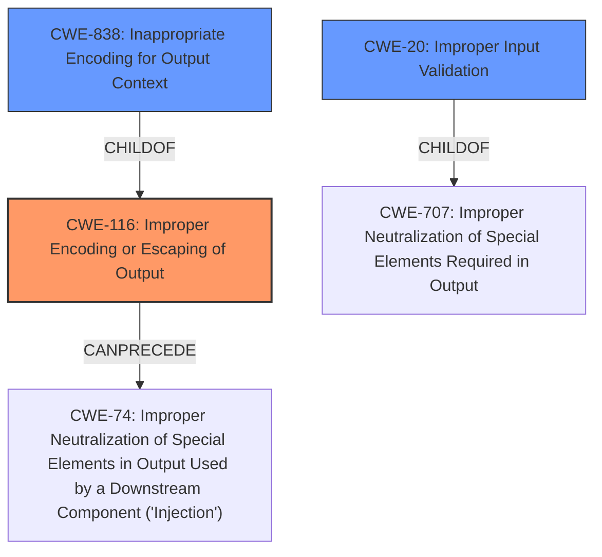

# Enhanced Analysis for CVE-2022-43408

# Summary
| CWE ID | CWE Name | Confidence | CWE Abstraction Level | CWE Vulnerability Mapping Label | CWE-Vulnerability Mapping Notes |
|---|---|---|---|---|---|
| CWE-116 | Improper Encoding or Escaping of Output | 0.9 | Class | Primary | Allowed-with-Review |
| CWE-838 | Inappropriate Encoding for Output Context | 0.8 | Base | Secondary | Allowed |
| CWE-20 | Improper Input Validation | 0.6 | Class | Secondary | Discouraged |

## Evidence and Confidence

*   **Confidence Score:** 0.8
*   **Evidence Strength:** HIGH

## Relationship Analysis
The primary weakness identified is CWE-116, which falls under the class of "Improper Encoding or Escaping of Output". A more specific base-level CWE, CWE-838 "Inappropriate Encoding for Output Context" was also considered a candidate to describe the weakness. The vulnerability involves **improper encoding of input step IDs**, which causes the CSRF protection to be bypassed, which aligns with the description of CWE-116. CWE-20 "Improper Input Validation" was also considered due to the input ID not being validated but was considered secondary. The relationship between CWE-116, CWE-838, and CWE-20 influenced the decision to include CWE-116 as the primary cause, with CWE-838 and CWE-20 considered secondary contributing factors.



## Vulnerability Chain
The vulnerability chain begins with the **improper encoding of the input step ID** (CWE-116), which leads to the **bypassing of CSRF protection**. This allows attackers to configure Pipelines with malicious input step IDs that can execute arbitrary actions within Jenkins under the victim's identity.

## Summary of Analysis
The initial analysis identified the **improper encoding** as the root cause. The retriever results suggested CWE-838 "Inappropriate Encoding for Output Context" and CWE-116 "Improper Encoding or Escaping of Output". Considering the vulnerability description, where the **improper encoding of the ID of input steps** is the identified **rootcause**, CWE-116 is the more appropriate choice because it covers the encoding of data for communication with another component. Although CWE-838 is a base level CWE, I chose the Class CWE-116 due to the vulnerability description details aligning closer to that CWE.

The vulnerability description states that "Jenkins Pipeline Stage View Plugin 2.26 and earlier does not correctly encode the ID of input steps when using it to generate URLs to proceed or abort Pipeline builds, allowing attackers able to configure Pipelines to specify input step IDs resulting in URLs that would bypass the CSRF protection of any target URL in Jenkins."

Relevant CWE Information:
- Vulnerability Description Key Phrases
  - **rootcause:** **improper encoding of the ID of input steps**

- CVE Reference Links Content Summary
  - **Root Cause:** The Pipeline: Stage View Plugin does not properly encode the ID of `input` steps when generating URLs to proceed or abort Pipeline builds.

CWE-20 "Improper Input Validation" was also considered, as the input step IDs are not validated, contributing to the bypass of CSRF protection. However, the primary issue is the encoding, not the validation, so I am listing this as a secondary concern.

CWE-838 was considered and rejected as the primary weakness because it focuses on the encoding context being inappropriate for the downstream component. However, this is a contributing factor so it is listed as a secondary concern.


## CWE Relationship Analysis

Current CWEs represent these abstraction levels: .


### Vulnerability Chain Analysis

**Chain starting from CWE-20:**
- 20 (Improper Input Validation) - ROOT


**Chain starting from CWE-707:**
- 707 (Improper Neutralization) - ROOT


### CWE Relationship Diagram

```mermaid
graph TD
    classDef primary fill:#f96,stroke:#333,stroke-width:2px
    classDef secondary fill:#69f,stroke:#333
    classDef tertiary fill:#9e9,stroke:#333
```