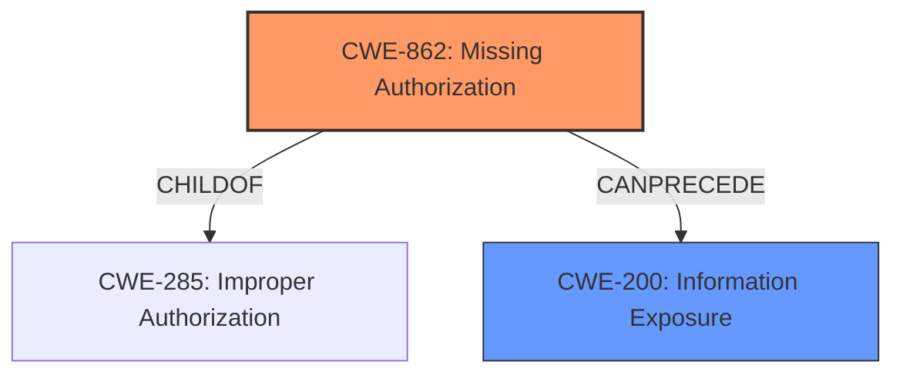

# Analysis Report for CVE-2022-43410

# Vulnerability Analysis Report: CVE-2022-43410

## Description


## Analysis (with Relationship Data)

# Summary
| CWE ID | CWE Name | Confidence | CWE Abstraction Level | CWE Vulnerability Mapping Label | CWE-Vulnerability Mapping Notes |
|---|---|---|---|---|---|
| CWE-862 | Missing Authorization | 0.9 | Class | Allowed-with-Review | The product does not perform an authorization check when an actor attempts to access a resource or perform an action. |
| CWE-200 | Information Exposure | 0.7 | Class | Allowed | The product exposes sensitive information to an actor that is not explicitly authorized to have access to that information. |

## Evidence and Confidence

*   **Confidence Score:** 0.8
*   **Evidence Strength:** HIGH

## Relationship Analysis
The primary relationship that influenced the CWE selection is the parent-child relationship between CWE-285 (Improper Authorization) and CWE-862 (Missing Authorization). Given that the vulnerability description specifies the absence of an authorization check, CWE-862 is a more precise classification than its parent, CWE-285. Additionally, the relationship of CWE-200 (Information Exposure) being a consequence of missing authorization also helped determine the secondary CWE.



## Vulnerability Chain
The vulnerability chain starts with the **missing authorization** check on the `/mercurial/notifyCommit` endpoint, leading to the **exposure of job names** to unauthorized users.
  - Root Cause: **Missing Authorization** (CWE-862)
  - Impact: **Information Exposure** (CWE-200)

## Summary of Analysis
The initial analysis focused on the **impact** of **information disclosure**, but the root cause is the **missing authorization** check, which led to the final conclusion. The selection is heavily based on the evidence provided in the "CVE Reference Links Content Summary" which states, "The vulnerability arises because the endpoint's output reveals which jobs were triggered or scheduled for polling, including jobs that the user doesn't have access to." This directly indicates a **missing authorization** check (CWE-862). The evidence also indicates that this leads to the **exposure of information**, namely job names (CWE-200).

The selected CWEs are at the optimal level of specificity. CWE-862 directly addresses the root cause, and CWE-200 captures the resulting impact.

Relevant CWE Information:

# Enhanced Context (25 CWEs)

## CWE-668: Exposure of Resource to Wrong Sphere
**Abstraction Level**: Class
**Similarity Score**: 0.77
**Source**: dense

**Description**:
The product exposes a resource to the wrong control sphere, providing unintended actors with inappropriate access to the resource.

**Mapping Guidance**:
- Usage: Discouraged
- Rationale: CWE-668 is high-level and is often misused as a catch-all when lower-level CWE IDs might be applicable. It is sometimes used for low-information vulnerability reports [REF-1287]. It is a level-1 Class (i.e., a child of a Pillar). It is not useful for trend analysis.

**CWE-668** was considered but deemed too high-level. While the vulnerability does involve exposing a resource (job names) to the wrong sphere, CWE-862 and CWE-200 provide a more precise explanation of the root cause and impact, respectively.

**CWE-862: Missing Authorization**
The product does not perform an authorization check when an actor attempts to access a resource or perform an action.
- **How the vulnerability's details match the CWE's characteristics:** The Mercurial plugin's webhook endpoint `/mercurial/notifyCommit` discloses job names to unauthorized users because it **does not perform an authorization check** to verify if the user has permissions to access the job information.
- **The security implications and potential impact:** Unauthorized users can enumerate configured jobs, which can be a stepping stone for more targeted attacks.
- **Any parent-child relationships or chain patterns that influenced your mapping:** CWE-862 is a child of CWE-285 (Improper Authorization), providing a more specific classification.
- **Whether the weakness is primary or secondary in the vulnerability:** Primary.
- **How the official MITRE mapping guidance influenced your decision:** Allowed-with-Review. The description of CWE-862 aligns directly with the vulnerability description.
- **Confidence:** 0.9

**CWE-200: Information Exposure**
The product exposes sensitive information to an actor that is not explicitly authorized to have access to that information.
- **How the vulnerability's details match the CWE's characteristics:** The webhook endpoint reveals job names to users who lack permission to access those jobs.
- **The security implications and potential impact:** The exposed job names can be used for reconnaissance and targeted attacks.
- **Any parent-child relationships or chain patterns that influenced your mapping:** CWE-200 stems directly from the **missing authorization** (CWE-862).
- **Whether the weakness is primary or secondary in the vulnerability:** Secondary.
- **How the official MITRE mapping guidance influenced your decision:** The CWE is a class level of abstraction and provides an appropriate description.
- **Confidence:** 0.7


## CWE Relationship Analysis

Current CWEs represent these abstraction levels: .


### Vulnerability Chain Analysis

**Chain starting from CWE-862:**
- 862 (Missing Authorization) - ROOT


**Chain starting from CWE-200:**
- 200 (Exposure of Sensitive Information to an Unauthorized Actor) - ROOT


### CWE Relationship Diagram

```mermaid
graph TD
    classDef primary fill:#f96,stroke:#333,stroke-width:2px
    classDef secondary fill:#69f,stroke:#333
    classDef tertiary fill:#9e9,stroke:#333
```


*Report generated on 2025-03-30 22:14:05*
