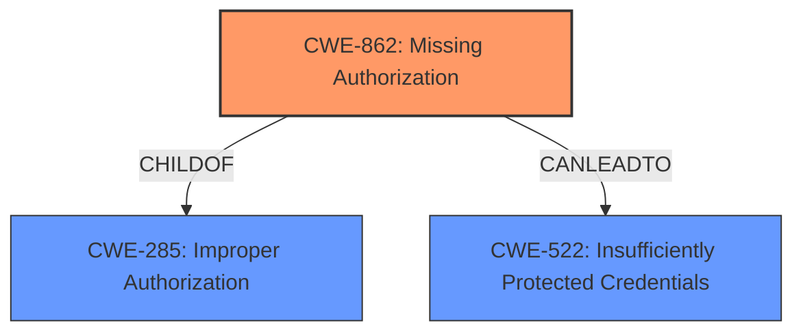

# Analysis Report for CVE-2022-43417

# Vulnerability Analysis Report: CVE-2022-43417

## Description


## Analysis (with Relationship Data)

# Summary
| CWE ID | CWE Name | Confidence | CWE Abstraction Level | CWE Vulnerability Mapping Label | CWE-Vulnerability Mapping Notes |
|---|---|---|---|---|---|
| CWE-862 | Missing Authorization | 1.0 | Class | Allowed-with-Review | Primary CWE |
| CWE-522 | Insufficiently Protected Credentials | 0.5 | Class | Allowed-with-Review | Secondary Candidate |

## Evidence and Confidence

*   **Confidence Score:** 0.8
*   **Evidence Strength:** HIGH

## Relationship Analysis
The primary CWE selected is CWE-862, **Missing Authorization**. This is a Class-level CWE. The vulnerability description explicitly states that the Jenkins Katalon Plugin **does not perform permission checks** in several HTTP endpoints. This directly aligns with the definition of CWE-862, where a product does not perform an authorization check when an actor attempts to access a resource or perform an action.

CWE-862 is a child of CWE-285 (**Improper Authorization**), but CWE-862 is more specific and thus more appropriate.

The analysis also considered a chain relationship with CWE-522 (**Insufficiently Protected Credentials**), where the missing authorization leads to exposure of credentials. While the impact includes capturing credentials, the root cause is the lack of permission checks.



## Vulnerability Chain
The chain of events for this vulnerability is:
1.  **Root Cause:** CWE-862 (**Missing Authorization**) - The plugin **does not perform permission checks** on HTTP endpoints.
2.  **Impact:** This allows attackers with Overall/Read permission to connect to attacker-specified URLs using attacker-specified credential IDs, capturing credentials stored in Jenkins. This can be viewed as a case of CWE-522 (**Insufficiently Protected Credentials**).

## Summary of Analysis
The analysis is based on the provided vulnerability description and supporting evidence from the CVE Reference Links Content Summary, which clearly states that the root cause is a **missing authorization** check.

The vulnerability description key phrases explicitly mentions "**does not perform permission checks**" as the root cause. The CVE Reference Links Content Summary reinforces this by stating "**Missing Authorization:** The plugin lacks proper authorization checks on its HTTP endpoints".

The retriever results also lists CWE-862 (**Missing Authorization**) as the top candidate.

The relationship graph shows the hierarchical relationship between CWE-862 and its parent, CWE-285, and the potential chain relationship leading to CWE-522.

CWE-862 is selected because it accurately describes the root cause of the vulnerability, which is the **lack of authorization checks**. While CWE-522 could describe the impact, it's more accurate to focus on the underlying weakness.

CWE-863 (**Incorrect Authorization**) was considered but rejected because the vulnerability is not about performing the check incorrectly, but about not performing it at all.

Relevant CWE Information:
*   CWE-862 (**Missing Authorization**): The product does not perform an authorization check when an actor attempts to access a resource or perform an action.
*   CWE-522 (**Insufficiently Protected Credentials**): The product transmits or stores authentication credentials, but it uses an insecure method that is susceptible to unauthorized interception and/or retrieval.


## CWE Relationship Analysis

Current CWEs represent these abstraction levels: .


### Vulnerability Chain Analysis

**Chain starting from CWE-862:**
- 862 (Missing Authorization) - ROOT


**Chain starting from CWE-522:**
- 522 (Insufficiently Protected Credentials) - ROOT


### CWE Relationship Diagram

```mermaid
graph TD
    classDef primary fill:#f96,stroke:#333,stroke-width:2px
    classDef secondary fill:#69f,stroke:#333
    classDef tertiary fill:#9e9,stroke:#333
```


*Report generated on 2025-03-31 10:41:11*
