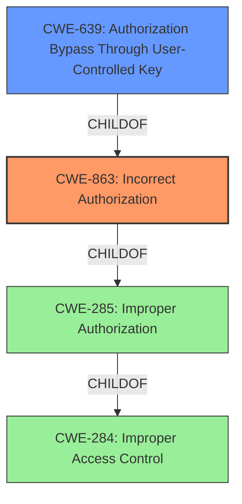

# Analysis for CVE-2022-43438

# Summary
| CWE ID  | CWE Name                                          | Confidence | CWE Abstraction Level | CWE Vulnerability Mapping Label | CWE-Vulnerability Mapping Notes |
| :-------- | :------------------------------------------------ | :--------- | :-------------------- | :------------------------------ | :------------------------------ |
| CWE-863   | Incorrect Authorization                           | 0.9        | Class                 | Primary                         | Allowed-with-Review           |
| CWE-639   | Authorization Bypass Through User-Controlled Key | 0.7        | Base                  | Secondary                       | Allowed                         |

## Evidence and Confidence

*   **Confidence Score:** 0.8
*   **Evidence Strength:** HIGH

## Relationship Analysis
The primary CWE is CWE-863, "Incorrect Authorization," which is a Class-level CWE. CWE-639, "Authorization Bypass Through User-Controlled Key," is a Base-level CWE and a child of CWE-863, offering a more specific description of the vulnerability if the authorization bypass is through a user-controlled key. Although the evidence points to the authorization bypass, it does not provide enough information to determine if the bypass happens through a user-controlled key.

## Vulnerability Chain
The chain starts with an **incorrect authorization** mechanism in the Administrator function. The **incorrect authorization** leads to the ability for a remote attacker, authenticated as a general user, to bypass intended access restrictions. Bypassing the access restrictions allows the attacker to make API function calls, manipulate the system, and terminate services.
The root cause is **incorrect authorization** and the impact is system manipulation and termination of services.

## Summary of Analysis
The initial assessment identified **incorrect authorization** as the primary weakness. The description states that a remote attacker, authenticated as a general user, can bypass intended access restrictions and make API function calls, manipulate the system, and terminate services. This directly points to a problem with how authorization is handled.

The evidence from the vulnerability description includes the key phrase "**Incorrect Authorization**" and the CVE Reference Links Content Summary states: "The vulnerability allows a regular user to bypass authorization checks and access API functions, due to missing or flawed authorization controls."

Based on this analysis, CWE-863 "Incorrect Authorization" is the most appropriate primary CWE. It is a Class-level CWE, and the evidence doesn't allow for a more specific Base-level CWE to be assigned with certainty. While CWE-639 "Authorization Bypass Through User-Controlled Key" is a potential candidate, there is no explicit mention of user-controlled keys being the method of bypass. Therefore, it is being added as a secondary candidate.

Relevant CWE Information:

# Enhanced Context (25 CWEs)

## CWE-284: Improper Access Control
**Abstraction:** Pillar
**Similarity Score**: 0.80 (Top Combined Results)

The product does not restrict or incorrectly restricts access to a resource from an unauthorized actor.

**Mapping Guidance**:
- Usage: Discouraged
- Rationale: CWE-284 is extremely high-level.
- Suggested Alternatives:
  - CWE-862: Missing Authorization
  - CWE-863: Incorrect Authorization

CWE-284 is a high-level "Pillar" and is too general for this vulnerability. The suggested alternatives, CWE-862 and CWE-863, are more specific.

## CWE-285: Improper Authorization
**Abstraction:** Class
**Similarity Score**: 0.256 (Top Combined Results)

The product does not perform or incorrectly performs an authorization check when an actor attempts to access a resource or perform an action.

**Mapping Guidance**:
- Usage: Discouraged
- Rationale: CWE-285 is high-level.
- Suggested Alternatives:
  - CWE-862: Missing Authorization
  - CWE-863: Incorrect Authorization

CWE-285 is a high-level "Class" and is similar to CWE-863. Since the vulnerability description specifically mentions **incorrect authorization**, CWE-863 is a slightly better fit.

## CWE-863: Incorrect Authorization
**Abstraction:** Class
**Similarity Score**: 0.255 (Top Combined Results)

The product performs an authorization check when an actor attempts to access a resource or perform an action, but it does not correctly perform the check.

**Mapping Guidance**:
- Usage: Allowed-with-Review
- Rationale: This CWE entry is a Class and might have Base-level children that would be more appropriate

CWE-863 is a "Class" and a strong candidate. The description aligns well with the vulnerability description, as the authorization check is performed, but it is done incorrectly.

## CWE-639: Authorization Bypass Through User-Controlled Key
**Abstraction:** Base
**Similarity Score**: 0.244 (Top Combined Results)

The system's authorization functionality does not prevent one user from gaining access to another user's data or record by modifying the key value identifying the data.

**Mapping Guidance**:
- Usage: Allowed
- Rationale: This CWE entry is at the Base level of abstraction, which is a preferred level of abstraction for mapping to the root causes of vulnerabilities.

CWE-639 is a "Base" level CWE and a child of CWE-863. It is a more specific type of **incorrect authorization**, where the bypass is achieved through a user-controlled key. If there were explicit evidence that the bypass was due to a user-controlled key, this would be the primary CWE. Without that evidence, it can only be a secondary candidate.

## CWE-306: Missing Authentication for Critical Function
**Abstraction:** Base
**Similarity Score**: 0.229 (Top Combined Results)

The product does not perform any authentication for functionality that requires a provable user identity or consumes a significant amount of resources.

**Mapping Guidance**:
- Usage: Allowed

CWE-306 is not a good fit because the attacker is authenticated. The problem is with authorization, not authentication.

## CWE-648: Incorrect Use of Privileged APIs
**Abstraction:** Base
**Similarity Score**: 0.527

The product does not conform to the API requirements for a function call that requires extra privileges.

CWE-648 could be a possible secondary CWE. If the attacker is able to leverage privileged APIs due to the authorization bypass, then this could be a contributing factor. However, without more information on how the APIs are being misused, it's hard to say.

## CWE-266: Incorrect Privilege Assignment
**Abstraction:** Base
**Similarity Score**: 0.002

A product incorrectly assigns a privilege to a particular actor, creating an unintended sphere of control for that actor.

CWE-266 doesn't fit as the vulnerability is not about **incorrect privilege assignment**, but about a general user bypassing authorization to gain access to privileged functions.

## CWE-457: Use of Uninitialized Variable
**Abstraction:** Variant
**Similarity Score**: 0.227

The code uses a variable that has not been initialized, leading to unpredictable or unintended results.

CWE-457 doesn't fit the **incorrect authorization** description.

## CWE-472: External Control of Assumed-Immutable Web Parameter
**Abstraction:** Base
**Similarity Score**: 0.225

The web application does not sufficiently verify inputs that are assumed to be immutable but are actually externally controllable, such as hidden form fields.

CWE-472 doesn't fit the **incorrect authorization** description.

## CWE-732: Incorrect Permission Assignment for Critical Resource
**Abstraction:** Class
**Similarity Score**: 0.222

The product specifies permissions for a security-critical resource in a way that allows that resource to be read or modified by unintended actors.

CWE-732 might be a possible fit, as the authorization bypass could be due to **incorrect permission assignment**. However, since there is no explicit mention of this, it's hard to say.

The selected CWEs are at the optimal level of specificity based on the provided evidence. CWE-863 is the primary CWE because the vulnerability description explicitly mentions **incorrect authorization**. CWE-639 is a secondary candidate because it provides a more specific description if the bypass is through a user-controlled key, but there isn't enough evidence to confirm this.