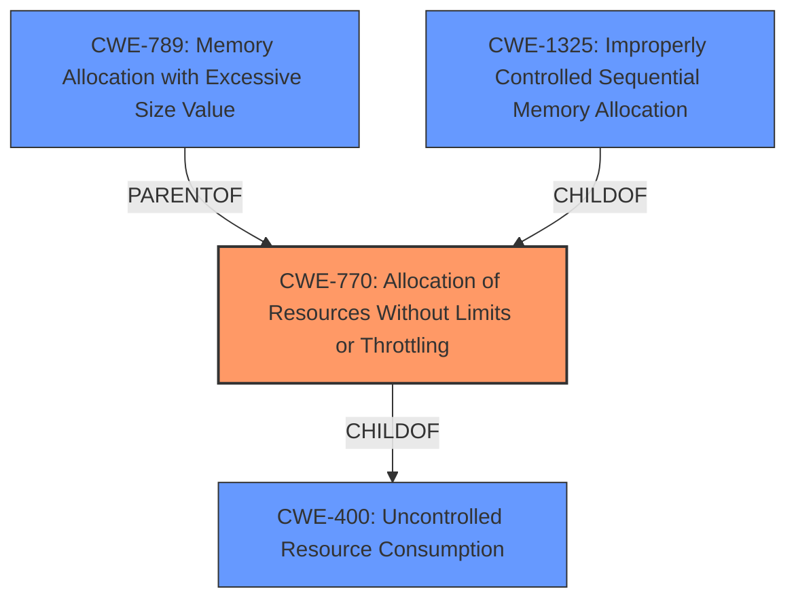

# Analysis for CVE-2022-4344

# Summary
| CWE ID  | CWE Name                                                        | Confidence | CWE Abstraction Level | CWE Vulnerability Mapping Label | CWE-Vulnerability Mapping Notes |
| :-------- | :-------------------------------------------------------------- | :--------- | :---------------------- | :------------------------------ | :------------------------------ |
| CWE-770 | Allocation of Resources Without Limits or Throttling | 0.9        | Base                    | Allowed                     | Primary CWE                     |
| CWE-400 | Uncontrolled Resource Consumption                  | 0.7        | Class                     | Discouraged                       | Secondary Candidate                       |
| CWE-789 | Memory Allocation with Excessive Size Value                   | 0.6        | Variant                    | Allowed                     | Secondary Candidate                       |
| CWE-1325 | Improperly Controlled Sequential Memory Allocation                   | 0.6        | Base                    | Allowed                     | Secondary Candidate                       |

## Evidence and Confidence

*   **Confidence Score:** 0.9
*   **Evidence Strength:** HIGH

## Relationship Analysis
The primary CWE is CWE-770, which falls under CWE-400, indicating a hierarchical relationship. CWE-770 is more specific, detailing the lack of limits on resource allocation. CWE-789 and CWE-1325 are peer CWEs addressing memory allocation issues, with CWE-789 focusing on excessive size and CWE-1325 focusing on sequential allocation. The relationships influenced the selection by highlighting the specific nature of the **resource allocation** problem.

## Vulnerability Chain
The vulnerability chain starts with **improper handling of malformed packets**, leading to **uncontrolled memory allocation**, and finally resulting in **memory exhaustion** and denial of service.

## Summary of Analysis
The analysis is heavily based on the provided evidence, specifically the "CVE Reference Links Content Summary" and "Vulnerability Description Key Phrases". The description explicitly mentions "**memory exhaustion**" as the root cause and denial of service as the impact.

> The vulnerability lies within the Kafka dissector in Wireshark. It is due to a flaw that allows the dissector to consume excessive memory when processing malformed Kafka packets.
> Memory exhaustion vulnerability: The Kafka dissector doesn't handle malformed packets properly, leading to uncontrolled memory allocation.

The primary CWE selected is CWE-770, which accurately captures the essence of **unlimited resource allocation** leading to **memory exhaustion**. The retriever results and CWE specifications supported this decision, with CWE-770 being a good fit and at the Base level of abstraction.

CWE-400 was considered but deemed less specific as it describes uncontrolled resource consumption in general. CWE-789 and CWE-1325, while related to memory allocation, were also considered secondary since the core issue is the lack of limits or throttling on the allocation process itself. The chosen CWEs are at the optimal level of specificity, addressing the **root cause** of the vulnerability rather than just the impact.

Relevant CWE Information:

# Enhanced Context (25 CWEs)

## CWE-1325: Improperly Controlled Sequential Memory Allocation
**Abstraction Level**: Base
**Similarity Score**: 0.77
**Source**: dense

**Description**:
The product manages a group of objects or resources and performs a separate memory allocation for each object, but it does not properly limit the total amount of memory that is consumed by all of the combined objects.

**Mapping Guidance**:
- Usage: Allowed
- Rationale: This CWE entry is at the Base level of abstraction, which is a preferred level of abstraction for mapping to the root causes of vulnerabilities.

**Why Not Used:** While this CWE is relevant, it doesn't fully capture the **root cause** which is the **lack of any limits on resource allocation**, not just the sequential aspect.

## CWE-789: Memory Allocation with Excessive Size Value
**Abstraction Level**: Variant
**Similarity Score**: 0.76
**Source**: dense

**Description**:
The product allocates memory based on an untrusted, large size value, but it does not ensure that the size is within expected limits, allowing arbitrary amounts of memory to be allocated.

**Mapping Guidance**:
- Usage: Allowed
- Rationale: This CWE entry is at the Variant level of abstraction, which is a preferred level of abstraction for mapping to the root causes of vulnerabilities.

**Why Not Used:** This CWE is related to excessive size, but the main problem is that there are **no limits** at all. This is why CWE-770 is a better fit.

## CWE-404: Improper Resource Shutdown or Release
**Abstraction Level**: Class
**Similarity Score**: 0.75
**Source**: dense

**Description**:
The product does not release or incorrectly releases a resource before it is made available for re-use.

**Mapping Guidance**:
- Usage: Allowed-with-Review
- Rationale: This CWE entry is a Class and might have Base-level children that would be more appropriate

**Why Not Used:** This CWE is about releasing resources. The vulnerability is about allocation of resources, so it is not relevant.

## CWE-664: Improper Control of a Resource Through its Lifetime
**Abstraction Level**: Pillar
**Similarity Score**: 0.75
**Source**: dense

**Description**:
The product does not maintain or incorrectly maintains control over a resource throughout its lifetime of creation, use, and release.

**Mapping Guidance**:
- Usage: Discouraged
- Rationale: This CWE entry is high-level when lower-level children are available.

**Why Not Used:** This CWE is too general, and lower-level options are available.

## CWE-835: Loop with Unreachable Exit Condition ('Infinite Loop')
**Abstraction Level**: Base
**Similarity Score**: 0.75
**Source**: dense

**Description**:
The product contains an iteration or loop with an exit condition that cannot be reached, i.e., an infinite loop.

**Mapping Guidance**:
- Usage: Allowed
- Rationale: This CWE entry is at the Base level of abstraction, which is a preferred level of abstraction for mapping to the root causes of vulnerabilities.

**Why Not Used:** There is no evidence of an infinite loop.

## CWE-226: Sensitive Information in Resource Not Removed Before Reuse
**Abstraction Level**: Base
**Similarity Score**: 0.75
**Source**: dense

**Description**:
The product releases a resource such as memory or a file so that it can be made available for reuse, but it does not clear or "zeroize" the information contained in the resource before the product performs a critical state transition or makes the resource available for reuse by other entities.

**Mapping Guidance**:
- Usage: Allowed
- Rationale: This CWE entry is at the Base level of abstraction, which is a preferred level of abstraction for mapping to the root causes of vulnerabilities.

**Why Not Used:** This CWE is about information leakage, not about resource allocation.

## CWE-606: Unchecked Input for Loop Condition
**Abstraction Level**: Base
**Similarity Score**: 0.74
**Source**: dense

**Description**:
The product does not properly check inputs that are used for loop conditions, potentially leading to a denial of service or other consequences because of excessive looping.

**Mapping Guidance**:
- Usage: Allowed
- Rationale: This CWE entry is at the Base level of abstraction, which is a preferred level of abstraction for mapping to the root causes of vulnerabilities.

**Why Not Used:** There is no evidence of a loop.

## CWE-834: Excessive Iteration
**Abstraction Level**: Class
**Similarity Score**: 0.74
**Source**: dense

**Description**:
The product performs an iteration or loop without sufficiently limiting the number of times that the loop is executed.

**Mapping Guidance**:
- Usage: Discouraged
- Rationale: This CWE entry is a level-1 Class (i.e., a child of a Pillar). It might have lower-level children that would be more appropriate

**Why Not Used:** The vulnerability does not seem to involve a loop or iteration, but rather a direct allocation of an excessive amount of memory.

## CWE-405: Asymmetric Resource Consumption (Amplification)
**Abstraction Level**: Class
**Similarity Score**: 0.74
**Source**: dense

**Description**:
The product does not properly control situations in which an adversary can cause the product