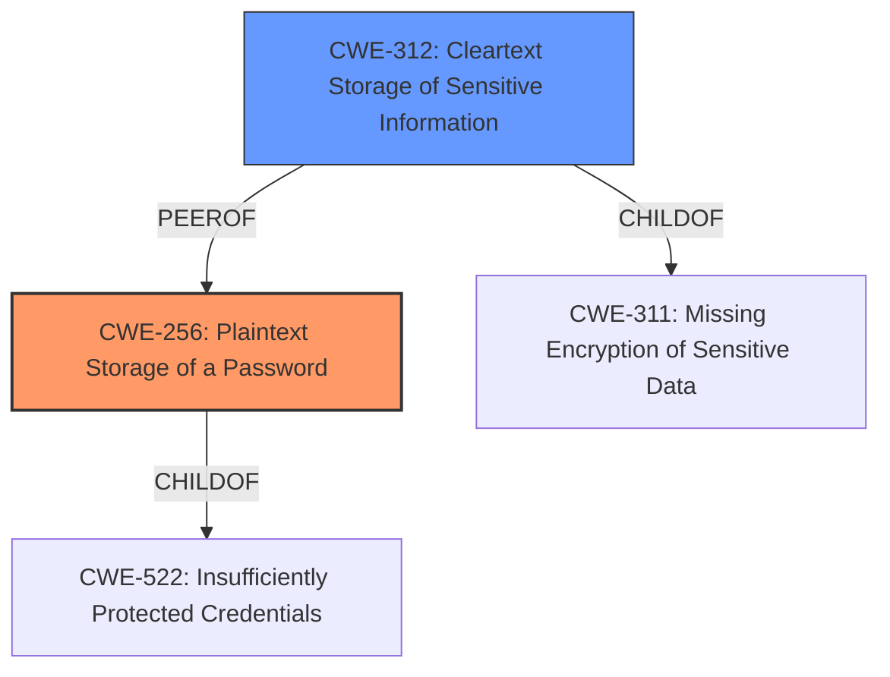

# Raw Analyzer Response for CVE-2022-43442

# Summary
| CWE ID | CWE Name | Confidence | CWE Abstraction Level | CWE Vulnerability Mapping Label | CWE-Vulnerability Mapping Notes |
|---|---|---|---|---|---|
| CWE-256 | Plaintext Storage of a Password | 1 | Base | Allowed | Primary CWE |
| CWE-312 | Cleartext Storage of Sensitive Information | 0.7 | Base | Allowed | Secondary Candidate |

## Evidence and Confidence

*   **Confidence Score:** 0.9
*   **Evidence Strength:** HIGH

## Relationship Analysis
The primary CWE selected is CWE-256, which is a Base level CWE and a child of CWE-522 (Insufficiently Protected Credentials). CWE-312 (Cleartext Storage of Sensitive Information) was also considered because it is closely related and represents a broader class of issues involving sensitive data. However, since the description specifically mentions "password", CWE-256 is a more precise fit.

## Vulnerability Chain
The vulnerability chain starts with the **plaintext storage of the password** (CWE-256), which allows an attacker to **obtain the login password** and then **log in to the management console**.

## Summary of Analysis
The analysis is primarily based on the vulnerability description and CVE reference, which clearly state the **root cause** as **"plaintext storage of password"**. The retriever results also strongly suggest CWE-256 as the most relevant CWE.

The vulnerability description states: "Plaintext storage of a password vulnerability exists in +F FS040U software versions v2.3.4 and earlier, which may allow an attacker to obtain the login password of +F FS040U and log in to the management console."

The CVE Reference Links Content Summary states: "The vulnerability is due to the plaintext storage of a password in the affected device." and "Plaintext Storage of a Password (CWE-256). This means the device stores the user's password without any encryption or hashing, making it easily readable."

CWE-256 is selected because it accurately represents the **root cause** of the vulnerability, which is storing passwords in **plaintext**, making them easily accessible to attackers. This directly leads to the attacker's ability to obtain the login password and access the management console.

CWE-312 was considered but not selected as the primary because while it addresses the general case of "sensitive information," the vulnerability specifically refers to a "password," making CWE-256 a more precise mapping. Other CWEs like CWE-916 (Use of Password Hash With Insufficient Computational Effort) and CWE-257 (Storing Passwords in a Recoverable Format) were not selected because the vulnerability involves storing the password in plaintext, not hashing or encryption that can be recovered.
Relevant CWE Information:

# Enhanced Context (25 CWEs)

## CWE-256: Plaintext Storage of a Password
**Abstraction:** Base
**Status:** Incomplete

### Description
Storing a password in plaintext may result in a system compromise.

### Extended Description
Password management issues occur when a password is stored in plaintext in an application's properties, configuration file, or memory. Storing a plaintext password in a configuration file allows anyone who can read the file access to the password-protected resource. In some contexts, even storage of a plaintext password in memory is considered a security risk if the password is not cleared immediately after it is used.

### Alternative Terms
None

### Relationships
ChildOf -> CWE-522

### Mapping Guidance
**Usage:** Allowed
**Rationale:** This CWE entry is at the Base level of abstraction, which is a preferred level of abstraction for mapping to the root causes of vulnerabilities.
**Comments:** Carefully read both the name and description to ensure that this mapping is an appropriate fit. Do not try to 'force' a mapping to a lower-level Base/Variant simply to comply with this preferred level of abstraction.
**Reasons:**
- Acceptable-Use

### Observed Examples
- **CVE-2022-30275:** Remote Terminal Unit (RTU) uses a driver that relies on a password stored in plaintext.