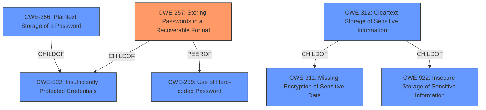

# Enhanced Analysis for CVE-2022-43460

# Summary
| CWE ID | CWE Name | Confidence | CWE Abstraction Level | CWE Vulnerability Mapping Label | CWE-Vulnerability Mapping Notes |
|---|---|---|---|---|---|
| CWE-257 | Storing Passwords in a Recoverable Format | 1.0 | Base | Allowed | Primary CWE |
| CWE-312 | Cleartext Storage of Sensitive Information | 0.7 | Base | Allowed | Secondary Candidate |
| CWE-256 | Plaintext Storage of a Password | 0.6 | Base | Allowed | Secondary Candidate |

## Evidence and Confidence

*   **Confidence Score:** 1.0
*   **Evidence Strength:** HIGH

## Relationship Analysis
The primary CWE selected is CWE-257 (Storing Passwords in a Recoverable Format), which is a Base level CWE. It is related to CWE-522 (Insufficiently Protected Credentials) as a ChildOf, indicating that storing passwords in a recoverable format is a specific type of insufficiently protected credential. It is also a PeerOf CWE-259 (Use of Hard-coded Password).

CWE-312 (Cleartext Storage of Sensitive Information) is another considered CWE and is a ChildOf CWE-311 (Missing Encryption of Sensitive Data) and CWE-922 (Insecure Storage of Sensitive Information).

CWE-256 (Plaintext Storage of a Password) is a ChildOf CWE-522.

The relationship analysis helped confirm that CWE-257 is a more appropriate fit than its parent CWE-522, as it describes the specific weakness more accurately.



## Vulnerability Chain
The vulnerability chain starts with the **root cause** of storing passwords in a recoverable format (CWE-257). This leads to the **impact** of an attacker being able to decrypt the encrypted administrator credentials, potentially leading to unauthorized access and further malicious activities.

## Summary of Analysis
The initial assessment identified CWE-257 as the primary candidate due to the explicit mention of "**passwords are stored in a recoverable format**" in the vulnerability description. The CVE Reference Links Content Summary further supports this by stating: "The primary weakness is that the software **stores passwords in a recoverable format**. Even though the passwords are encrypted, the encryption method is weak enough that it can be reversed, effectively exposing the passwords."

The graph relationships confirm that CWE-257 is a Base level CWE and a child of CWE-522 which is a Class level CWE.

The selection of CWE-257 is at the optimal level of specificity because it accurately describes the **root cause** of the vulnerability, which is the storage of passwords in a format that can be recovered, rather than simply stating that credentials are insufficiently protected (CWE-522).

CWE-312 (Cleartext Storage of Sensitive Information) was considered because the password could be retrieved, which effectively makes it cleartext. However, CWE-257 is more precise because it acknowledges that there was an attempt at encryption, albeit a weak one.

CWE-256 (Plaintext Storage of a Password) was considered. It's similar to CWE-312, but it is still too generic.

Relevant CWE Information:

# Enhanced Context (25 CWEs)

## CWE-312: Cleartext Storage of Sensitive Information
**Abstraction Level**: Base
**Similarity Score**: 0.80
**Source**: dense

**Description**:
The product stores sensitive information in cleartext within a resource that might be accessible to another control sphere.

**Mapping Guidance**:
- Usage: Allowed
- Rationale: This CWE entry is at the Base level of abstraction, which is a preferred level of abstraction for mapping to the root causes of vulnerabilities.

## CWE-257: Storing Passwords in a Recoverable Format
**Abstraction Level**: Base
**Similarity Score**: 0.76
**Source**: dense

**Description**:
The storage of passwords in a recoverable format makes them subject to password reuse attacks by malicious users. In fact, it should be noted that recoverable encrypted passwords provide no significant benefit over plaintext passwords since they are subject not only to reuse by malicious attackers but also by malicious insiders. If a system administrator can recover a password directly, or use a brute force search on the available information, the administrator can use the password on other accounts.

**Mapping Guidance**:
- Usage: Allowed
- Rationale: This CWE entry is at the Base level of abstraction, which is a preferred level of abstraction for mapping to the root causes of vulnerabilities.


## CWE Relationship Analysis

Current CWEs represent these abstraction levels: .


### Vulnerability Chain Analysis

**Chain starting from CWE-922:**
- 922 (Insecure Storage of Sensitive Information) - ROOT


**Chain starting from CWE-522:**
- 522 (Insufficiently Protected Credentials) - ROOT


### CWE Relationship Diagram

```mermaid
graph TD
    classDef primary fill:#f96,stroke:#333,stroke-width:2px
    classDef secondary fill:#69f,stroke:#333
    classDef tertiary fill:#9e9,stroke:#333
```