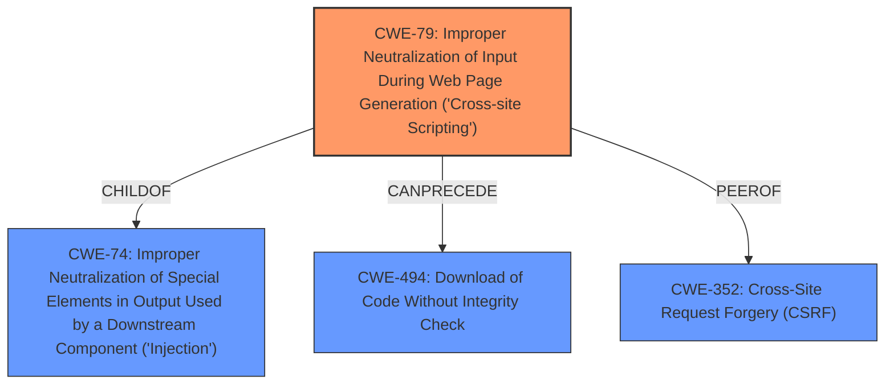

# Enhanced Analysis for CVE-2022-4347

# Summary
| CWE ID | CWE Name | Confidence | CWE Abstraction Level | CWE Vulnerability Mapping Label | CWE-Vulnerability Mapping Notes |
|---|---|---|---|---|---|
| CWE-79 | Improper Neutralization of Input During Web Page Generation ('Cross-site Scripting') | 1.0 | Base | Allowed | Primary CWE |

## Evidence and Confidence

*   **Confidence Score:** 1.0
*   **Evidence Strength:** HIGH

## Relationship Analysis
The primary relationship influencing the decision is that CWE-79 is a base-level CWE, making it specific enough to describe the vulnerability, and it is a child of CWE-74 (Improper Neutralization of Special Elements in Output Used by a Downstream Component ('Injection')). While CWE-74 is a parent, it's a Class, and therefore less specific. The relationship `CanPrecede` -> CWE-494 (Download of Code Without Integrity Check) and PeerOf -> CWE-352 (Cross-Site Request Forgery (CSRF)) are not relevant in this case.



## Vulnerability Chain
The vulnerability chain starts with the **manipulation of the user argument**, leading to **improper neutralization** and ultimately resulting in a Cross-Site Scripting (XSS) vulnerability.
  - **Root Cause**: **Manipulation of User Argument**
  - **Weakness**: **Improper Neutralization**
  - **Impact**: Cross-Site Scripting (CWE-79)

## Summary of Analysis
The initial analysis correctly identifies CWE-79 as the primary weakness. The vulnerability description clearly states that the **manipulation of the user argument** leads to cross-site scripting, which aligns perfectly with CWE-79's description of **improper neutralization of user-controllable input** before it's placed in a web page.

The evidence from the vulnerability description, specifically the "Vulnerability Description Key Phrases" section and the "CVE Reference Links Content Summary," supports this conclusion. The "CVE Reference Links Content Summary" states: "The `WebUtils.java` file in xiandafu beetl-bbs does not neutralize or incorrectly neutralizes user-controlled input before it is placed in output that is used as a web page. Specifically, the **manipulation of the `user` argument** with an unknown input leads to the vulnerability." This directly matches the CWE-79 description.

The retriever results also list CWE-79 as the top result, further supporting this classification. While other CWEs were considered, they were either too general (CWE-74) or did not directly address the specific weakness described in the vulnerability (e.g., CWE-89, CWE-352, CWE-434).

CWE-80 (Improper Neutralization of Script-Related HTML Tags in a Web Page (Basic XSS)) was considered, however, CWE-79 is more general and accurately describes the issue. The description does not provide enough information to restrict the attack vector to HTML tags alone, so a broader XSS classification is more appropriate.

Therefore, CWE-79 is the optimal level of specificity and accurately represents the vulnerability.


## CWE Relationship Analysis

Current CWEs represent these abstraction levels: .


### Vulnerability Chain Analysis

**Chain starting from CWE-89:**
- 89 (Improper Neutralization of Special Elements used in an SQL Command ('SQL Injection')) - ROOT


**Chain starting from CWE-80:**
- 80 (Improper Neutralization of Script-Related HTML Tags in a Web Page (Basic XSS)) - ROOT


### CWE Relationship Diagram

```mermaid
graph TD
    classDef primary fill:#f96,stroke:#333,stroke-width:2px
    classDef secondary fill:#69f,stroke:#333
    classDef tertiary fill:#9e9,stroke:#333
```