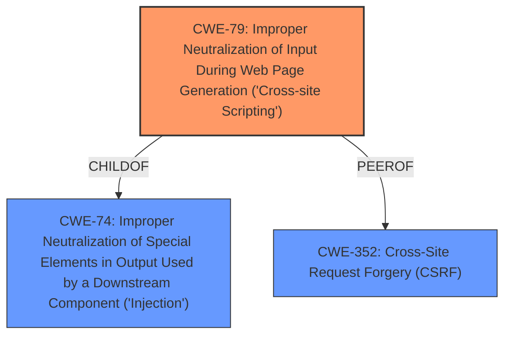

# Analysis Report for CVE-2022-4348

# Vulnerability Analysis Report: CVE-2022-4348

## Description


## Analysis (with Relationship Data)

# Summary
| CWE ID | CWE Name | Confidence | CWE Abstraction Level | CWE Vulnerability Mapping Label | CWE-Vulnerability Mapping Notes |
|---|---|---|---|---|---|
| CWE-79 | Improper Neutralization of Input During Web Page Generation ('Cross-site Scripting') | 1.0 | Base | Allowed | Primary CWE |

## Evidence and Confidence

*   **Confidence Score:** 1.0
*   **Evidence Strength:** HIGH

## Relationship Analysis
The primary relationship influencing the decision is that **CWE-79** [CWE-79: Improper Neutralization of Input During Web Page Generation ('Cross-site Scripting')] is a **Base** level CWE, which is the preferred level of abstraction. It also has **PeerOf** relationship with **CWE-352** [CWE-352: Cross-Site Request Forgery (CSRF)] and **ChildOf** with **CWE-74** [CWE-74: Improper Neutralization of Special Elements in Output Used by a Downstream Component ('Injection')] which highlights the commonality of injection-style vulnerabilities in web applications.



## Vulnerability Chain
The vulnerability chain starts with **improper input handling** in the `HTMLFilter` component, leading to the **rootcause** of **cross-site scripting (XSS)**. The impact is that an attacker can inject malicious scripts, leading to integrity violation and potential arbitrary script execution in the victim's browser.

## Summary of Analysis
Based on the vulnerability description and the provided context, the primary **rootcause** of this vulnerability is **cross-site scripting (XSS)** due to **improper neutralization of input during web page generation**. The vulnerability lies within the `HTMLFilter` component of the `y_project RuoYi-Cloud` application, where it **fails to properly escape the closing double quote (`"`)** character within HTML attributes when processing JSON data. This allows for the injection of malicious scripts into web pages served to other users.

The evidence from the "CVE Reference Links Content Summary" clearly states:
- "**Cross-Site Scripting (XSS):** The core issue is a reflected XSS vulnerability (CWE-79). The application fails to correctly sanitize user-supplied input when embedding it into a JSON response, which is then interpreted by the browser."
- "**Improper Input Handling:** The `HTMLFilter` component incorrectly processes HTML tag parameters by not escaping the `"` character."

The "Vulnerability Description Key Phrases" also directly mentions "**rootcause: cross-site scripting**".

Therefore, **CWE-79** [CWE-79: Improper Neutralization of Input During Web Page Generation ('Cross-site Scripting')] is the most appropriate CWE because it directly addresses the **rootcause** of the vulnerability which is **improper neutralization of input** leading to **cross-site scripting**. It is a **Base** level CWE, which is the preferred level of abstraction for mapping.

Other CWEs were considered but deemed less suitable:

- **CWE-80** [CWE-80: Improper Neutralization of Script-Related HTML Tags in a Web Page (Basic XSS)] is a **Variant** of **CWE-79** [CWE-79: Improper Neutralization of Input During Web Page Generation ('Cross-site Scripting')], focusing specifically on script-related HTML tags. While relevant, **CWE-79** [CWE-79: Improper Neutralization of Input During Web Page Generation ('Cross-site Scripting')] provides a broader coverage of XSS vulnerabilities and is more appropriate as the primary CWE.
- **CWE-74** [CWE-74: Improper Neutralization of Special Elements in Output Used by a Downstream Component ('Injection')] is a more general **Class** level CWE related to injection vulnerabilities. While XSS is a type of injection, **CWE-79** [CWE-79: Improper Neutralization of Input During Web Page Generation ('Cross-site Scripting')] is more specific and accurately describes the vulnerability.
- **CWE-352** [CWE-352: Cross-Site Request Forgery (CSRF)] is a **Compound** CWE that is related to XSS, it requires an attacker to trick a client into making an unintentional request to the web server which will be treated as an authentic request. This is not the case here.
- **CWE-434** [CWE-434: Unrestricted Upload of File with Dangerous Type] is about dangerous file types being uploaded. This is not the case here.
- **CWE-502** [CWE-502: Deserialization of Untrusted Data] is about deserialization without sufficient validation. This is not the case here.
- **CWE-78** [CWE-78: Improper Neutralization of Special Elements used in an OS Command ('OS Command Injection')] and **CWE-89** [CWE-89: Improper Neutralization of Special Elements used in an SQL Command ('SQL Injection')] are related to command and SQL injection respectively. These are not the case here.

The selection of **CWE-79** [CWE-79: Improper Neutralization of Input During Web Page Generation ('Cross-site Scripting')] is based on the direct evidence of **cross-site scripting** as the **rootcause** and the fact that the `HTMLFilter` component **fails to properly escape the closing double quote (`"`)** which can be considered **improper neutralization of input during web page generation**. The retriever results also give **CWE-79** [CWE-79: Improper Neutralization of Input During Web Page Generation ('Cross-site Scripting')] the highest score.


## CWE Relationship Analysis

Current CWEs represent these abstraction levels: .


### Vulnerability Chain Analysis

**Chain starting from CWE-89:**
- 89 (Improper Neutralization of Special Elements used in an SQL Command ('SQL Injection')) - ROOT


**Chain starting from CWE-80:**
- 80 (Improper Neutralization of Script-Related HTML Tags in a Web Page (Basic XSS)) - ROOT


### CWE Relationship Diagram

```mermaid
graph TD
    classDef primary fill:#f96,stroke:#333,stroke-width:2px
    classDef secondary fill:#69f,stroke:#333
    classDef tertiary fill:#9e9,stroke:#333
```


*Report generated on 2025-03-30 12:03:53*
