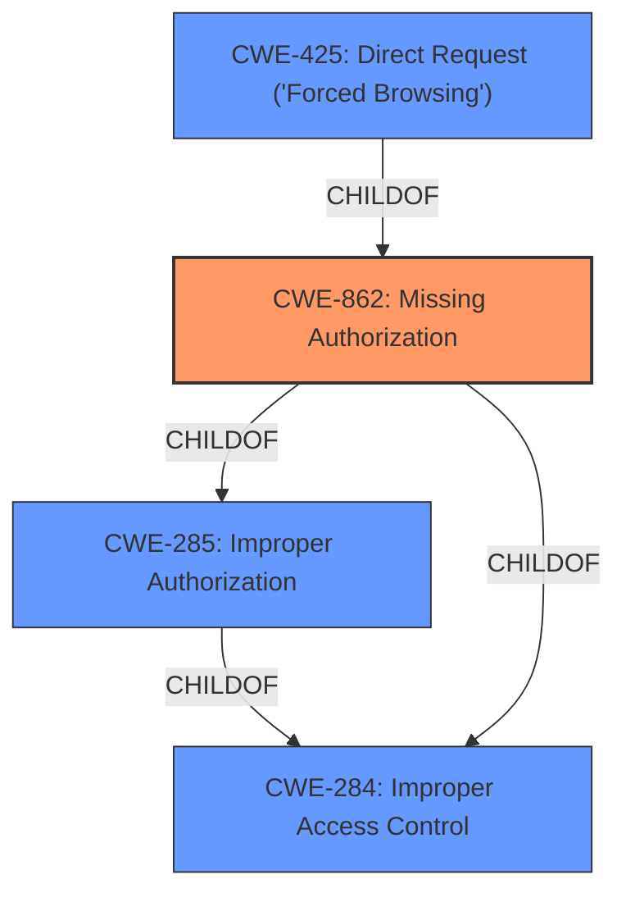

# Raw Analyzer Response for CVE-2022-43482

# Summary
| CWE ID | CWE Name | Confidence | CWE Abstraction Level | CWE Vulnerability Mapping Label | CWE-Vulnerability Mapping Notes |
|---|---|---|---|---|---|
| CWE-862 | Missing Authorization | 1.0 | Class | Allowed-with-Review | Primary CWE |
| CWE-285 | Improper Authorization | 0.7 | Class | Discouraged | Secondary Candidate |
| CWE-425 | Direct Request ('Forced Browsing') | 0.6 | Base | Allowed | Secondary Candidate |

## Evidence and Confidence

*   **Confidence Score:** 0.8
*   **Evidence Strength:** HIGH

## Relationship Analysis
The primary relationship impacting the CWE selection is the hierarchical structure. CWE-862 **Missing Authorization** is a child of CWE-285 **Improper Authorization**. While CWE-284 **Improper Access Control** is the parent of both. Given the provided information, selecting CWE-862 is more specific than CWE-285 and significantly more specific than CWE-284. CWE-425 **Direct Request ('Forced Browsing')** is a child of CWE-862, but the description doesn't explicitly indicate that the application makes assumptions about the navigation path, so CWE-862 is a better fit.

## Vulnerability Chain
The vulnerability chain starts with the **missing authorization** check. This allows an unprivileged user to perform actions that should be restricted to higher-privileged users. The root cause is the **missing authorization**, and the impact is the ability to execute higher-privileged actions.

## Summary of Analysis
The initial analysis focused on identifying the root cause of the vulnerability, which is the **missing authorization** check in the Appointment Booking Calendar plugin. The vulnerability description and CVE reference links content summary provide strong evidence for this.

The primary CWE selected is CWE-862 **Missing Authorization**, with a confidence score of 1.0. This selection is based on the explicit mention of **missing authorization** in the vulnerability description key phrases and the CVE reference links content summary. The CVE reference links content summary states the root cause as "The plugin has a broken access control issue, specifically **missing authorization**, authentication, or nonce token checks in a function."

CWE-285 **Improper Authorization** and CWE-425 **Direct Request ('Forced Browsing')** were considered as secondary candidates. CWE-285 is a parent of CWE-862, but CWE-862 is more specific. CWE-425 is a child of CWE-862 but requires the application to make assumptions about the navigation path, which is not explicitly mentioned.

The final selection of CWE-862 is based on the provided evidence, the hierarchical relationships between CWEs, and the mapping guidance. The CWE is at the optimal level of specificity, as it directly reflects the root cause of the vulnerability.

Relevant CWE Information:

# Enhanced Context (25 CWEs)
The following CWEs were identified as potentially relevant to this vulnerability:

## CWE-639: Authorization Bypass Through User-Controlled Key
**Abstraction Level**: Base
**Similarity Score**: 0.77
**Source**: dense

**Description**:
The system's authorization functionality does not prevent one user from gaining access to another user's data or record by modifying the key value identifying the data.
- NOT USED: This CWE describes a specific case of authorization bypass through a user-controlled key, which is not the case here. The vulnerability description indicates a general lack of authorization checks, not a manipulation of keys.

## CWE-74: Improper Neutralization of Special Elements in Output Used by a Downstream Component ('Injection')
**Abstraction Level**: Class
**Similarity Score**: 0.76
**Source**: dense

**Description**:
The product constructs all or part of a command, data structure, or record using externally-influenced input from an upstream component, but it does not neutralize or incorrectly neutralizes special elements that could modify how it is parsed or interpreted when it is sent to a downstream component.
- NOT USED: This CWE describes injection vulnerabilities, which are not present in the provided vulnerability description. The issue is with authorization, not with improper handling of special elements.

## CWE-472: External Control of Assumed-Immutable Web Parameter
**Abstraction Level**: Base
**Similarity Score**: 0.76
**Source**: dense

**Description**:
The web application does not sufficiently verify inputs that are assumed to be immutable but are actually externally controllable, such as hidden form fields.
- NOT USED: This CWE describes a specific case of external control of assumed-immutable web parameters, which is not the case here. The vulnerability description indicates a general lack of authorization checks.

## CWE-1289: Improper Validation of Unsafe Equivalence in Input
**Abstraction Level**: Base
**Similarity Score**: 0.76
**Source**: dense

**Description**:
The product receives an input value that is used as a resource identifier or other type of reference, but it does not validate or incorrectly validates that the input is equivalent to a potentially-unsafe value.
- NOT USED: This CWE describes a specific case of improper validation of unsafe equivalence in input, which is not the case here. The vulnerability description indicates a general lack of authorization checks.

## CWE-807: Reliance on Untrusted Inputs in a Security Decision
**Abstraction Level**: Base
**Similarity Score**: 0.76
**Source**: dense

**Description**:
The product uses a protection mechanism that relies on the existence or values of an input, but the input can be modified by an untrusted actor in a way that bypasses the protection mechanism.
- NOT USED: This CWE describes reliance on untrusted inputs in a security decision, which is not the case here. The vulnerability description indicates a general lack of authorization checks.

## CWE-41: Improper Resolution of Path Equivalence
**Abstraction Level**: Base
**Similarity Score**: 0.75
**Source**: dense

**Description**:
The product is vulnerable to file system contents disclosure through path equivalence. Path equivalence involves the use of special characters in file and directory names. The associated manipulations are intended to generate multiple names for the same object.
- NOT USED: This CWE describes path equivalence issues, which are not present in the provided vulnerability description. The issue is with authorization, not with file system path handling.

## CWE-116: Improper Encoding or Escaping of Output
**Abstraction Level**: Class
**Similarity Score**: 0.75
**Source**: dense

**Description**:
The product prepares a structured message for communication with another component, but encoding or escaping of the data is either missing or done incorrectly. As a result, the intended structure of the message is not preserved.
- NOT USED: This CWE describes improper encoding or escaping of output, which is not the case here. The vulnerability description indicates a general lack of authorization checks.

## CWE-425: Direct Request ('Forced Browsing')
**Abstraction Level**: Base
**Similarity Score**: 0.75
**Source**: dense

**Description**:
The web application does not adequately enforce appropriate authorization on all restricted URLs, scripts, or files.
- CONSIDERED: This CWE is a child of CWE-862 and describes the scenario where authorization is not adequately enforced. It could be applicable, but there isn't specific evidence in the description to support that the application makes assumptions about navigation paths.
- USED AS SECONDARY: It is a close fit and related to the primary.

## CWE-184: Incomplete List of Disallowed Inputs
**Abstraction Level**: Base
**Similarity Score**: 0.75
**Source**: dense

**Description**:
The product implements a protection mechanism that relies on a list of inputs (or properties of inputs) that are not allowed by policy or otherwise require other action to neutralize before additional processing takes place, but the list is incomplete.
- NOT USED: This CWE describes an incomplete list of disallowed inputs, which is not the case here. The vulnerability description indicates a general lack of authorization checks.

## CWE-799: Improper Control of Interaction Frequency
**Abstraction Level**: Class
**Similarity Score**: 0.75
**Source**: dense

**Description**:
The product does not properly limit the number or frequency of interactions that it has with an actor, such as the number of incoming requests.
- NOT USED: This CWE describes improper control of interaction frequency, which is not the case here.