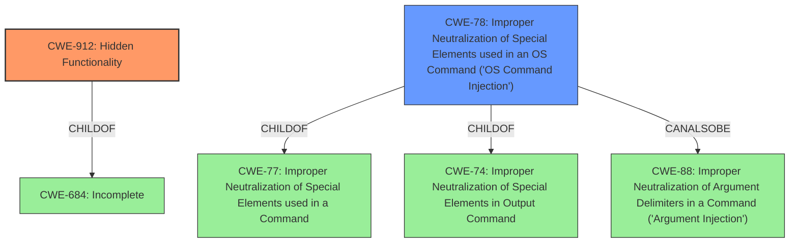

# Analysis Report for CVE-2022-43486

# Vulnerability Analysis Report: CVE-2022-43486

## Description


## Analysis (with Relationship Data)

# Summary
| CWE ID | CWE Name | Confidence | CWE Abstraction Level | CWE Vulnerability Mapping Label | CWE-Vulnerability Mapping Notes |
|---|---|---|---|---|---|
| CWE-912 | Hidden Functionality | 0.9 | Class | Allowed-with-Review | Primary CWE |
| CWE-78 | Improper Neutralization of Special Elements used in an OS Command ('OS Command Injection') | 0.7 | Base | Allowed | Secondary Candidate |

## Evidence and Confidence

*   **Confidence Score:** 0.8
*   **Evidence Strength:** HIGH

## Relationship Analysis
The primary CWE selected is CWE-912 (Hidden Functionality), which is a Class-level CWE. The secondary CWE is CWE-78 (Improper Neutralization of Special Elements used in an OS Command ('OS Command Injection')), which is a Base-level CWE.

CWE-912 is a child of CWE-684 (Incomplete).

CWE-78 is a child of CWE-77 (Improper Neutralization of Special Elements used in a Command) and CWE-74 (Improper Neutralization of Special Elements in Output Command). It can also be related to CWE-88 (Improper Neutralization of Argument Delimiters in a Command ('Argument Injection')).



## Vulnerability Chain
The vulnerability chain starts with the **hidden functionality**, which allows an attacker with administrative privileges to enable debug functionalities, leading to arbitrary command execution.

*   Root Cause: **Hidden Functionality (CWE-912)**
*   Weakness: Improper access control due to the **hidden functionality**.
*   Impact: Arbitrary command execution (**CWE-78**, implied).

## Summary of Analysis
The analysis is based on the provided vulnerability description and the CVE reference links content summary. The key evidence is the presence of **hidden functionality** that enables arbitrary command execution.

The primary CWE is CWE-912 (Hidden Functionality), which aligns with the **root cause** of the vulnerability. The CVE Reference Links Content Summary explicitly mentions **Hidden Functionality (CWE-912)** as a weakness. The description of CWE-912 states: "The product contains functionality that is not documented, not part of the specification, and not accessible through an interface or command sequence that is obvious to the product's users or administrators." This aligns with the vulnerability description.

The secondary CWE is CWE-78 (Improper Neutralization of Special Elements used in an OS Command ('OS Command Injection')), because the impact of enabling the **hidden functionality** is arbitrary command execution. The vulnerability description states the attacker can "execute an arbitrary command on the affected devices".

CWE-284 (Improper Access Control) was considered because the **hidden functionality** effectively bypasses normal access controls, but it's too high-level. CWE-912 is more specific. The retriever results also list CWE-284, but the mapping guidance discourages its use.

CWE-78 is at the optimal level of specificity because it directly describes the impact of the vulnerability: arbitrary command execution. CWE-912 is at the class level, but it is more descriptive of the root cause than any of its base-level children.


## CWE Relationship Analysis

Current CWEs represent these abstraction levels: .


### Vulnerability Chain Analysis

**Chain starting from CWE-284:**
- 284 (Improper Access Control) - ROOT


**Chain starting from CWE-78:**
- 78 (Improper Neutralization of Special Elements used in an OS Command ('OS Command Injection')) - ROOT


### CWE Relationship Diagram

```mermaid
graph TD
    classDef primary fill:#f96,stroke:#333,stroke-width:2px
    classDef secondary fill:#69f,stroke:#333
    classDef tertiary fill:#9e9,stroke:#333
```


*Report generated on 2025-03-30 12:11:23*
