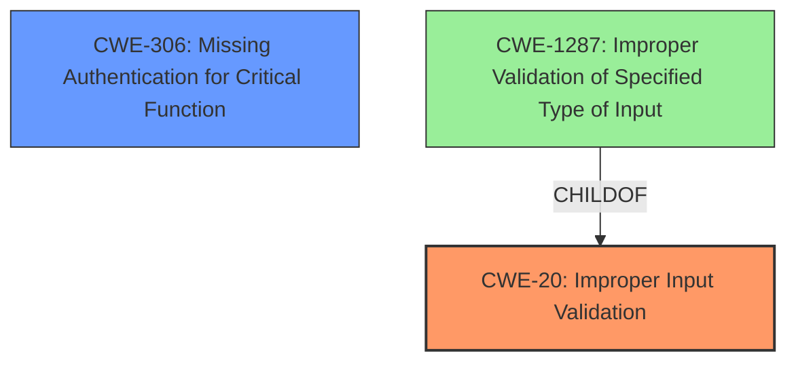

# Analysis Report for CVE-2022-43545

# Vulnerability Analysis Report: CVE-2022-43545

## Description


## Analysis (with Relationship Data)

# Summary
| CWE ID  | CWE Name                                                                                 | Confidence | CWE Abstraction Level | CWE Vulnerability Mapping Label | CWE-Vulnerability Mapping Notes |
| :-------- | :----------------------------------------------------------------------------------------- | :--------- | :---------------------- | :------------------------------ | :------------------------------- |
| CWE-20   | Improper Input Validation                                                            | 0.95       | Class                   | Primary                         | Discouraged                      |
| CWE-306 | Missing Authentication for Critical Function | 0.75       | Base                   | Secondary                         | Allowed                      |

## Evidence and Confidence

*   **Confidence Score:** 0.85
*   **Evidence Strength:** HIGH

## Relationship Analysis
The primary relationship influencing the CWE selection is the hierarchical relationship with CWE-20 as a Class and more specific Base CWEs that could be considered. The vulnerability description clearly indicates **improper input validation** as the root cause. While there might be other contributing factors or resulting impacts, the **lack of proper validation** is the most direct representation of the weakness. The relationship with CWE-306 comes from the fact that the attacker needs to be authenticated, but it is not clear if that's a prerequisite or not from the description.



## Vulnerability Chain
The vulnerability chain starts with the **improper input validation** of the `RecordType` parameter (CWE-20). This **lack of validation** allows an attacker to send malicious input, leading to a device crash and potential remote code execution. The **missing authentication** (CWE-306) is also a part of this since the attacker has to be authenticated to send the request.
  - **Root Cause:** **Improper Input Validation** (CWE-20), **Missing Authentication** (CWE-306)
  - **Impact:** Denial of Service (Device Crash), Remote Code Execution

## Summary of Analysis
The initial assessment identified **improper input validation** (CWE-20) as the primary weakness, supported by the vulnerability description and the "CVE Reference Links Content Summary," which states, "The vulnerability stems from **improper input validation** of the `RecordType` parameter." The vulnerability description key phrases also highlight "**do not properly validate the RecordType-parameter**" as the root cause.

The retriever results listed CWE-20 as a candidate, but it's discouraged. Given the clear evidence pointing towards **improper input validation**, CWE-20 is the most appropriate. Though discouraged, it is still more appropriate than its parents or peers given the information provided.

CWE-306 was chosen as a secondary candidate because the attacker needs to be authenticated to send the malicious request. This indicates a **missing authentication** aspect that could allow unauthorized actions if authentication were not present.

The selected CWEs are at an adequate level of specificity, given the provided information. While more specific variants of CWE-20 exist (e.g., CWE-1287), the available details do not allow for a confident mapping to those variants.

Relevant CWE Information:

# Enhanced Context (25 CWEs)

## CWE-41: Improper Resolution of Path Equivalence
**Abstraction Level**: Base
**Similarity Score**: 0.78
**Source**: dense

**Description**:
The product is vulnerable to file system contents disclosure through path equivalence. Path equivalence involves the use of special characters in file and directory names. The associated manipulations are intended to generate multiple names for the same object.

**Mapping Guidance**:
- Usage: Allowed
- Rationale: This CWE entry is at the Base level of abstraction, which is a preferred level of abstraction for mapping to the root causes of vulnerabilities.

I did not select this because the vulnerability does not involve path equivalence issues.

## CWE-1289: Improper Validation of Unsafe Equivalence in Input
**Abstraction Level**: Base
**Similarity Score**: 0.77
**Source**: dense

**Description**:
The product receives an input value that is used as a resource identifier or other type of reference, but it does not validate or incorrectly validates that the input is equivalent to a potentially-unsafe value.

**Mapping Guidance**:
- Usage: Allowed
- Rationale: This CWE entry is at the Base level of abstraction, which is a preferred level of abstraction for mapping to the root causes of vulnerabilities.

I did not select this because the vulnerability does not involve equivalence issues.

## CWE-668: Exposure of Resource to Wrong Sphere
**Abstraction Level**: Class
**Similarity Score**: 0.77
**Source**: dense

**Description**:
The product exposes a resource to the wrong control sphere, providing unintended actors with inappropriate access to the resource.

**Mapping Guidance**:
- Usage: Discouraged
- Rationale: CWE-668 is high-level and is often misused as a catch-all when lower-level CWE IDs might be applicable. It is sometimes used for low-information vulnerability reports [REF-1287]. It is a level-1 Class (i.e., a child of a Pillar). It is not useful for trend analysis.

I did not select this because the vulnerability is more related to input validation issues.

## CWE-23: Relative Path Traversal
**Abstraction Level**: Base
**Similarity Score**: 0.77
**Source**: dense

**Description**:
The product uses external input to construct a pathname that should be within a restricted directory, but it does not properly neutralize sequences such as ".." that can resolve to a location that is outside of that directory.

**Mapping Guidance**:
- Usage: Allowed
- Rationale: This CWE entry is at the Base level of abstraction, which is a preferred level of abstraction for mapping to the root causes of vulnerabilities.

I did not select this because the vulnerability is not related to path traversal issues.

## CWE-807: Reliance on Untrusted Inputs in a Security Decision
**Abstraction Level**: Base
**Similarity Score**: 0.77
**Source**: dense

**Description**:
The product uses a protection mechanism that relies on the existence or values of an input, but the input can be modified by an untrusted actor in a way that bypasses the protection mechanism.

**Mapping Guidance**:
- Usage: Allowed
- Rationale: This CWE entry is at the Base level of abstraction, which is a preferred level of abstraction for mapping to the root causes of vulnerabilities.

I did not select this because the vulnerability is more directly caused by input validation problems.

## CWE-184: Incomplete List of Disallowed Inputs
**Abstraction Level**: Base
**Similarity Score**: 0.77
**Source**: dense

**Description**:
The product implements a protection mechanism that relies on a list of inputs (or properties of inputs) that are not allowed by policy or otherwise require other action to neutralize before additional processing takes place, but the list is incomplete.

**Mapping Guidance**:
- Usage: Allowed
- Rationale: This CWE entry is at the Base level of abstraction, which is a preferred level of abstraction for mapping to the root causes of vulnerabilities.

I did not select this because there is no mention of a list of disallowed inputs.

## CWE-610: Externally Controlled Reference to a Resource in Another Sphere
**Abstraction Level**: Class
**Similarity Score**: 0.76
**Source**: dense

**Description**:
The product uses an externally controlled name or reference that resolves to a resource that is outside of the intended control sphere.

**Mapping Guidance**:
- Usage: Discouraged
- Rationale: This CWE entry is a level-1 Class (i.e., a child of a Pillar). It might have lower-level children that would be more appropriate

I did not select this because the vulnerability does not directly involve external references to resources.

## CWE-552: Files or Directories Accessible to External Parties
**Abstraction Level**: Base
**Similarity Score**: 0.76
**Source**: dense

**Description**:
The product makes files or directories accessible to unauthorized actors, even though they should not be.

**Mapping Guidance**:
- Usage: Allowed
- Rationale: This CWE entry is at the Base level of abstraction, which is a preferred level of abstraction for mapping to the root causes of vulnerabilities.

I did not select this because the vulnerability does not involve files/directories accessible to external parties.

## CWE-74: Improper Neutralization of Special Elements in Output Used by a Downstream Component ('Injection')
**Abstraction Level**: Class
**Similarity Score**: 0.76
**Source**: dense

**Description**:
The product constructs all or part of a command, data structure, or record using externally-influenced input from an upstream component, but it does not neutralize or incorrectly neutralizes special elements that could modify how


## CWE Relationship Analysis

Current CWEs represent these abstraction levels: .


### Vulnerability Chain Analysis

**Chain starting from CWE-552:**
- 552 (Files or Directories Accessible to External Parties) - ROOT


**Chain starting from CWE-41:**
- 41 (Improper Resolution of Path Equivalence) - ROOT


### CWE Relationship Diagram

```mermaid
graph TD
    classDef primary fill:#f96,stroke:#333,stroke-width:2px
    classDef secondary fill:#69f,stroke:#333
    classDef tertiary fill:#9e9,stroke:#333
```


*Report generated on 2025-03-30 21:37:32*
