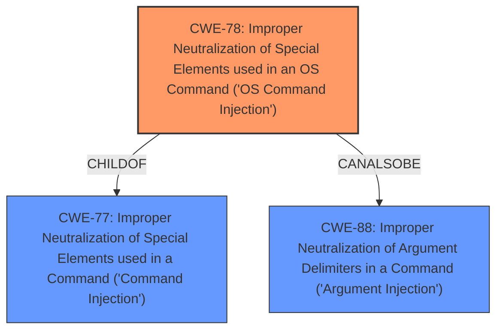

# Raw Analyzer Response for CVE-2022-43550

# Summary
| CWE ID | CWE Name | Confidence | CWE Abstraction Level | CWE Vulnerability Mapping Label | CWE-Vulnerability Mapping Notes |
|---|---|---|---|---|---|
| CWE-78 | Improper Neutralization of Special Elements used in an OS Command ('OS Command Injection') | 1.0 | Base | Primary | Allowed |
| CWE-77 | Improper Neutralization of Special Elements used in a Command ('Command Injection') | 0.7 | Class | Secondary | Allowed-with-Review |
| CWE-88 | Improper Neutralization of Argument Delimiters in a Command ('Argument Injection') | 0.6 | Base | Secondary | Allowed |

## Evidence and Confidence

*   **Confidence Score:** 0.8
*   **Evidence Strength:** HIGH

## Relationship Analysis
The primary CWE, CWE-78, is a base-level CWE and a child of CWE-77. CWE-88 is a peer of CWE-78, and can also be related to it. The abstraction levels were considered to select the most specific and accurate representation of the vulnerability.

## Vulnerability Chain
The vulnerability chain starts with **insufficient validation** of the URL, leading to the possibility of **command injection**, and ultimately resulting in **remote code execution**.

## Summary of Analysis
The initial assessment identified a **command injection** vulnerability due to **insufficient URL validation**. The retriever results suggested CWE-77, CWE-78, and CWE-88 as potential candidates. After reviewing the complete CWE specifications and considering the specific details of the vulnerability, CWE-78 was selected as the primary CWE because the **command injection** occurs in the context of an OS command. CWE-77 is a more general class of weakness and is therefore a less precise fit. CWE-88 might apply because the injection could involve argument delimiters, however the primary issue is the lack of neutralization of special elements, so this is less of a fit than CWE-78 and CWE-77.

The evidence from the vulnerability description, specifically the phrases "**command injection**" and "launching browsers on Windows which could allow an attacker to insert an arbitrary URL which opens up the opportunity to remote execution," strongly supports the selection of CWE-78. The "CVE Reference Links Content Summary" section confirms that the `openURL` function **does not properly** validate the input URL, leading to the possibility of arbitrary command execution.

The final selection of CWE-78 is based on the available evidence, relationship analysis, and mapping guidance, ensuring that the chosen CWE is at the optimal level of specificity and accurately represents the root cause of the vulnerability.

Relevant CWE Information:

# Enhanced Context (25 CWEs)
The following CWEs were identified as potentially relevant to this vulnerability:

## CWE-838: Inappropriate Encoding for Output Context
**Abstraction Level**: Base
**Similarity Score**: 0.76

## CWE-150: Improper Neutralization of Escape, Meta, or Control Sequences
**Abstraction Level**: Variant
**Similarity Score**: 0.73

## CWE-80: Improper Neutralization of Script-Related HTML Tags in a Web Page (Basic XSS)
**Abstraction Level**: Variant
**Similarity Score**: 0.72

## CWE-1289: Improper Validation of Unsafe Equivalence in Input
**Abstraction Level**: Base
**Similarity Score**: 0.72

## CWE-173: Improper Handling of Alternate Encoding
**Abstraction Level**: Variant
**Similarity Score**: 0.71

## CWE-74: Improper Neutralization of Special Elements in Output Used by a Downstream Component ('Injection')
**Abstraction Level**: Class
**Similarity Score**: 0.70

## CWE-115: Misinterpretation of Input
**Abstraction Level**: Base
**Similarity Score**: 0.70

## CWE-184: Incomplete List of Disallowed Inputs
**Abstraction Level**: Base
**Similarity Score**: 0.70

## CWE-917: Improper Neutralization of Special Elements used in an Expression Language Statement ('Expression Language Injection')
**Abstraction Level**: Base
**Similarity Score**: 0.70

## CWE-138: Improper Neutralization of Special Elements
**Abstraction Level**: Class
**Similarity Score**: 0.70

## CWE-116: Improper Encoding or Escaping of Output
**Abstraction Level**: Class
**Similarity Score**: 10923.21

## CWE-79: Improper Neutralization of Input During Web Page Generation ('Cross-site Scripting')
**Abstraction Level**: Base
**Similarity Score**: 10503.95

## CWE-88: Improper Neutralization of Argument Delimiters in a Command ('Argument Injection')
**Abstraction Level**: Base
**Similarity Score**: 10492.35

## CWE-138: Improper Neutralization of Special Elements
**Abstraction Level**: Class
**Similarity Score**: 10310.91

## CWE-1336: Improper Neutralization of Special Elements Used in a Template Engine
**Abstraction Level**: Base
**Similarity Score**: 10260.18

## CWE-79: Improper Neutralization of Input During Web Page Generation ('Cross-site Scripting')
**Abstraction Level**: base
**Similarity Score**: 5.03

## CWE-41: Improper Resolution of Path Equivalence
**Abstraction Level**: base
**Similarity Score**: 5.03

## CWE-78: Improper Neutralization of Special Elements used in an OS Command ('OS Command Injection')
**Abstraction Level**: base
**Similarity Score**: 4.47

## CWE-73: External Control of File Name or Path
**Abstraction Level**: base
**Similarity Score**: 4.33

## CWE-494: Download of Code Without Integrity Check
**Abstraction Level**: base
**Similarity Score**: 4.33

## CWE-22: Improper Limitation of a Pathname to a Restricted Directory ('Path Traversal')
**Abstraction Level**: base
**Similarity Score**: 4.33

## CWE-770: Allocation of Resources Without Limits or Throttling
**Abstraction Level**: base
**Similarity Score**: 4.33

## CWE-190: Integer Overflow or Wraparound
**Abstraction Level**: base
**Similarity Score**: 4.33

## CWE-94: Improper Control of Generation of Code ('Code Injection')
**Abstraction Level**: base
**Similarity Score**: 3.89

## CWE-88: Improper Neutralization of Argument Delimiters in a Command ('Argument Injection')
**Abstraction Level**: base
**Similarity Score**: 3.64

**CWE-78: Improper Neutralization of Special Elements used in an OS Command ('OS Command Injection')**

*   **How the vulnerability's details match the CWE's characteristics:** The vulnerability involves the product constructing an OS command using externally-influenced input (the URL), but it **does not neutralize** special elements, allowing modification of the intended command.
*   **The security implications and potential impact:** An attacker could execute arbitrary OS commands, potentially leading to complete system compromise.
*   **Any parent-child relationships or chain patterns that influenced your mapping:** CWE-78 is a child of CWE-77, indicating a more specific type of command injection. The chain involves **insufficient validation** leading to **command injection**.
*   **Whether the weakness is primary or secondary in the vulnerability:** Primary.
*   **How the official MITRE mapping guidance influenced your decision:** The MITRE mapping guidance recommends using the Base level of abstraction when possible, and CWE-78 is a Base-level CWE.

**CWE-77: Improper Neutralization of Special Elements used in a Command ('Command Injection')**

*   **How the vulnerability's details match the CWE's characteristics:** The vulnerability involves the product constructing a command using externally-influenced input (the URL), but it **does not neutralize** special elements, allowing modification of the intended command.
*   **The security implications and potential impact:** An attacker could execute arbitrary commands, potentially leading to unauthorized actions.
*   **Any parent-child relationships or chain patterns that influenced your mapping:** CWE-77 is a parent of CWE-78, indicating a more general type of command injection.
*   **Whether the weakness is primary or secondary in the vulnerability:** Secondary.
*   **How the official MITRE mapping guidance influenced your decision:** The MITRE mapping guidance