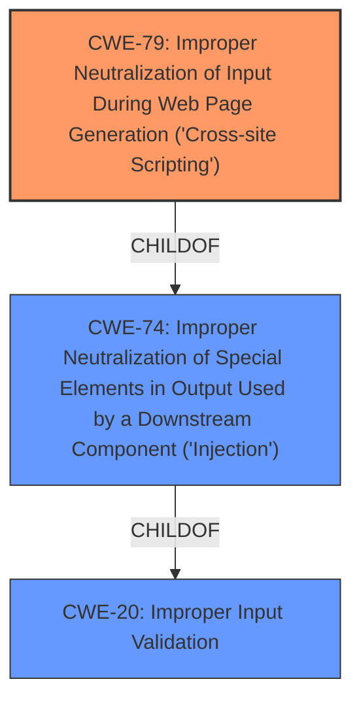

# Raw Analyzer Response for CVE-2022-43562

# Summary

| CWE ID | CWE Name | Confidence | CWE Abstraction Level | CWE Vulnerability Mapping Label | CWE-Vulnerability Mapping Notes |
|---|---|---|---|---|---|
| CWE-79 | Improper Neutralization of Input During Web Page Generation ('Cross-site Scripting') | 0.8 | Base | Allowed | Primary CWE |
| CWE-20 | Improper Input Validation | 0.5 | Class | Discouraged | Secondary Candidate |
| CWE-74 | Improper Neutralization of Special Elements in Output Used by a Downstream Component ('Injection') | 0.4 | Class | Discouraged | Secondary Candidate |

## Evidence and Confidence

*   **Confidence Score:** 0.8
*   **Evidence Strength:** HIGH

## Relationship Analysis

The primary relationship that influenced the decision was the parent-child relationship between CWE-79 and higher-level injection-related CWEs. The selection of CWE-79 was driven by the vulnerability's direct impact being Cross-site Scripting, making it a more specific and accurate representation of the weakness than its broader parent categories. Additionally, CWE-20, while relevant, was deemed too general as the core issue involves improper escaping of the Host header, leading directly to XSS.

## Vulnerability Chain

The vulnerability chain starts with the **failure to properly validate and escape the Host header**. This **root cause** leads directly to the possibility of **cross-site scripting (XSS)** and **cache poisoning**. The improper handling of the Host header allows an attacker to inject malicious scripts, which are then executed by the user's browser (XSS) or stored in a cache, affecting other users (cache poisoning).

## Summary of Analysis

The initial analysis focused on identifying the **root cause** of the vulnerability, which is the **failure to properly validate and escape the Host header**. The vulnerability description clearly states this: "**Splunk Enterprise fails to properly validate and escape the Host header**". The "CVE Reference Links Content Summary" reinforces this by stating: "**Root cause of vulnerability**: Splunk Enterprise fails to properly validate and escape the Host header."

Given the **root cause** and the resulting impact, several CWEs were considered, particularly those related to input validation and injection. The Retriever Results suggested CWE-74 (Improper Neutralization of Special Elements in Output Used by a Downstream Component ('Injection')) and CWE-20 (Improper Input Validation) as potential candidates. However, the specific impact of the vulnerability, namely cross-site scripting, made CWE-79 (Improper Neutralization of Input During Web Page Generation ('Cross-site Scripting')) the most appropriate choice.

CWE-79 is at the Base level of abstraction and directly addresses the XSS vulnerability resulting from the improper handling of the Host header. The MITRE mapping guidance allows the use of Base-level CWEs, making CWE-79 a suitable fit. While CWE-74 and CWE-20 are relevant, they are more general and do not specifically capture the XSS aspect of the vulnerability. Therefore, CWE-79 was selected as the primary CWE, with CWE-20 and CWE-74 considered as secondary candidates due to their relationship to input validation and injection.

# Relevant CWE Information:

## CWE-74: Improper Neutralization of Special Elements in Output Used by a Downstream Component ('Injection')
**Abstraction:** Class
**Status:** Incomplete

### Description
The product constructs all or part of a command, data structure, or record using externally-influenced input from an upstream component, but it does not neutralize or incorrectly neutralizes special elements that could modify how it is parsed or interpreted when it is sent to a downstream component.

## CWE-79: Improper Neutralization of Input During Web Page Generation ('Cross-site Scripting')
**Abstraction:** Base
**Status:** Stable

### Description
The product receives input from an upstream component, but it does not neutralize or incorrectly neutralizes special characters such as "<", ">", and "&" that could be interpreted as web-scripting elements when they are sent to a downstream component that processes web pages.

## CWE-20: Improper Input Validation
**Abstraction:** Class
**Status:** Stable

### Description
The product receives input or data, but it does not validate or incorrectly validates that the input has the properties that are required to process the data safely and correctly.