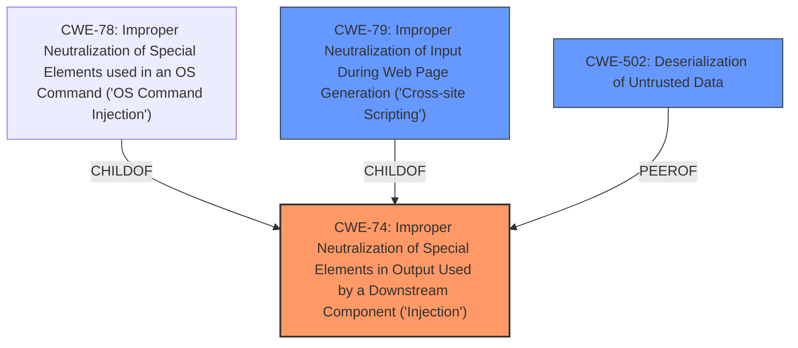

# Analysis Report for CVE-2022-43565

# Vulnerability Analysis Report: CVE-2022-43565

## Description


## Analysis (with Relationship Data)

# Summary
| CWE ID | CWE Name | Confidence | CWE Abstraction Level | CWE Vulnerability Mapping Label | CWE-Vulnerability Mapping Notes |
|---|---|---|---|---|---|
| CWE-74 | Improper Neutralization of Special Elements in Output Used by a Downstream Component ('Injection') | 0.7 | Class | Primary | Allowed-with-Review |
| CWE-502 | Deserialization of Untrusted Data | 0.6 | Base | Secondary | Allowed |
| CWE-79 | Improper Neutralization of Input During Web Page Generation ('Cross-site Scripting') | 0.5 | Base | Secondary | Allowed |

## Evidence and Confidence

*   **Confidence Score:** 0.7
*   **Evidence Strength:** MEDIUM

## Relationship Analysis
The primary relationship considered was that CWE-74 is a class-level CWE, and it has child CWEs like CWE-78 (OS Command Injection) and CWE-79 (Cross-site Scripting). The choice of CWE-74 reflects a general injection issue due to **improper input sanitization**. There's a CanFollow relationship from CWE-74 to other CWEs.



## Vulnerability Chain
The vulnerability chain starts with **improper input sanitization**, leading to the bypass of SPL safeguards. This results in the potential execution of risky commands.
- Root Cause: **Improper Input Sanitization**
- Weakness: Bypass of SPL safeguards
- Impact: Execution of risky commands

## Summary of Analysis
The initial assessment focused on the **improper input sanitization** as the root cause. The description mentions that the 'tstats' command improperly handles JSON, leading to the bypass of SPL safeguards.

The final decision is primarily based on the evidence provided in the vulnerability description and the CVE reference links. The relationship analysis and mapping guidance support the selection of CWE-74 as the primary CWE due to the general nature of the injection and **improper neutralization**. The other CWEs were considered based on the retriever results and their relevance to the vulnerability details, especially related to JSON handling and potential XSS.

CWE-74 is chosen at the Class level because the details do not clearly specify the exact type of injection but rather a general **improper neutralization** issue.

Relevant CWE Information:

# Enhanced Context (25 CWEs)

## CWE-74: Improper Neutralization of Special Elements in Output Used by a Downstream Component ('Injection')
**Abstraction Level**: Class
**Similarity Score**: 0.78
**Source**: dense

**Description**:
The product constructs all or part of a command, data structure, or record using externally-influenced input from an upstream component, but it does not neutralize or incorrectly neutralizes special elements that could modify how it is parsed or interpreted when it is sent to a downstream component.

**Mapping Guidance**:
- Usage: Discouraged
- Rationale: CWE-74 is high-level and often misused when lower-level weaknesses are more appropriate.

**Justification:** The vulnerability description explicitly mentions that the 'tstats' command **improperly handles JSON**, which allows an attacker to bypass SPL safeguards. This indicates a failure to neutralize special elements in the input, leading to unintended behavior. While CWE-74 is discouraged as a high-level CWE, the current evidence does not pinpoint a more specific injection type.

## CWE-502: Deserialization of Untrusted Data
**Abstraction Level**: Base
**Similarity Score**: 0.75
**Source**: dense

**Description**:
The product deserializes untrusted data without sufficiently ensuring that the resulting data will be valid.

**Mapping Guidance**:
- Usage: Allowed
- Rationale: This CWE entry is at the Base level of abstraction, which is a preferred level of abstraction for mapping to the root causes of vulnerabilities.

**Justification:** Since the vulnerability involves **improper handling of JSON**, which is a data serialization format, CWE-502 is a relevant consideration. The 'tstats' command processes JSON data, and **improper handling** could lead to the deserialization of untrusted data without proper validation.

## CWE-79: Improper Neutralization of Input During Web Page Generation ('Cross-site Scripting')
**Abstraction Level**: Base
**Similarity Score**: 10333.01
**Source**: sparse

**Description**:
The product does not neutralize or incorrectly neutralizes user-controllable input before it is placed in output that is used as a web page that is served to other users.

**Mapping Guidance**:
- Usage: Allowed
- Rationale: This CWE entry is at the Base level of abstraction, which is a preferred level of abstraction for mapping to the root causes of vulnerabilities.

**Justification:** The vulnerability description mentions that the attacker needs to phish the victim into initiating a request within their browser. Since XSS involves tricking a user's browser to execute malicious code, it's possible that the **improper handling of JSON** could lead to XSS if the data is reflected in a web page.

## Other CWEs Considered but Not Used:
- CWE-20: Improper Input Validation: Although **improper input sanitization** is mentioned, CWE-20 is discouraged due to its high-level nature. CWE-74 is a more specific Class-level CWE related to injection, making it a better fit.
- CWE-78: Improper Neutralization of Special Elements used in an OS Command ('OS Command Injection'): While the vulnerability involves the execution of risky commands, there's no explicit mention of OS commands being injected. Therefore, CWE-78 is not selected.
- CWE-94: Improper Control of Generation of Code ('Code Injection'): Similar to CWE-78, there's no direct evidence of code injection. The vulnerability focuses on the bypass of SPL safeguards rather than the injection of arbitrary code.
- CWE-918: Server-Side Request Forgery (SSRF): There is no evidence that the server is being forced to make requests to unexpected destinations. The issue is with command execution within Splunk.


## CWE Relationship Analysis

Current CWEs represent these abstraction levels: .


### Vulnerability Chain Analysis

**Chain starting from CWE-918:**
- 918 (Server-Side Request Forgery (SSRF)) - ROOT


**Chain starting from CWE-20:**
- 20 (Improper Input Validation) - ROOT


### CWE Relationship Diagram

```mermaid
graph TD
    classDef primary fill:#f96,stroke:#333,stroke-width:2px
    classDef secondary fill:#69f,stroke:#333
    classDef tertiary fill:#9e9,stroke:#333
```


*Report generated on 2025-03-30 21:08:12*
