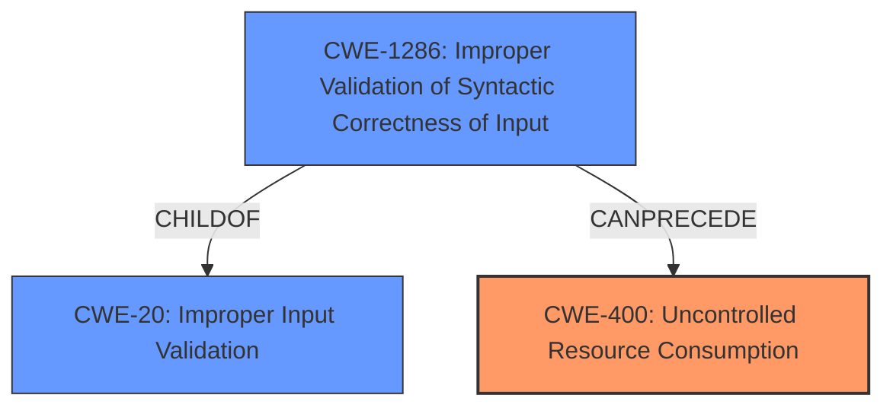

# Analysis Report for CVE-2022-43572

# Vulnerability Analysis Report: CVE-2022-43572

## Description


## Analysis (with Relationship Data)

# Summary

| CWE ID | CWE Name | Confidence | CWE Abstraction Level | CWE Vulnerability Mapping Label | CWE-Vulnerability Mapping Notes |
|---|---|---|---|---|---|
| CWE-400 | Uncontrolled Resource Consumption | 0.8 | Class | Allowed-with-Review | Primary CWE |
| CWE-1286 | Improper Validation of Syntactic Correctness of Input | 0.7 | Base | Allowed | Secondary Candidate |
| CWE-20 | Improper Input Validation | 0.6 | Class | Discouraged | Secondary Candidate |

## Evidence and Confidence

*   **Confidence Score:** 0.8
*   **Evidence Strength:** MEDIUM

## Relationship Analysis
The primary CWE, CWE-400 [CWE-400: Uncontrolled Resource Consumption], is a Class that has children CWEs such as CWE-770 [CWE-770: Allocation of Resources Without Limits or Throttling], CWE-771 [CWE-771: Missing Reference to Active Allocated Resource], CWE-410 [CWE-410: Insufficient Resource Pool], CWE-772 [CWE-772: Missing Release of Resource after Effective Lifetime], and CWE-834 [CWE-834: Excessive Iteration] which could be considered if there was evidence for any of them.
CWE-1286 [CWE-1286: Improper Validation of Syntactic Correctness of Input] is a child of CWE-20 [CWE-20: Improper Input Validation], indicating a more specific form of input validation failure. CWE-20 is a higher-level class that could be used if insufficient information existed to assign a more specific CWE.



## Vulnerability Chain
The vulnerability chain starts with a **malformed file handling** weakness, leading to an uncontrolled resource consumption, and culminating in a blockage or denial-of-service.

## Summary of Analysis
The initial assessment focused on identifying the root cause of the denial-of-service. The vulnerability description indicates that sending a **malformed file** through specific protocols leads to a blockage preventing further indexing.

The primary selection is CWE-400 [CWE-400: Uncontrolled Resource Consumption] due to the resulting denial-of-service. The malformed file leads to resource exhaustion, preventing further indexing. The description of CWE-400 matches this scenario: "The product does not properly control the allocation and maintenance of a limited resource, thereby enabling an actor to influence the amount of resources consumed, eventually leading to the exhaustion of available resources."

CWE-1286 [CWE-1286: Improper Validation of Syntactic Correctness of Input] was considered because the vulnerability involves **malformed files**, suggesting a failure to properly validate the syntactic correctness of the input. The description of CWE-1286 states: "The product receives input that is expected to be well-formed - i.e., to comply with a certain syntax - but it does not validate or incorrectly validates that the input complies with the syntax." This is a reasonable secondary candidate.

CWE-20 [CWE-20: Improper Input Validation] was considered as a general case of input validation failure. However, CWE-1286 [CWE-1286: Improper Validation of Syntactic Correctness of Input] is a more specific and appropriate choice.

The selection of CWE-400 [CWE-400: Uncontrolled Resource Consumption] as the primary CWE is based on the evidence that a **malformed file** causes a blockage or denial-of-service, indicating uncontrolled resource consumption.

The provided evidence is: "sending a **malformed file** through the Splunk-to-Splunk (S2S) or HTTP Event Collector (HEC) protocols to an indexer results in a blockage or denial-of-service preventing further indexing."

The decision to use CWE-400 [CWE-400: Uncontrolled Resource Consumption] is at the Class level, but due to the nature of the vulnerability, it is the most appropriate representation.

Relevant CWE Information:

# Enhanced Context (25 CWEs)

## CWE-131: Incorrect Calculation of Buffer Size
**Abstraction Level**: Base
**Similarity Score**: 0.75
**Source**: dense

**Description**:
The product does not correctly calculate the size to be used when allocating a buffer, which could lead to a buffer overflow.

**Mapping Guidance**:
- Usage: Allowed
- Rationale: This CWE entry is at the Base level of abstraction, which is a preferred level of abstraction for mapping to the root causes of vulnerabilities.

## CWE-226: Sensitive Information in Resource Not Removed Before Reuse
**Abstraction Level**: Base
**Similarity Score**: 0.74
**Source**: dense

**Description**:
The product releases a resource such as memory or a file so that it can be made available for reuse, but it does not clear or "zeroize" the information contained in the resource before the product performs a critical state transition or makes the resource available for reuse by other entities.

**Mapping Guidance**:
- Usage: Allowed
- Rationale: This CWE entry is at the Base level of abstraction, which is a preferred level of abstraction for mapping to the root causes of vulnerabilities.

## CWE-404: Improper Resource Shutdown or Release
**Abstraction Level**: Class
**Similarity Score**: 0.74
**Source**: dense

**Description**:
The product does not release or incorrectly releases a resource before it is made available for re-use.

**Mapping Guidance**:
- Usage: Allowed-with-Review
- Rationale: This CWE entry is a Class and might have Base-level children that would be more appropriate

## CWE-1325: Improperly Controlled Sequential Memory Allocation
**Abstraction Level**: Base
**Similarity Score**: 0.74
**Source**: dense

**Description**:
The product manages a group of objects or resources and performs a separate memory allocation for each object, but it does not properly limit the total amount of memory that is consumed by all of the combined objects.

**Mapping Guidance**:
- Usage: Allowed
- Rationale: This CWE entry is at the Base level of abstraction, which is a preferred level of abstraction for mapping to the root causes of vulnerabilities.

## CWE-191: Integer Underflow (Wrap or Wraparound)
**Abstraction Level**: Base
**Similarity Score**: 0.74
**Source**: dense

**Description**:
The product subtracts one value from another, such that the result is less than the minimum allowable integer value, which produces a value that is not equal to the correct result.

**Mapping Guidance**:
- Usage: Allowed
- Rationale: This CWE entry is at the Base level of abstraction, which is a preferred level of abstraction for mapping to the root causes of vulnerabilities.

## CWE-668: Exposure of Resource to Wrong Sphere
**Abstraction Level**: Class
**Similarity Score**: 0.74
**Source**: dense

**Description**:
The product exposes a resource to the wrong control sphere, providing unintended actors with inappropriate access to the resource.

**Mapping Guidance**:
- Usage: Discouraged
- Rationale: CWE-668 is high-level and is often misused as a catch-all when lower-level CWE IDs might be applicable. It is sometimes used for low-information vulnerability reports [REF-1287]. It is a level-1 Class (i.e., a child of a Pillar). It is not useful for trend analysis.

## CWE-1289: Improper Validation of Unsafe Equivalence in Input
**Abstraction Level**: Base
**Similarity Score**: 0.74
**Source**: dense

**Description**:
The product receives an input value that is used as a resource identifier or other type of reference, but it does not validate or incorrectly validates that the input is equivalent to a potentially-unsafe value.

**Mapping Guidance**:
- Usage: Allowed
- Rationale: This CWE entry is at the Base level of abstraction, which is a preferred level of abstraction for mapping to the root causes of vulnerabilities.

## CWE-125: Out-of-bounds Read
**Abstraction Level**: Base
**Similarity Score**: 0.74
**Source**: dense

**Description**:
The product reads data past the end, or before the beginning, of the intended buffer.

**Mapping Guidance**:
- Usage: Allowed
- Rationale: This CWE entry is at the Base level of abstraction, which is a preferred level of abstraction for mapping to the root causes of vulnerabilities.


## CWE Relationship Analysis

Current CWEs represent these abstraction levels: .


### Vulnerability Chain Analysis

**Chain starting from CWE-131:**
- 131 (Incorrect Calculation of Buffer Size) - ROOT


**Chain starting from CWE-226:**
- 226 (Sensitive Information in Resource Not Removed Before Reuse) - ROOT


### CWE Relationship Diagram

```mermaid
graph TD
    classDef primary fill:#f96,stroke:#333,stroke-width:2px
    classDef secondary fill:#69f,stroke:#333
    classDef tertiary fill:#9e9,stroke:#333
```


*Report generated on 2025-03-30 17:43:45*
