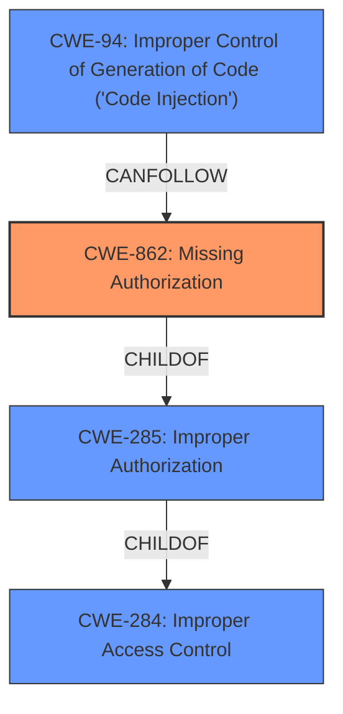

# Raw Analyzer Response for CVE-2022-43581

# Summary
| CWE ID  | CWE Name                                                                   | Confidence | CWE Abstraction Level | CWE Vulnerability Mapping Label | CWE-Vulnerability Mapping Notes |
| ------- | -------------------------------------------------------------------------- | ---------- | --------------------- | ------------------------------- | ------------------------------- |
| CWE-862 | Missing Authorization                                                      | 0.9        | Class                 | Primary                         | Allowed-with-Review           |
| CWE-94  | Improper Control of Generation of Code ('Code Injection')                 | 0.6        | Base                  | Secondary                       | Allowed-with-Review           |

## Evidence and Confidence

*   **Confidence Score:** 0.8
*   **Evidence Strength:** HIGH

## Relationship Analysis
The primary relationship that influenced the decision was the hierarchical relationship between CWE-284 (Improper Access Control), CWE-285 (Improper Authorization), and CWE-862 (Missing Authorization). CWE-862 is a child of CWE-285, which is a child of CWE-284. This hierarchy suggests that CWE-862 is a more specific classification for this vulnerability than its parents. The description clearly states a **missing authorization** issue, leading to the selection of CWE-862. Additionally, the potential impact of code execution suggests a possible chain relationship leading to CWE-94, but the evidence for direct code injection is not strong.

## Vulnerability Chain
The vulnerability chain starts with the **missing authorization** (**CWE-862**). This allows an authenticated user to load external plugins and execute code (**CWE-94**).
  - **Root Cause:** Missing Authorization (CWE-862)
  - **Impact:** Code Execution (CWE-94)

## Summary of Analysis
The initial analysis focused on the **missing authorization** aspect of the vulnerability. The "Vulnerability Description Key Phrases" section explicitly mentions "**missing authorization**" as the root cause. The "CVE Reference Links Content Summary" also states that the root cause is **missing authorization**, which allows an authenticated user to load external plugins.

The Retriever Results highlighted CWE-284 (Improper Access Control), CWE-639 (Authorization Bypass Through User-Controlled Key), CWE-863 (Incorrect Authorization), CWE-862 (Missing Authorization), and CWE-285 (Improper Authorization) as potential candidates. However, considering the specific **missing authorization** aspect, CWE-862 aligns best with the vulnerability description.

CWE-284 is too high-level (Pillar) and is discouraged by MITRE. CWE-639 involves user-controlled keys, which isn't explicitly mentioned. CWE-863 describes *incorrect* authorization, whereas the described vulnerability involves *missing* authorization. CWE-285 is a Class that encompasses both missing and incorrect authorization, but CWE-862 is more specific.

The possibility of code execution led to the consideration of CWE-94 (Improper Control of Generation of Code ('Code Injection')), since the **impact** allows an authenticated user to load external plugins and execute code. This could be a secondary weakness, but the evidence is not strong enough to make it a primary one.

The final decision favors CWE-862 as the primary CWE due to the explicit mention of **missing authorization**. It is also at the Class level, which is the most specific level for which there is strong evidence.

Relevant CWE Information:

# Enhanced Context (25 CWEs)
The following CWEs were identified as potentially relevant to this vulnerability:

## CWE-1240: Use of a Cryptographic Primitive with a Risky Implementation
**Abstraction Level**: Base
**Similarity Score**: 0.77
**Source**: dense

**Description**:
To fulfill the need for a cryptographic primitive, the product implements a cryptographic algorithm using a non-standard, unproven, or disallowed/non-compliant cryptographic implementation.
**Not Used**: This vulnerability doesn't involve cryptographic primitives.

## CWE-345: Insufficient Verification of Data Authenticity
**Abstraction Level**: Class
**Similarity Score**: 0.77
**Source**: dense

**Description**:
The product does not sufficiently verify the origin or authenticity of data, in a way that causes it to accept invalid data.
**Not Used**: This vulnerability doesn't focus on data authenticity.

## CWE-1391: Use of Weak Credentials
**Abstraction Level**: Class
**Similarity Score**: 0.77
**Source**: dense

**Description**:
The product uses weak credentials (such as a default key or hard-coded password) that can be calculated, derived, reused, or guessed by an attacker.
**Not Used**: The vulnerability description doesn't mention weak credentials.

## CWE-330: Use of Insufficiently Random Values
**Abstraction Level**: Class
**Similarity Score**: 0.77
**Source**: dense

**Description**:
The product uses insufficiently random numbers or values in a security context that depends on unpredictable numbers.
**Not Used**: Random number generation is not related to this vulnerability.

## CWE-807: Reliance on Untrusted Inputs in a Security Decision
**Abstraction Level**: Base
**Similarity Score**: 0.76
**Source**: dense

**Description**:
The product uses a protection mechanism that relies on the existence or values of an input, but the input can be modified by an untrusted actor in a way that bypasses the protection mechanism.
**Not Used**: The vulnerability centers on missing, not bypassed, authorization.

## CWE-303: Incorrect Implementation of Authentication Algorithm
**Abstraction Level**: Base
**Similarity Score**: 0.76
**Source**: dense

**Description**:
The requirements for the product dictate the use of an established authentication algorithm, but the implementation of the algorithm is incorrect.
**Not Used**: The issue is with authorization, not authentication implementation.

## CWE-328: Use of Weak Hash
**Abstraction Level**: Base
**Similarity Score**: 0.76
**Source**: dense

**Description**:
The product uses an algorithm that produces a digest (output value) that does not meet security expectations for a hash function that allows an adversary to reasonably determine the original input (preimage attack), find another input that can produce the same hash (2nd preimage attack), or find multiple inputs that evaluate to the same hash (birthday attack).
**Not Used**: Hashing algorithms are not mentioned in the vulnerability.

## CWE-41: Improper Resolution of Path Equivalence
**Abstraction Level**: Base
**Similarity Score**: 0.76
**Source**: dense

**Description**:
The product is vulnerable to file system contents disclosure through path equivalence. Path equivalence involves the use of special characters in file and directory names. The associated manipulations are intended to generate multiple names for the same object.
**Not Used**: Path equivalence is not related to this vulnerability.

## CWE-668: Exposure of Resource to Wrong Sphere
**Abstraction Level**: Class
**Similarity Score**: 0.76
**Source**: dense

**Description**:
The product exposes a resource to the wrong control sphere, providing unintended actors with inappropriate access to the resource.
**Not Used**: Too generic; CWE-862 is more specific.

## CWE-319: Cleartext Transmission of Sensitive Information
**Abstraction Level**: Base
**Similarity Score**: 0.76
**Source**: dense

**Description**:
The product transmits sensitive or security-critical data in cleartext in a communication channel that can be sniffed by unauthorized actors.
**Not Used**: Cleartext transmission is not part of this vulnerability.

## CWE-639: Authorization Bypass Through User-Controlled Key
**Abstraction Level**: Base
**Similarity Score**: 7272.83
**Source**: sparse

**Description**:
The system's authorization functionality does not prevent one user from gaining access to another user's data or record by modifying the key value identifying the data.
**Not Used**: The description does not mention that the user controls the key that is used for authorization.

## CWE-863: Incorrect Authorization
**Abstraction Level**: Class
**Similarity Score**: 7036.20
**Source**: sparse

**Description**:
The product performs an authorization check when an actor attempts to access a resource or perform an action, but it does not correctly perform the check.
**Not Used**: The description says that authorization is missing, not performed incorrectly.

## CWE-22: Improper Limitation of a Pathname to a Restricted Directory ('