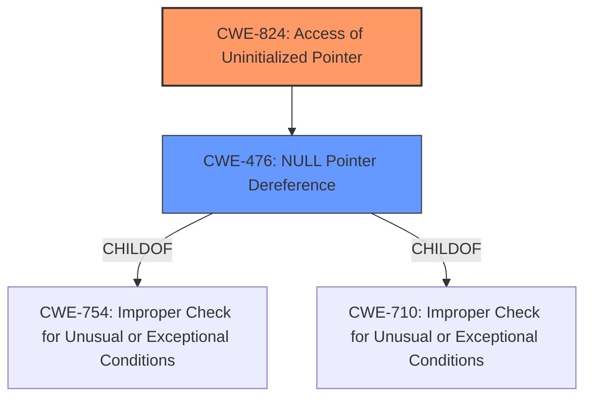

# Raw Analyzer Response for CVE-2022-43606

# Summary
| CWE ID | CWE Name | Confidence | CWE Abstraction Level | CWE Vulnerability Mapping Label | CWE-Vulnerability Mapping Notes |
|---|---|---|---|---|---|
| CWE-824 | Access of Uninitialized Pointer | 1 | Base | Allowed | Primary CWE |
| CWE-476 | NULL Pointer Dereference | 0.7 | Base | Allowed | Secondary CWE |

## Evidence and Confidence

*   **Confidence Score:** 0.85
*   **Evidence Strength:** HIGH

## Relationship Analysis
The primary CWE identified is CWE-824, which is a base-level weakness describing the access of an uninitialized pointer. This is directly supported by the vulnerability description's focus on a **use-of-uninitialized-pointer** as the root cause. CWE-476, NULL Pointer Dereference, is a child of CWE-754 (Improper Check for Unusual or Exceptional Conditions) and CWE-710 (NULL Pointer Dereference). CWE-824 can precede CWE-787 (Out-of-bounds Write) and CWE-125 (Out-of-bounds Read). The relationship between CWE-824 and CWE-476 is that an uninitialized pointer can often lead to a null pointer dereference if its value happens to be NULL.

## Vulnerability Chain
The vulnerability chain starts with the **use of an uninitialized pointer** (CWE-824). This **uninitialized pointer** is then dereferenced, leading to a NULL pointer dereference (CWE-476) and ultimately a crash (denial of service).

## Summary of Analysis
The initial analysis strongly suggests CWE-824 (Access of Uninitialized Pointer) as the primary weakness. The vulnerability description explicitly states that a **use-of-uninitialized-pointer** exists. The CVE Reference Links Content Summary confirms this, stating "The vulnerability stems from a **use-of-uninitialized-pointer** in the `Forward Open connection_management_entry` functionality." The retriever results also list CWE-824 as the top combined result. CWE-476 (NULL Pointer Dereference) is added as a secondary CWE because the dereference of the **uninitialized pointer** leads to a crash, suggesting it was a NULL pointer.

The decision to use CWE-824 is based on the evidence directly pointing to the **use of an uninitialized pointer** as the root cause. The selection of CWE-824 is at the optimal level of specificity, as it precisely describes the nature of the weakness. CWE-476 is included to reflect the consequence of the **uninitialized pointer** being dereferenced when it contains a NULL value, leading to the crash.

Relevant CWE Information: