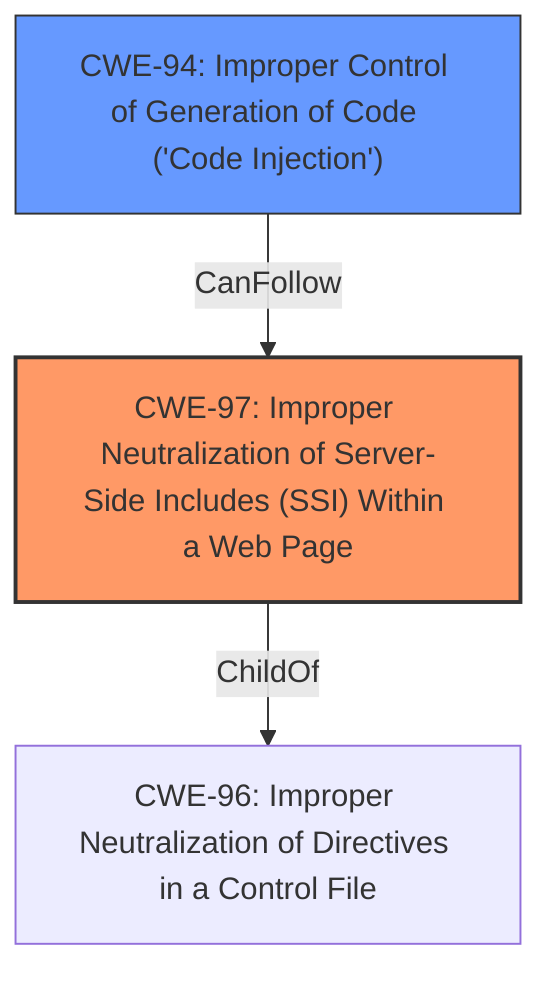

# Raw Analyzer Response for CVE-2022-43660

# Summary
| CWE ID | CWE Name | Confidence | CWE Abstraction Level | CWE Vulnerability Mapping Label | CWE-Vulnerability Mapping Notes |
|---|---|---|---|---|---|
| CWE-97 | Improper Neutralization of Server-Side Includes (SSI) Within a Web Page | 1.0 | Variant | Allowed | Primary CWE |
| CWE-94 | Improper Control of Generation of Code ('Code Injection') | 0.7 | Base | Allowed-with-Review | Secondary Candidate |

## Evidence and Confidence

*   **Confidence Score:** 0.85
*   **Evidence Strength:** HIGH

## Relationship Analysis
The primary CWE is CWE-97, a Variant of CWE-96. CWE-94 is a possible alternate as code injection is a result.

## Vulnerability Chain
The vulnerability chain starts with the **improper neutralization of SSI**, leading to the ability to **execute arbitrary Perl scripts and/or arbitrary OS commands**.

## Summary of Analysis
The initial assessment and conclusion are based on the provided evidence, specifically the vulnerability description and CVE reference summary, which explicitly mentions **"Improper neutralization of Server-Side Includes"** as the root cause. The graph relationships confirm the hierarchical structure, with CWE-97 being a specific variant of a broader class.

> Vulnerability Description: **Improper neutralization of Server-Side Includes** (SSW) within a web page in Movable Type series allows a remote authenticated attacker with Privilege of Manage of Content Types may execute an arbitrary Perl script and/or an arbitrary OS command.

> CVE Reference Links Content Summary: **Root Cause of Vulnerability:** Improper Neutralization of Server-Side Includes (SSI) within a web page. This means the application is not properly sanitizing or escaping user-provided input when it is used in Server-Side Includes, which could lead to the execution of unintended code.

CWE-97 is selected because it directly addresses the identified weakness, and it's at the optimal level of specificity (Variant). CWE-94 is considered as a secondary candidate because the impact includes code execution, but the root cause is the **improper neutralization of SSI**.

Relevant CWE Information:

# Enhanced Context (25 CWEs)

## CWE-97: Improper Neutralization of Server-Side Includes (SSI) Within a Web Page
**Abstraction:** Variant

### Description
The product generates a web page, but does not neutralize or incorrectly neutralizes user-controllable input that could be interpreted as a server-side include (SSI) directive.

### Mapping Guidance
**Usage:** Allowed
**Rationale:** This CWE entry is at the Variant level of abstraction, which is a preferred level of abstraction for mapping to the root causes of vulnerabilities.

## CWE-94: Improper Control of Generation of Code ('Code Injection')
**Abstraction:** Base

### Description
The product constructs all or part of a code segment using externally-influenced input from an upstream component, but it does not neutralize or incorrectly neutralizes special elements that could modify the syntax or behavior of the intended code segment.

### Mapping Guidance
**Usage:** Allowed-with-Review
**Rationale:** This entry is frequently misused for vulnerabilities with a technical impact of "code execution," which does not by itself indicate a root cause weakness, since dozens of weaknesses can enable code execution.