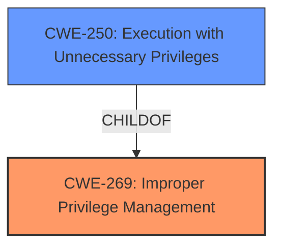

# Analysis for CVE-2022-43863

# Summary
| CWE ID | CWE Name | Confidence | CWE Abstraction Level | CWE Vulnerability Mapping Label | CWE-Vulnerability Mapping Notes |
|---|---|---|---|---|---|
| CWE-269 | Improper Privilege Management | 0.8 | Class | Primary | Allowed-with-Review |
| CWE-250 | Execution with Unnecessary Privileges | 0.6 | Base | Secondary | Allowed |

## Evidence and Confidence

*   **Confidence Score:** 0.7
*   **Evidence Strength:** MEDIUM

## Relationship Analysis
The primary CWE is CWE-269, Improper Privilege Management, which is a Class-level CWE. A potential secondary CWE is CWE-250, Execution with Unnecessary Privileges, which is a Base-level CWE and a child of CWE-269. The relationships helped in identifying a more specific root cause related to privilege management.

## Vulnerability Chain
The vulnerability chain involves a user with some admin capabilities (**ROOT CAUSE: Improper Privilege Management**) gaining additional admin capabilities (**IMPACT: Privilege Escalation**).

## Summary of Analysis
The initial analysis focused on identifying the root cause of the privilege escalation. The key phrase "allows a user with some admin capabilities to gain additional admin capabilities" suggests a flaw in how privileges are managed within the system.

The primary CWE is CWE-269, Improper Privilege Management. The vulnerability description indicates a **failure** in the system's ability to properly manage user privileges, allowing a user with limited admin rights to escalate their privileges.

CWE-250, Execution with Unnecessary Privileges, was considered as a potential secondary CWE. If the system was running with higher privileges than necessary, this could have amplified the impact of the **improper** privilege management, allowing the escalation to occur more easily. However, there isn't strong evidence to support the application is running with unnecessary privileges, so its confidence level is lower and is considered as a secondary candidate.

The retriever results also suggested other CWEs like CWE-322 (Key Exchange without Entity Authentication), CWE-326 (Inadequate Encryption Strength), CWE-319 (Cleartext Transmission of Sensitive Information), but these do not fit the **improper** privilege management scenario.

Relevant CWE Information:

# Enhanced Context (25 CWEs)
The following CWEs were identified as potentially relevant to this vulnerability:

## CWE-668: Exposure of Resource to Wrong Sphere
**Abstraction Level**: Class
**Similarity Score**: 0.77
**Source**: dense

**Description**:
The product exposes a resource to the wrong control sphere, providing unintended actors with inappropriate access to the resource.

**Mapping Guidance**:
- Usage: Discouraged
- Rationale: CWE-668 is high-level and is often misused as a catch-all when lower-level CWE IDs might be applicable. It is sometimes used for low-information vulnerability reports [REF-1287]. It is a level-1 Class (i.e., a child of a Pillar). It is not useful for trend analysis.

## CWE-269: Improper Privilege Management
**Abstraction:** Class
**Status:** Draft

### Description
The product does not properly assign, modify, track, or check privileges for an actor, creating an unintended sphere of control for that actor.

### Extended Description
Not provided

### Alternative Terms
None

### Relationships
ChildOf -> CWE-284

### Mapping Guidance
**Usage:** Discouraged
**Rationale:** CWE-269 is commonly misused. It can be conflated with "privilege escalation," which is a technical impact that is listed in many low-information vulnerability reports [REF-1287]. It is not useful for trend analysis.
**Comments:** If an error or mistake allows privilege escalation, then use the CWE ID for that mistake. Avoid using CWE-269 when only phrases such as "privilege escalation" or "gain privileges" are available, as these indicate technical impact of the vulnerability - not the root cause weakness. If the root cause seems to be directly related to privileges, then examine the children of CWE-269 for additional hints, such as Execution with Unnecessary Privileges (CWE-250) or Incorrect Privilege Assignment (CWE-266).
**Reasons:**
- Frequent Misuse

### CWE-250: Execution with Unnecessary Privileges
**Abstraction:** Base
**Status:** Draft

### Description
The product performs an operation at a privilege level that is higher than the minimum level required, which creates new weaknesses or amplifies the consequences of other weaknesses.

### Mapping Guidance**Usage:** Allowed
**Rationale:** This CWE entry is at the Base level of abstraction, which is a preferred level of abstraction for mapping to the root causes of vulnerabilities.

### Explanation of Selected CWEs:

*   **CWE-269: Improper Privilege Management**
    *   The vulnerability allows a user with some admin capabilities to gain *additional* admin capabilities. This directly aligns with the description of CWE-269, which states that the product does not properly assign, modify, track, or check privileges for an actor.
    *   The impact is privilege escalation, where a user gains higher-level administrative privileges than they were initially granted.
    *   CWE-269 is a class-level CWE, but it is the most appropriate given the available information. The mapping guidance advises against using CWE-269 when only phrases like "privilege escalation" are available, but in this case, the description clearly indicates a problem with privilege management.
    *   Confidence: 0.8
*   **CWE-250: Execution with Unnecessary Privileges**
    *   The vulnerability may have been amplified by the application running with more privileges than necessary. If the system had been running with only the minimum required privileges, the impact of the **improper** privilege management might have been less severe.
    *   CWE-250 is a Base-level CWE, making it more specific than CWE-269.
    *   Confidence: 0.6

### Explanation of Omitted CWEs:

*   CWE-322, CWE-326, and CWE-319 were not selected because they relate to key exchange, encryption strength, and cleartext transmission, respectively. These vulnerabilities are not related to the privilege escalation issue described in the vulnerability description.
*   CWE-732, Incorrect Permission Assignment for Critical Resource, was considered but not selected because the vulnerability focuses on the management of user privileges rather than the assignment of permissions to specific resources.