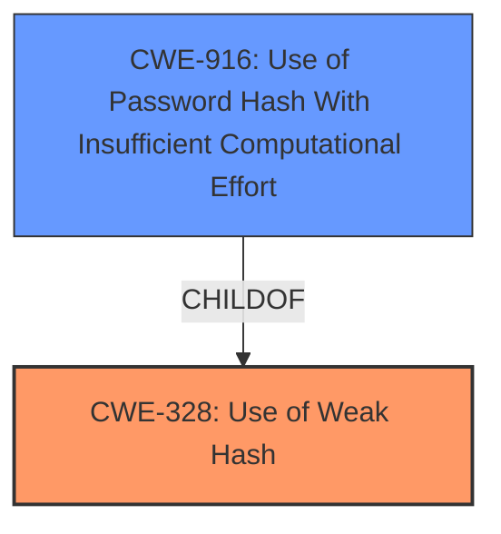

# Enhanced Analysis for CVE-2022-43922

# Summary
| CWE ID | CWE Name | Confidence | CWE Abstraction Level | CWE Vulnerability Mapping Label | CWE-Vulnerability Mapping Notes |
|---|---|---|---|---|---|
| CWE-328 | Use of Weak Hash | 1.0 | Base | Primary | Allowed |
| CWE-916 | Use of Password Hash With Insufficient Computational Effort | 0.8 | Base | Secondary | Allowed |

## Evidence and Confidence

*   **Confidence Score:** 0.9
*   **Evidence Strength:** HIGH

## Relationship Analysis
The primary relationship impacting the decision is that CWE-328 **Use of Weak Hash** is a parent of CWE-916 **Use of Password Hash With Insufficient Computational Effort**. CWE-328 is selected as the primary because the vulnerability is specifically about the use of a weak hash algorithm, without necessarily being exclusively related to passwords. If the API key was being used as a password, then CWE-916 would be the better choice. However, in this case, it is more general and the hash is used to generate a secret name, not specifically for password storage or authentication.



## Vulnerability Chain
The chain of events is as follows:
1.  **Root Cause:** **Weak hash of an API Key in the configuration** (CWE-328)
2.  The IBM App Connect Enterprise Certified Container operator uses a **weak hashing algorithm** to generate the secret name if one is not manually created.
3.  This could expose the API key through the name of the secret.
4.  **Impact:** Loss of confidentiality of the API key. An attacker may gain access to the API Key based on the weak hash being used to generate the secret name.

## Summary of Analysis
The initial analysis pointed to CWE-328 **Use of Weak Hash** as the primary weakness due to the **rootcause** being a **weak hash of an API Key in the configuration**. The CVE Reference Links Content Summary confirmed this by stating the use of a **weak hashing algorithm** to create the secret name.

The retriever results also listed CWE-328 as the top match. The relationship graph shows that CWE-328 is a parent of CWE-916, which could be a secondary weakness if the API key was being used as a password. However, in this case, it is more general and the hash is used to generate a secret name.

The evidence from the Vulnerability Description Key Phrases and CVE Reference Links Content Summary, combined with the retriever results and relationship analysis, supports the selection of CWE-328 as the primary weakness.

The selected CWE is at the optimal level of specificity because it directly addresses the root cause of the vulnerability, which is the use of a **weak hash**.

Other CWEs Considered:

*   CWE-327 **Use of a Broken or Risky Cryptographic Algorithm**: Considered but not used because it is a class-level CWE and CWE-328 provides a more specific base-level mapping.
*   CWE-916 **Use of Password Hash With Insufficient Computational Effort**: Considered as a possible secondary CWE, but only if the API key was used as a password. Ultimately, the hashing algorithm was not used for a password, so this CWE was deemed less accurate.
*   CWE-522 **Insufficiently Protected Credentials**: This CWE addresses the broader issue of how credentials are protected, but CWE-328 is more specific to the hashing algorithm itself.
*   CWE-639 **Authorization Bypass Through User-Controlled Key**: This CWE is related to authorization bypass, which is not the primary issue in this vulnerability. The main issue is the use of a weak hash, not the authorization mechanism.

Relevant CWE Information:

# Enhanced Context (25 CWEs)
The following CWEs were identified as potentially relevant to this vulnerability:

## CWE-916: Use of Password Hash With Insufficient Computational Effort
**Abstraction Level**: Base
**Similarity Score**: 0.80
**Source**: dense

**Description**:
The product generates a hash for a password, but it uses a scheme that does not provide a sufficient level of computational effort that would make password cracking attacks infeasible or expensive.

**Mapping Guidance**:
- Usage: Allowed
- Rationale: This CWE entry is at the Base level of abstraction, which is a preferred level of abstraction for mapping to the root causes of vulnerabilities.


## CWE-328: Use of Weak Hash
**Abstraction Level**: Base
**Similarity Score**: 0.79
**Source**: dense

**Description**:
The product uses an algorithm that produces a digest (output value) that does not meet security expectations for a hash function that allows an adversary to reasonably determine the original input (preimage attack), find another input that can produce the same hash (2nd preimage attack), or find multiple inputs that evaluate to the same hash (birthday attack).

**Mapping Guidance**:
- Usage: Allowed
- Rationale: This CWE entry is at the Base level of abstraction, which is a preferred level of abstraction for mapping to the root causes of vulnerabilities.


## CWE-1391: Use of Weak Credentials
**Abstraction Level**: Class
**Similarity Score**: 0.77
**Source**: dense

**Description**:
The product uses weak credentials (such as a default key or hard-coded password) that can be calculated, derived, reused, or guessed by an attacker.

**Mapping Guidance**:
- Usage: Allowed-with-Review
- Rationale: This CWE entry is a Class and might have Base-level children that would be more appropriate


## CWE-1240: Use of a Cryptographic Primitive with a Risky Implementation
**Abstraction Level**: Base
**Similarity Score**: 0.77
**Source**: dense

**Description**:
To fulfill the need for a cryptographic primitive, the product implements a cryptographic algorithm using a non-standard, unproven, or disallowed/non-compliant cryptographic implementation.

**Mapping Guidance**:
- Usage: Allowed
- Rationale: This CWE entry is at the Base level of abstraction, which is a preferred level of abstraction for mapping to the root causes of vulnerabilities.


## CWE-331: Insufficient Entropy
**Abstraction Level**: Base
**Similarity Score**: 0.76
**Source**: dense

**Description**:
The product uses an algorithm or scheme that produces insufficient entropy, leaving patterns or clusters of values that are more likely to occur than others.

**Mapping Guidance**:
- Usage: Allowed
- Rationale: This CWE entry is at the Base level of abstraction, which is a preferred level of abstraction for mapping to the root causes of vulnerabilities.


## CWE-330: Use of Insufficiently Random Values
**Abstraction Level**: Class
**Similarity Score**: 0.76
**Source**: dense

**Description**:
The product uses insufficiently random numbers or values in a security context that depends on unpredictable numbers.

**Mapping Guidance**:
- Usage: Discouraged
- Rationale: This CWE entry is a level-1 Class (i.e., a child of a Pillar). It might have lower-level children that would be more appropriate


## CWE-312: Cleartext Storage of Sensitive Information
**Abstraction Level**: Base
**Similarity Score**: 0.75
**Source**: dense

**Description**:
The product stores sensitive information in cleartext within a resource that might be accessible to another control sphere.

**Mapping Guidance**:
- Usage: Allowed
- Rationale: This CWE entry is at the Base level of abstraction, which is a preferred level of abstraction for mapping to the root causes of vulnerabilities.


## CWE-759: Use of a One-Way Hash without a Salt
**Abstraction Level**: Variant
**Similarity Score**: 0.74
**Source**: dense

**Description**:
The product uses a one-way cryptographic hash against an input that should not be reversible, such as a password, but the product does not also use a salt as part of the input.

**Mapping Guidance**:
- Usage: Allowed
- Rationale: This CWE entry is at the Variant level of abstraction, which is a preferred level of abstraction for mapping to the root causes of vulnerabilities.


## CWE-319: Cleartext Transmission of Sensitive Information
**Abstraction Level**: Base
**Similarity Score**: 0.74
**Source**: dense

**Description**:
The product transmits sensitive or security-critical data in cleartext in a communication channel that can be sniffed by unauthorized actors.

**Mapping Guidance**:
- Usage: Allowed
- Rationale: This CWE entry is at the Base level of abstraction, which is a preferred level of abstraction for mapping to the root causes of vulnerabilities.


## CWE-836: Use of Password Hash Instead of Password for Authentication
**Abstraction Level**: Base
**Similarity Score**: 0.74
**Source**: dense

**Description**:
The product records password hashes in a data store, receives a


## CWE Relationship Analysis

Current CWEs represent these abstraction levels: .


### Vulnerability Chain Analysis

**Chain starting from CWE-916:**
- 916 (Use of Password Hash With Insufficient Computational Effort) - ROOT


**Chain starting from CWE-327:**
- 327 (Use of a Broken or Risky Cryptographic Algorithm) - ROOT


### CWE Relationship Diagram

```mermaid
graph TD
    classDef primary fill:#f96,stroke:#333,stroke-width:2px
    classDef secondary fill:#69f,stroke:#333
    classDef tertiary fill:#9e9,stroke:#333
```