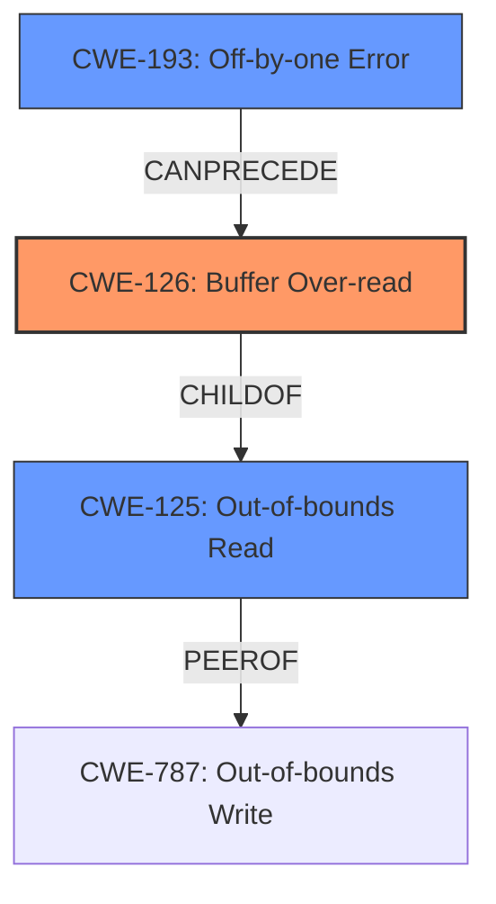

# Analysis for CVE-2022-43995

# Summary
| CWE ID | CWE Name | Confidence | CWE Abstraction Level | CWE Vulnerability Mapping Label | CWE-Vulnerability Mapping Notes |
|---|---|---|---|---|---|
| CWE-126 | Buffer Over-read | 0.9 | Variant | Allowed | Primary CWE |
| CWE-125 | Out-of-bounds Read | 0.7 | Base | Allowed | Secondary Candidate |
| CWE-193 | Off-by-one Error | 0.6 | Base | Allowed | Secondary Candidate |

## Evidence and Confidence

*   **Confidence Score:** 0.9
*   **Evidence Strength:** HIGH

## Relationship Analysis
The primary CWE selected is CWE-126 (Buffer Over-read), a Variant of CWE-125 (Out-of-bounds Read). CWE-125 is a more general, Base-level CWE. Since the vulnerability description specifically mentions a heap-based buffer over-read, CWE-126 provides a more precise classification. CWE-193 (Off-by-one Error) is also considered as a possible contributing factor to the root cause.

## Vulnerability Chain
The vulnerability chain starts with a **missing input validation** on the password length. This leads to an **array-out-of-bounds error** in `passwd.c`, which results in a **heap-based buffer over-read**. The impact is a potential denial-of-service.

## Summary of Analysis
The primary CWE, CWE-126 (Buffer Over-read), is selected because the vulnerability description clearly indicates a heap-based buffer over-read due to an **array-out-of-bounds error**. The "CVE Reference Links Content Summary" confirms this, stating: "The code makes an incorrect assumption about the minimum size of the password input, leading to an array-out-of-bounds error. Specifically, the code assumes that the password is at least nine bytes in size, which is not always the case when using the `crypt()` password backend. This assumption results in an attempt to access memory beyond the allocated buffer." This statement supports the selection of CWE-126, as it describes reading beyond the intended buffer.

The vulnerability description states: "Sudo 1.8.0 through 1.9.12, with the crypt() password backend, contains a plugins/sudoers/auth/passwd.c **array-out-of-bounds error** that can result in a heap-based buffer over-read."

CWE-125 (Out-of-bounds Read) was considered but is a more general term. CWE-126 is more specific as it clarifies that the over-read is happening in a buffer.

CWE-193 (Off-by-one Error) was considered because it could be related to the root cause of the vulnerability. An off-by-one error in calculating the buffer size or index could lead to the out-of-bounds read. However, the description focuses on the over-read itself, making CWE-126 more directly relevant.

CWE-787 (Out-of-bounds Write) was not selected because the vulnerability description specifies an "over-read," not an "over-write."

CWE-1284 (Improper Validation of Specified Quantity in Input) was considered because the vulnerability is triggered by a password of a specific length (seven characters or fewer). The code does not properly validate the password length, leading to the out-of-bounds read. However, the primary issue is the resulting over-read, so CWE-126 is more appropriate.

CWE-916 (Use of Password Hash With Insufficient Computational Effort) was not selected because it relates to the strength of password hashing algorithms, which is not the core issue in this vulnerability. The vulnerability is about reading beyond the allocated buffer, not about weak password hashing.

CWE-170 (Improper Null Termination) was not selected because there is no mention of missing null termination in the vulnerability description.

CWE-476 (NULL Pointer Dereference) was not selected because there is no mention of null pointer dereference in the vulnerability description.

The mitigation, which involves upgrading to Sudo 1.9.12-r1 or later and compiling sudo with PAM support, aligns with addressing the root cause of the buffer over-read. By fixing the code that handles password lengths and avoiding the `crypt()` backend, the vulnerability can be prevented.