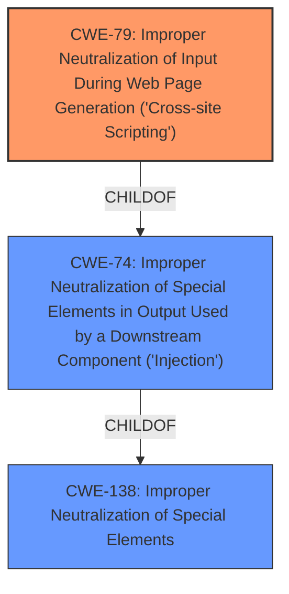

# Raw Analyzer Response for CVE-2022-44012

# Summary
| CWE ID | CWE Name | Confidence | CWE Abstraction Level | CWE Vulnerability Mapping Label | CWE-Vulnerability Mapping Notes |
|---|---|---|---|---|---|
| CWE-79 | Improper Neutralization of Input During Web Page Generation ('Cross-site Scripting') | 1.0 | Base | Allowed | Primary CWE |

## Evidence and Confidence

*   **Confidence Score:** 1.0
*   **Evidence Strength:** HIGH

## Relationship Analysis
The primary relationship that influenced the decision was that CWE-79 is a Base level CWE. The vulnerability description clearly indicates a Cross-Site Scripting issue due to lack of input sanitization. The related CWEs such as CWE-74 and CWE-138 were not selected since they are higher level.

## Vulnerability Chain
The chain of events starts with **lack of input sanitization** which leads to **stored XSS** and the impact is **execution of JavaScript code** and **potential decryption of passwords**.

## Summary of Analysis
The initial assessment was based on the vulnerability description, which clearly indicated a stored Cross-Site Scripting (XSS) vulnerability. The key phrases "execute JavaScript code in browser" and "lack of input sanitization" pointed strongly to CWE-79. The "CVE Reference Links Content Summary" section reinforced this by explicitly stating "Stored Cross-Site Scripting (XSS) vulnerability".

The selection of CWE-79 is further supported by its definition as a "Base" level CWE, which is preferred for vulnerability mapping. The retriever results also listed CWE-79 as the top candidate.

The evidence from the "CVE Reference Links Content Summary" section is key:
> **Root cause of vulnerability:**
> The root cause is a **lack of input sanitization**, allowing an attacker to inject malicious JavaScript code into the database, specifically within the "Bemerkung" field of the "Lieferzeiten" table.
>
> **Weaknesses/vulnerabilities present:**
> - Stored Cross-Site Scripting (XSS) vulnerability

Based on the evidence, relationship analysis, and mapping guidance, CWE-79 is the most appropriate and specific classification for this vulnerability. Other CWEs, such as CWE-74 and CWE-138, were considered but deemed too high-level.