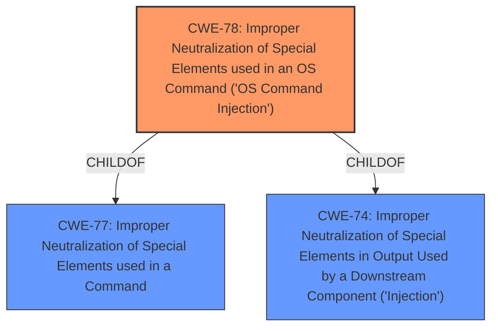

# Enhanced Analysis for CVE-2022-44019

# Summary
| CWE ID | CWE Name | Confidence | CWE Abstraction Level | CWE Vulnerability Mapping Label | CWE-Vulnerability Mapping Notes |
|---|---|---|---|---|---|
| CWE-78 | Improper Neutralization of Special Elements used in an OS Command ('OS Command Injection') | 1.0 | Base | Allowed | Primary CWE |

## Evidence and Confidence

*   **Confidence Score:** 1.0
*   **Evidence Strength:** HIGH

## Relationship Analysis
The primary relationship influencing the decision is that CWE-78 is a base-level weakness, providing a specific description of the **improper neutralization** of OS command elements. The vulnerability description explicitly mentions the injection of shell metacharacters, aligning directly with the characteristics of CWE-78. CWE-78 is a child of CWE-77 (Improper Neutralization of Special Elements used in a Command) and CWE-74 (Improper Neutralization of Special Elements in Output Used by a Downstream Component ('Injection')), showing a clear hierarchical relationship.



## Vulnerability Chain
The chain of events starts with the application's **failure to properly neutralize** special elements in the `host` parameter. This leads directly to OS command injection, allowing an attacker to execute arbitrary commands.

## Summary of Analysis
The analysis is primarily based on the provided vulnerability description and the CVE reference links content summary, which clearly indicates an **OS command injection** vulnerability due to **insufficient sanitization** of the `host` parameter.

The description states that the `/api/common/ping` endpoint is vulnerable to remote command execution via shell metacharacters in the host parameter. The CVE Reference Links Content Summary confirms this by stating that the root cause is **insufficient sanitization** of the `host` parameter, allowing the injection of arbitrary shell commands.

The retriever results also list CWE-78 as the top candidate, further supporting this assessment. CWE-78 is a base-level CWE, which is the preferred level of abstraction.

Relevant CWE Information:

# Enhanced Context (25 CWEs)
The following CWEs were identified as potentially relevant to this vulnerability:

## CWE-74: Improper Neutralization of Special Elements in Output Used by a Downstream Component ('Injection')
**Abstraction Level**: Class
**Similarity Score**: 0.78
**Source**: dense

**Description**:
The product constructs all or part of a command, data structure, or record using externally-influenced input from an upstream component, but it does not neutralize or incorrectly neutralizes special elements that could modify how it is parsed or interpreted when it is sent to a downstream component.

**Mapping Guidance**:
- Usage: Discouraged
- Rationale: CWE-74 is high-level and often misused when lower-level weaknesses are more appropriate.

## CWE-78: Improper Neutralization of Special Elements used in an OS Command ('OS Command Injection')
**Abstraction Level**: base
**Similarity Score**: 5.03
**Source**: graph

**Description**:
CWE-78: Improper Neutralization of Special Elements used in an OS Command ('OS Command Injection')

**Mapping Guidance**:
- Usage: Allowed
- Rationale: This CWE entry is at the Base level of abstraction, which is a preferred level of abstraction for mapping to the root causes of vulnerabilities.

**Relationships**:
- CANFOLLOW -> CWE-184
- CANALSOBE -> CWE-88
- CHILDOF -> CWE-77
- CHILDOF -> CWE-77
- CHILDOF -> CWE-74

## CWE Selection Justification
CWE-78 is selected as the primary CWE because the vulnerability description explicitly mentions the injection of shell metacharacters in the `host` parameter leading to remote command execution, which aligns directly with the characteristics of CWE-78. The description explicitly mentions the impact of remote command execution, the vector of shell metacharacters, and the **failure to sanitize** the `host` parameter.

Other CWEs Considered and Rejected:
- CWE-74: While CWE-74 is a parent of CWE-78, it is a class-level CWE and is too general. The vulnerability description provides sufficient detail to map to the more specific base-level CWE-78.
- CWE-88: While CWE-88 (Improper Neutralization of Argument Delimiters in a Command ('Argument Injection')) is a related weakness, the primary issue is the injection of arbitrary shell commands, making CWE-78 a more accurate fit.
- CWE-94: Improper Control of Generation of Code ('Code Injection') - This CWE is too broad and does not specifically address the OS command injection aspect of the vulnerability.
- CWE-95: Improper Neutralization of Directives in Dynamically Evaluated Code ('Eval Injection') - This CWE is not applicable as the vulnerability does not involve dynamic evaluation of code.
- CWE-184: Incomplete List of Disallowed Inputs - While this could be a contributing factor, the primary issue is the lack of proper neutralization of special elements, making CWE-78 a more direct mapping.


## CWE Relationship Analysis

Current CWEs represent these abstraction levels: .


### Vulnerability Chain Analysis

**Chain starting from CWE-184:**
- 184 (Incomplete List of Disallowed Inputs) - ROOT


**Chain starting from CWE-78:**
- 78 (Improper Neutralization of Special Elements used in an OS Command ('OS Command Injection')) - ROOT


### CWE Relationship Diagram

```mermaid
graph TD
    classDef primary fill:#f96,stroke:#333,stroke-width:2px
    classDef secondary fill:#69f,stroke:#333
    classDef tertiary fill:#9e9,stroke:#333
```