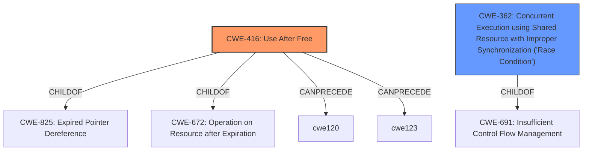

# Analysis Report for CVE-2022-44034

# Vulnerability Analysis Report: CVE-2022-44034

## Description


## Analysis (with Relationship Data)

# Summary
| CWE ID | CWE Name | Confidence | CWE Abstraction Level | CWE Vulnerability Mapping Label | CWE-Vulnerability Mapping Notes |
|---|---|---|---|---|---|
| CWE-416 | Use After Free | 1.0 | Variant | Allowed | Primary CWE |
| CWE-362 | Concurrent Execution using Shared Resource with Improper Synchronization ('Race Condition') | 1.0 | Class | Allowed-with-Review | Secondary CWE |

## Evidence and Confidence

*   **Confidence Score:** 1.0
*   **Evidence Strength:** HIGH

## Relationship Analysis
The primary weakness is **CWE-416 (Use After Free)**, which occurs due to a **race condition**. The **race condition** is classified as **CWE-362 (Concurrent Execution using Shared Resource with Improper Synchronization)**. **CWE-362** is a Class-level CWE, and has children that might be more appropriate, but in this case accurately captures the nature of the race condition.



## Vulnerability Chain
The vulnerability chain starts with a **race condition** (**CWE-362**) between `scr24x_open()` and `scr24x_remove()`. This **race condition** then leads to a **use-after-free** vulnerability (**CWE-416**).
1.  **CWE-362**: A **race condition** exists due to concurrent access to a shared resource without proper synchronization.
2.  **CWE-416**: The **race condition** leads to memory being freed while it is still being accessed, resulting in a **use-after-free**.

## Summary of Analysis
The analysis indicates a clear chain of events: a **race condition** (**CWE-362**) leads to a **use-after-free** (**CWE-416**) vulnerability. The evidence from the vulnerability description and the CVE Reference Links Content Summary supports this conclusion. The selection of **CWE-416** as the primary CWE is based on it being the direct result of the race condition and the actual vulnerability being exploited.

The vulnerability description explicitly mentions a "**race condition** and resultant **use-after-free** if a physically proximate attacker removes a PCMCIA device while calling open(), aka a **race condition** between scr24x_open() and scr24x_remove()." The CVE Reference Links Content Summary details the sequence of events leading to the **use-after-free** due to the **race condition**.

The retriever results also support these findings, with **CWE-362** and **CWE-416** being among the top matches. While **CWE-362** is a Class-level CWE, it is appropriate here as it clearly describes the nature of the **race condition** leading to the vulnerability.

Other CWEs considered but not used:

*   **CWE-367 (Time-of-check Time-of-use (TOCTOU) Race Condition)**: While a **race condition** is present, it's not specifically a TOCTOU issue.
*   **CWE-366 (Race Condition within a Thread)**: This is too specific, as the **race condition** occurs between two functions, not necessarily within a single thread.
*   **CWE-667 (Improper Locking)**: While locking issues can lead to **race conditions**, the description doesn't explicitly mention improper locking as the root cause.
*   **CWE-415 (Double Free)**: The vulnerability is a **use-after-free**, not a double free.
*   **CWE-476 (NULL Pointer Dereference)**: While a NULL pointer dereference could be a consequence of the UAF, the core issue is using memory after it's been freed.
*   **CWE-1285 (Improper Validation of Specified Index, Position, or Offset in Input)**: This is not relevant to the vulnerability description.


## CWE Relationship Analysis

Current CWEs represent these abstraction levels: .


### Vulnerability Chain Analysis

**Chain starting from CWE-825:**
- 825 (Expired Pointer Dereference) - ROOT


**Chain starting from CWE-476:**
- 476 (NULL Pointer Dereference) - ROOT


### CWE Relationship Diagram

```mermaid
graph TD
    classDef primary fill:#f96,stroke:#333,stroke-width:2px
    classDef secondary fill:#69f,stroke:#333
    classDef tertiary fill:#9e9,stroke:#333
```


*Report generated on 2025-03-31 12:19:53*
