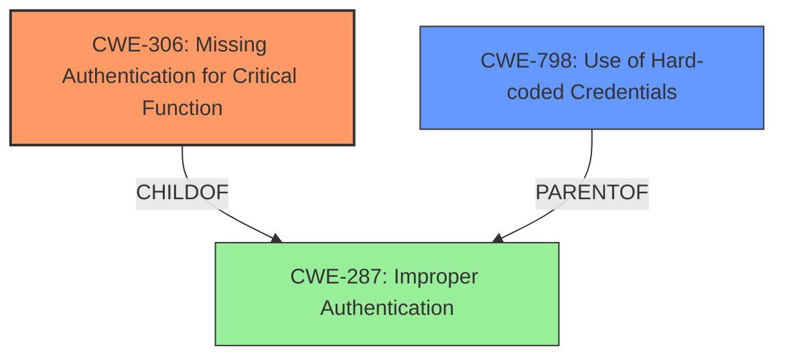

# Raw Analyzer Response for CVE-2022-44244

```markdown
# Summary 
| CWE ID    | CWE Name                                       | Confidence | CWE Abstraction Level | CWE Vulnerability Mapping Label | CWE-Vulnerability Mapping Notes |
|-----------|------------------------------------------------|------------|-----------------------|---------------------------------|---------------------------------|
| CWE-306   | Missing Authentication for Critical Function   | 0.85       | Base                  | Allowed                         | Primary CWE                     |
| CWE-798   | Use of Hard-coded Credentials                 | 0.75       | Base                  | Allowed                         | Secondary Candidate             |
| CWE-287   | Improper Authentication                       | 0.50       | Class                  | Discouraged                     | Secondary Candidate             |

## Evidence and Confidence

*   **Confidence Score:** 0.80
*   **Evidence Strength:** HIGH

## Relationship Analysis
The primary relationship that influenced the selection was the ChildOf relationship from CWE-306 to CWE-287. CWE-306 is a Base level CWE that is a child of the Class level CWE-287, making CWE-306 a more specific and appropriate choice. CWE-798 was considered as a secondary weakness because the vulnerability involves the use of default credentials in the demo environment, which can be seen as a form of hard-coded credentials.



## Vulnerability Chain
The vulnerability chain starts with the **missing authentication** for critical functions in Lin-CMS, which allows the use of a token obtained from a demo environment with **default credentials** to bypass authentication and escalate privileges on other instances. This leads to the final impact of privilege escalation and potential system compromise.

## Summary of Analysis
The initial analysis focused on identifying the root cause of the **authentication bypass** vulnerability in Lin-CMS v0.2.1. The evidence clearly points to a **lack of proper authentication** for critical functions, allowing an attacker to escalate privileges.

The primary CWE selected is CWE-306 **Missing Authentication for Critical Function**, because the system allows an attacker to use a valid authentication token from a demo environment on other Lin-CMS installations to obtain administrative privileges. This matches the description of CWE-306, which states that "The product does not perform any authentication for functionality that requires a provable user identity or consumes a significant amount of resources." The retriever results also showed this CWE as a possible candidate.

CWE-798 **Use of Hard-coded Credentials** was selected as a secondary CWE because the vulnerability utilizes default credentials in the demo environment (root/123456) to obtain a valid token. While the main issue is the missing authentication, the use of default credentials contributes to the ease of exploitation.

CWE-287 **Improper Authentication** was considered but not selected as the primary CWE because it is a broader, class-level CWE. While the vulnerability does involve improper authentication, CWE-306 provides a more specific and accurate representation of the root cause. The MITRE mapping guidance discourages using class-level CWEs when lower-level CWEs are applicable.

The selection of CWE-306 and CWE-798 is based on the provided evidence from the vulnerability description and CVE reference links content summary, which highlights the **lack of authentication** and the **use of default credentials** as key factors in the vulnerability. The hierarchical relationships between the CWEs further support this selection, with CWE-306 being a more specific child of the broader CWE-287.

Relevant CWE Information:

# Enhanced Context (25 CWEs)
The following CWEs were identified as potentially relevant to this vulnerability:

## CWE-1391: Use of Weak Credentials
**Abstraction Level**: Class
**Similarity Score**: 0.81
**Source**: dense

**Description**:
The product uses weak credentials (such as a default key or hard-coded password) that can be calculated, derived, reused, or guessed by an attacker.

**Mapping Guidance**:
- Usage: Allowed-with-Review
- Rationale: This CWE entry is a Class and might have Base-level children that would be more appropriate

## CWE-303: Incorrect Implementation of Authentication Algorithm
**Abstraction Level**: Base
**Similarity Score**: 0.81
**Source**: dense

**Description**:
The requirements for the product dictate the use of an established authentication algorithm, but the implementation of the algorithm is incorrect.

**Mapping Guidance**:
- Usage: Allowed
- Rationale: This CWE entry is at the Base level of abstraction, which is a preferred level of abstraction for mapping to the root causes of vulnerabilities.

## CWE-807: Reliance on Untrusted Inputs in a Security Decision
**Abstraction Level**: Base
**Similarity Score**: 0.80
**Source**: dense

**Description**:
The product uses a protection mechanism that relies on the existence or values of an input, but the input can be modified by an untrusted actor in a way that bypasses the protection mechanism.

**Mapping Guidance**:
- Usage: Allowed
- Rationale: This CWE entry is at the Base level of abstraction, which is a preferred level of abstraction for mapping to the root causes of vulnerabilities.

## CWE-302: Authentication Bypass by Assumed-Immutable Data
**Abstraction Level**: Base
**Similarity Score**: 0.80
**Source**: dense

**Description**:
The authentication scheme or implementation uses key data elements that are assumed to be immutable, but can be controlled or modified by the attacker.

**Mapping Guidance**:
- Usage: Allowed
- Rationale: This CWE entry is at the Base level of abstraction, which is a preferred level of abstraction for mapping to the root causes of vulnerabilities.

## CWE-472: External Control of Assumed-Immutable Web Parameter
**Abstraction Level**: Base
**Similarity Score**: 0.80
**Source**: dense

**Description**:
The web application does not sufficiently verify inputs that are assumed to be immutable but are actually externally controllable, such as hidden form fields.

**Mapping Guidance**:
- Usage: Allowed
- Rationale: This CWE entry is at the Base level of abstraction, which is a preferred level of abstraction for mapping to the root causes of vulnerabilities.

## CWE-288: Authentication Bypass Using an Alternate Path or Channel
**Abstraction Level**: Base
**Similarity Score**: 0.80
**Source**: dense

**Description**:
The product requires authentication, but the product has an alternate path or channel that does not require authentication.

**Mapping Guidance**:
- Usage: Allowed
- Rationale: This CWE entry is at the Base level of abstraction, which is a preferred level of abstraction for mapping to the root causes of vulnerabilities.

## CWE-305: Authentication Bypass by Primary Weakness
**Abstraction Level**: Base
**Similarity Score**: 0.80
**Source**: dense

**Description**:
The authentication algorithm is sound, but the implemented mechanism can be bypassed as the result of a separate weakness that is primary to the authentication error.

**Mapping Guidance**:
- Usage: Allowed
- Rationale: This CWE entry is at the Base level of abstraction, which is a preferred level of abstraction for mapping to the root causes of vulnerabilities.

## CWE-1390: Weak Authentication
**Abstraction Level**: Class
**Similarity Score**: 0.79
**Source**: dense

**Description**:
The product uses an authentication mechanism to restrict access to specific users or identities, but the mechanism does not sufficiently prove that the claimed identity is correct.

**Mapping Guidance**:
- Usage: Allowed-with-Review
- Rationale: This CWE entry is a Class and might have Base-level children that would be more appropriate

## CWE-798: Use of Hard-coded Credentials
**Abstraction Level**: Base
**Similarity Score**: 0.79
**Source**: dense

**Description**:
The product contains hard-coded credentials, such as a password or cryptographic key.

**Mapping Guidance**:
- Usage: Allowed
- Rationale: This CWE entry is at the Base level of abstraction, which is a preferred level of abstraction for mapping to the root causes of vulnerabilities.

## CWE-294: Authentication Bypass by Capture-replay
**Abstraction Level**: Base
**Similarity Score**: 0.78
**Source**: dense

**Description**:
A capture-replay flaw exists when the design of the product makes it possible for a malicious user to sniff network traffic and bypass authentication by replaying it to the server in question to the same effect as the original message (or with minor changes).

**Mapping Guidance**:
- Usage: Allowed
- Rationale: This CWE entry is at the Base level of abstraction, which is a preferred level of abstraction for mapping to