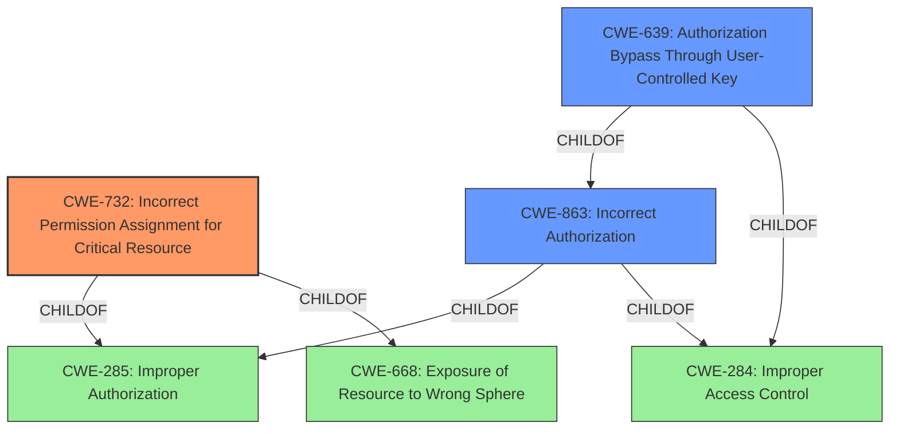

# Analysis Report for CVE-2022-44263

# Vulnerability Analysis Report: CVE-2022-44263

## Description


## Analysis (with Relationship Data)

# Summary
| CWE ID | CWE Name | Confidence | CWE Abstraction Level | CWE Vulnerability Mapping Label | CWE-Vulnerability Mapping Notes |
|---|---|---|---|---|---|
| CWE-732 | Incorrect Permission Assignment for Critical Resource | 0.8 | Class | Allowed-with-Review | Primary CWE |
| CWE-863 | Incorrect Authorization | 0.6 | Class | Allowed-with-Review | Secondary Candidate |
| CWE-639 | Authorization Bypass Through User-Controlled Key | 0.5 | Base | Allowed | Secondary Candidate |

## Evidence and Confidence

*   **Confidence Score:** 0.7
*   **Evidence Strength:** MEDIUM

## Relationship Analysis
The primary CWE, CWE-732 (Incorrect Permission Assignment for Critical Resource), is a child of both CWE-285 (Improper Authorization) and CWE-668 (Exposure of Resource to Wrong Sphere). CWE-863 (Incorrect Authorization) is also a child of CWE-285 and CWE-284 (Improper Access Control). CWE-639 (Authorization Bypass Through User-Controlled Key) is a child of both CWE-863 and CWE-284.
The choice of CWE-732 as the primary CWE is because the vulnerability description mentions "**incorrect access control**", which is related to how permissions are set for a resource which can then be exploited. CWE-863 and CWE-639 were considered because the vulnerability could involve an authorization issue, but CWE-732 aligns better with the provided information.



## Vulnerability Chain
The chain starts with the **incorrect access control** (**rootcause**) which directly leads to resources being accessed or modified by unintended actors. This is a direct cause-and-effect relationship.

## Summary of Analysis
The analysis is based primarily on the provided vulnerability description, which states "**incorrect access control**." This suggests that the system is **not properly restricting access to resources**.

Based on the evidence, the most appropriate CWE is CWE-732 (Incorrect Permission Assignment for Critical Resource), because the **rootcause** involves the program specifying permissions for a security-critical resource in a way that allows that resource to be read or modified by unintended actors. The vulnerability description explicitly points to "**incorrect access control**," aligning well with CWE-732's focus on misconfigured permissions for critical resources.

Other CWEs considered but not used:

*   CWE-284 (Improper Access Control): While relevant, it's a high-level pillar, and CWE-732 provides more specific details about the nature of the access control issue.
*   CWE-639 (Authorization Bypass Through User-Controlled Key): This is related to users gaining access to other users' data by modifying a key. Though possible, it's not as directly indicated as the permission issue of CWE-732.
*   CWE-863 (Incorrect Authorization): Similar to CWE-639, it focuses on authorization checks being performed incorrectly, which is possible, but the description leans more towards a permission assignment issue.
*   CWE-269 (Improper Privilege Management): This is too broad and doesn't fit the specific scenario.
*   CWE-668 (Exposure of Resource to Wrong Sphere): This is a class-level CWE and less specific than CWE-732.

The selected CWE, CWE-732, is at the Class level, providing a good balance between specificity and coverage of the vulnerability.


## CWE Relationship Analysis

Current CWEs represent these abstraction levels: .


### Vulnerability Chain Analysis

**Chain starting from CWE-668:**
- 668 (Exposure of Resource to Wrong Sphere) - ROOT


**Chain starting from CWE-732:**
- 732 (Incorrect Permission Assignment for Critical Resource) - ROOT


### CWE Relationship Diagram

```mermaid
graph TD
    classDef primary fill:#f96,stroke:#333,stroke-width:2px
    classDef secondary fill:#69f,stroke:#333
    classDef tertiary fill:#9e9,stroke:#333
```


*Report generated on 2025-03-31 05:48:45*
