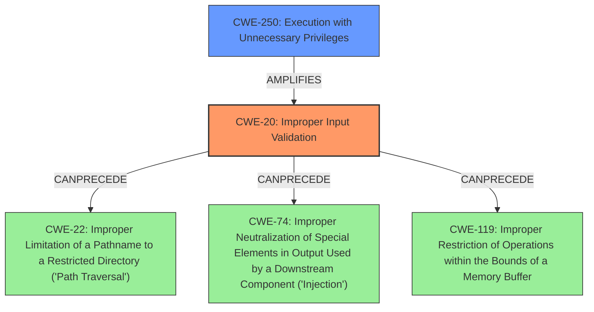

# Analysis for CVE-2022-4428

# Summary
| CWE ID | CWE Name | Confidence | CWE Abstraction Level | CWE Vulnerability Mapping Label | CWE-Vulnerability Mapping Notes |
|---|---|---|---|---|---|
| CWE-20 | Improper Input Validation | 0.8 | Class | Primary | Discouraged |
| CWE-250 | Execution with Unnecessary Privileges | 0.6 | Base | Secondary | Allowed |

## Evidence and Confidence

*   **Confidence Score:** 0.7
*   **Evidence Strength:** HIGH

## Relationship Analysis
The primary CWE is CWE-20 which is a Class level CWE. However, the vulnerability description clearly states a **lack of proper validation** which is the root cause.

The relationship between CWE-20 and other CWEs involves `CanPrecede` relationships to weaknesses like Path Traversal (CWE-22), Code Injection (CWE-74), and Buffer Overflows (CWE-119). The vulnerability's impact mentions privilege escalation and arbitrary code execution, suggesting a potential chain. The relationship with CWE-250 is that **unnecessary privileges** may amplify the impact of **improper input validation**.

## Vulnerability Chain
The chain of weaknesses begins with **improper input validation** (CWE-20) of the `support_uri` parameter. An attacker could then craft an XML config file to point to a malicious file, leading to privilege escalation and arbitrary code execution. If the program runs with **unnecessary privileges** (CWE-250), the impact of the **improper input validation** is amplified.

## Summary of Analysis
The initial assessment identified CWE-20 as the primary weakness due to the **lack of proper validation** of the `support_uri` parameter. The crafted XML config file leading to privilege escalation and arbitrary code execution supports this classification. The presence of **unnecessary privileges** (CWE-250) can amplify the impact of **improper input validation**.

While CWE-20 is a Class-level CWE and is discouraged, no other more specific CWEs clearly fit the scenario. The evidence points to a general **lack of proper validation**, and the subsequent exploitation leads to privilege escalation and arbitrary code execution.

The selection of CWE-20 is based on the explicit statement in the vulnerability description and CVE Reference Links Content Summary that the `support_uri` parameter **lacked proper validation**. This directly aligns with the definition of CWE-20. The addition of CWE-250 as a secondary weakness acknowledges the role of **unnecessary privileges** in exacerbating the vulnerability's impact.

Relevant CWE Information:

# Enhanced Context (25 CWEs)
The following CWEs were identified as potentially relevant to this vulnerability:

## CWE-274: Improper Handling of Insufficient Privileges
**Abstraction Level**: Base
**Similarity Score**: 0.78
**Source**: dense

**Description**:
The product does not handle or incorrectly handles when it has insufficient privileges to perform an operation, leading to resultant weaknesses.

**Mapping Guidance**:
- Usage: Discouraged
- Rationale: This CWE entry could be deprecated in a future version of CWE.

*Not Selected*: This CWE focuses on insufficient privileges, while the vulnerability involves improper validation leading to potential privilege escalation, which is the opposite.

## CWE-266: Incorrect Privilege Assignment
**Abstraction Level**: Base
**Similarity Score**: 0.78
**Source**: dense

**Description**:
A product incorrectly assigns a privilege to a particular actor, creating an unintended sphere of control for that actor.

**Mapping Guidance**:
- Usage: Allowed
- Rationale: This CWE entry is at the Base level of abstraction, which is a preferred level of abstraction for mapping to the root causes of vulnerabilities.

*Not Selected*: This CWE focuses on incorrect assignment of privileges, which is not the primary issue. The vulnerability is about **improper input validation**.

## CWE-653: Improper Isolation or Compartmentalization
**Abstraction Level**: Class
**Similarity Score**: 0.78
**Source**: dense

**Description**:
The product does not properly compartmentalize or isolate functionality, processes, or resources that require different privilege levels, rights, or permissions.

**Mapping Guidance**:
- Usage: Allowed
- Rationale: This CWE entry is at the Base level of abstraction, which is a preferred level of abstraction for mapping to the root causes of vulnerabilities.

*Not Selected*: This CWE is not the primary issue. The vulnerability is about **improper input validation**.

## CWE-280: Improper Handling of Insufficient Permissions or Privileges
**Abstraction Level**: Base
**Similarity Score**: 0.77
**Source**: dense

**Description**:
The product does not handle or incorrectly handles when it has insufficient privileges to access resources or functionality as specified by their permissions. This may cause it to follow unexpected code paths that may leave the product in an invalid state.

**Mapping Guidance**:
- Usage: Allowed
- Rationale: This CWE entry is at the Base level of abstraction, which is a preferred level of abstraction for mapping to the root causes of vulnerabilities.

*Not Selected*: This CWE focuses on insufficient privileges, while the vulnerability involves improper validation leading to potential privilege escalation, which is the opposite.

## CWE-267: Privilege Defined With Unsafe Actions
**Abstraction Level**: Base
**Similarity Score**: 0.77
**Source**: dense

**Description**:
A particular privilege, role, capability, or right can be used to perform unsafe actions that were not intended, even when it is assigned to the correct entity.

**Mapping Guidance**:
- Usage: Allowed
- Rationale: This CWE entry is at the Base level of abstraction, which is a preferred level of abstraction for mapping to the root causes of vulnerabilities.

*Not Selected*: This CWE focuses on a privilege enabling unsafe actions. The vulnerability's root cause is **improper input validation**.

## CWE-668: Exposure of Resource to Wrong Sphere
**Abstraction Level**: Class
**Similarity Score**: 0.76
**Source**: dense

**Description**:
The product exposes a resource to the wrong control sphere, providing unintended actors with inappropriate access to the resource.

**Mapping Guidance**:
- Usage: Discouraged
- Rationale: CWE-668 is high-level and is often misused as a catch-all when lower-level CWE IDs might be applicable. It is sometimes used for low-information vulnerability reports [REF-1287]. It is a level-1 Class (i.e., a child of a Pillar). It is not useful for trend analysis.

*Not Selected*: The vulnerability is about **improper input validation** leading to privilege escalation.

## CWE-41: Improper Resolution of Path Equivalence
**Abstraction Level**: Base
**Similarity Score**: 0.76
**Source**: dense

**Description**:
The product is vulnerable to file system contents disclosure through path equivalence. Path equivalence involves the use of special characters in file and directory names. The associated manipulations are intended to generate multiple names for the same object.

**Mapping Guidance**:
- Usage: Allowed
- Rationale: This CWE entry is at the Base level of abstraction, which is a preferred level of abstraction for mapping to the root causes of vulnerabilities.

*Not Selected*: While the vulnerability involves a file path, the root cause is **improper input validation**, not path equivalence.

## CWE-73: External Control of File Name or Path
**Abstraction Level**: Base
**Similarity Score**: 0.76
**Source**: dense

**Description**:
The product allows user input to control or influence paths or file names that are used in filesystem operations.

**Mapping Guidance**:
- Usage: Allowed
- Rationale: This CWE entry is at the Base level of abstraction, which is a preferred level of abstraction for mapping to the root causes of vulnerabilities.

*Not Selected*: While the vulnerability involves external control of a file path, the root cause is the **lack of proper validation** of that path.

## CWE-59: Improper Link Resolution Before File Access ('Link Following')
**Abstraction Level**: Base
**Similarity Score**: 0.76
**Source**: dense

**