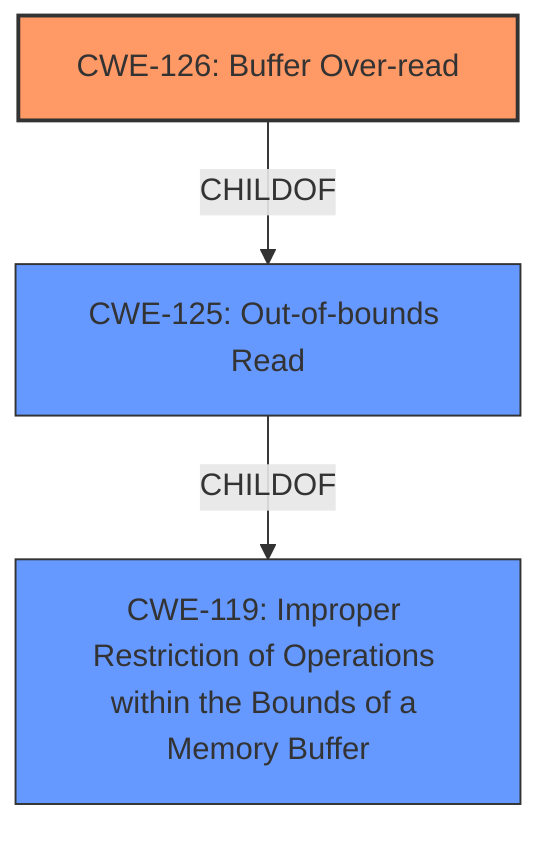

# Raw Analyzer Response for CVE-2022-4433

# Summary
| CWE ID | CWE Name | Confidence | CWE Abstraction Level | CWE Vulnerability Mapping Label | CWE-Vulnerability Mapping Notes |
|---|---|---|---|---|---|
| CWE-126 | Buffer Over-read | 0.9 | Variant | Primary | Allowed |
| CWE-125 | Out-of-bounds Read | 0.7 | Base | Secondary | Allowed |
| CWE-119 | Improper Restriction of Operations within the Bounds of a Memory Buffer | 0.4 | Class | Secondary | Discouraged |

## Evidence and Confidence

*   **Confidence Score:** 0.9
*   **Evidence Strength:** HIGH

## Relationship Analysis
The primary focus is on **CWE-126** (Buffer Over-read), a variant of **CWE-125** (Out-of-bounds Read), which in turn is a child of **CWE-119** (Improper Restriction of Operations within the Bounds of a Memory Buffer). The vulnerability description clearly indicates reading past the buffer's boundary, making **CWE-126** the most specific and appropriate choice. **CWE-119** is a more general category and is discouraged when more specific CWEs are available.

## Vulnerability Chain
The vulnerability chain starts with the **buffer over-read** (**CWE-126**), leading to information disclosure. There isn't a clear preceding weakness identified in the provided description.

## Summary of Analysis
The analysis focuses on the provided vulnerability description, which explicitly states a "**buffer over-read**" condition in the ThinkPadX13s BIOS LenovoSetupConfigDxe driver. This condition allows a local attacker with elevated privileges to cause information disclosure.

The primary CWE selection is **CWE-126** (Buffer Over-read). This choice is supported by:
- The explicit mention of "**buffer over-read**" in the vulnerability description.
- **CWE-126's** description as "The product reads from a buffer using buffer access mechanisms such as indexes or pointers that reference memory locations after the targeted buffer," which aligns perfectly with the vulnerability.
- The "Usage: Allowed" mapping guidance for **CWE-126**.
- The "Abstraction: Variant" level of **CWE-126**, which is the preferred level of abstraction.

**CWE-125** (Out-of-bounds Read) was considered as a broader classification. While it is also applicable, **CWE-126** is more specific as it explicitly refers to reading *past* the end of the buffer, whereas **CWE-125** includes reading *before* the buffer as well. Since the description specifically mentions "over-read," **CWE-126** is the better fit.

**CWE-119** (Improper Restriction of Operations within the Bounds of a Memory Buffer) was considered but ultimately rejected as the primary CWE because it is too general. The mapping guidance for **CWE-119** explicitly discourages its use when more specific CWEs are available.

The selection of **CWE-126** is based on direct evidence from the vulnerability description and aligns with the recommended mapping practices.

Relevant CWE Information:

# Enhanced Context (25 CWEs)

## CWE-805: Buffer Access with Incorrect Length Value
**Abstraction Level**: Base
**Similarity Score**: 0.78

**Description**:
The product uses a sequential operation to read or write a buffer, but it uses an incorrect length value that causes it to access memory that is outside of the bounds of the buffer.

**Mapping Guidance**:
- Usage: Allowed
- Rationale: This CWE entry is at the Base level of abstraction, which is a preferred level of abstraction for mapping to the root causes of vulnerabilities.

This CWE was not selected, because there isn't evidence of an incorrect length value being the cause. The description indicates a simple out-of-bounds read.

## CWE-131: Incorrect Calculation of Buffer Size
**Abstraction Level**: Base
**Similarity Score**: 0.78

**Description**:
The product does not correctly calculate the size to be used when allocating a buffer, which could lead to a buffer overflow.

**Mapping Guidance**:
- Usage: Allowed
- Rationale: This CWE entry is at the Base level of abstraction, which is a preferred level of abstraction for mapping to the root causes of vulnerabilities.

This CWE was not selected, because the vulnerability description doesn't mention incorrect calculation of buffer size. It focuses on reading beyond the buffer.

## CWE-226: Sensitive Information in Resource Not Removed Before Reuse
**Abstraction Level**: Base
**Similarity Score**: 0.77

**Description**:
The product releases a resource such as memory or a file so that it can be made available for reuse, but it does not clear or "zeroize" the information contained in the resource before the product performs a critical state transition or makes the resource available for reuse by other entities.

**Mapping Guidance**:
- Usage: Allowed
- Rationale: This CWE entry is at the Base level of abstraction, which is a preferred level of abstraction for mapping to the root causes of vulnerabilities.

This CWE doesn't fit because the vulnerability isn't about sensitive information not being removed before reuse.

## CWE-909: Missing Initialization of Resource
**Abstraction Level**: Class
**Similarity Score**: 0.76

**Description**:
The product does not initialize a critical resource.

**Mapping Guidance**:
- Usage: Allowed-with-Review
- Rationale: This CWE entry is a Class and might have Base-level children that would be more appropriate

This is not related to the vulnerability description.

## CWE-124: Buffer Underwrite ('Buffer Underflow')
**Abstraction Level**: Base
**Similarity Score**: 0.76

**Description**:
The product writes to a buffer using an index or pointer that references a memory location prior to the beginning of the buffer.

**Mapping Guidance**:
- Usage: Allowed
- Rationale: This CWE entry is at the Base level of abstraction, which is a preferred level of abstraction for mapping to the root causes of vulnerabilities.

This CWE doesn't fit because the description describes an *over-read*, not an *underwrite*.

## CWE-126: Buffer Over-read
**Abstraction Level**: Variant
**Similarity Score**: 0.76

**Description**:
The product reads from a buffer using buffer access mechanisms such as indexes or pointers that reference memory locations after the targeted buffer.

**Mapping Guidance**:
- Usage: Allowed
- Rationale: This CWE entry is at the Variant level of abstraction, which is a preferred level of abstraction for mapping to the root causes of vulnerabilities.

This is the selected CWE.

## CWE-404: Improper Resource Shutdown or Release
**Abstraction Level**: Class
**Similarity Score**: 0.76

**Description**:
The product does not release or incorrectly releases a resource before it is made available for re-use.

**Mapping Guidance**:
- Usage: Allowed-with-Review
- Rationale: This CWE entry is a Class and might have Base-level children that would be more appropriate

Not related to the vulnerability description.

## CWE-119: Improper Restriction of Operations within the Bounds of a Memory Buffer
**Abstraction Level**: Class
**Similarity Score**: 0.76

**Description**:
The product performs operations on a memory buffer, but it reads from or writes to a memory location outside the buffer's intended boundary. This may result in read or write operations on unexpected memory locations that could be linked to other variables, data structures, or internal program data.

**Mapping Guidance**:
- Usage: Discouraged
- Rationale: CWE-119 is commonly misused in low-information vulnerability reports when lower-level CWEs could be used instead, or when more details about the vulnerability are available.

This CWE is too general as a more specific one exists.

## CWE-191: Integer Underflow (Wrap or Wraparound)
**Abstraction Level**: Base
**Similarity Score**: 0.75

**Description**:
The product subtracts one value from another, such that the result is less than the minimum allowable integer value, which produces a value that is not equal to the correct result.

**Mapping Guidance**:
- Usage: Allowed
- Rationale: This CWE entry is at the Base level of abstraction, which is a preferred level of abstraction for mapping to the root causes of vulnerabilities.

Not related to the vulnerability description.

## CWE