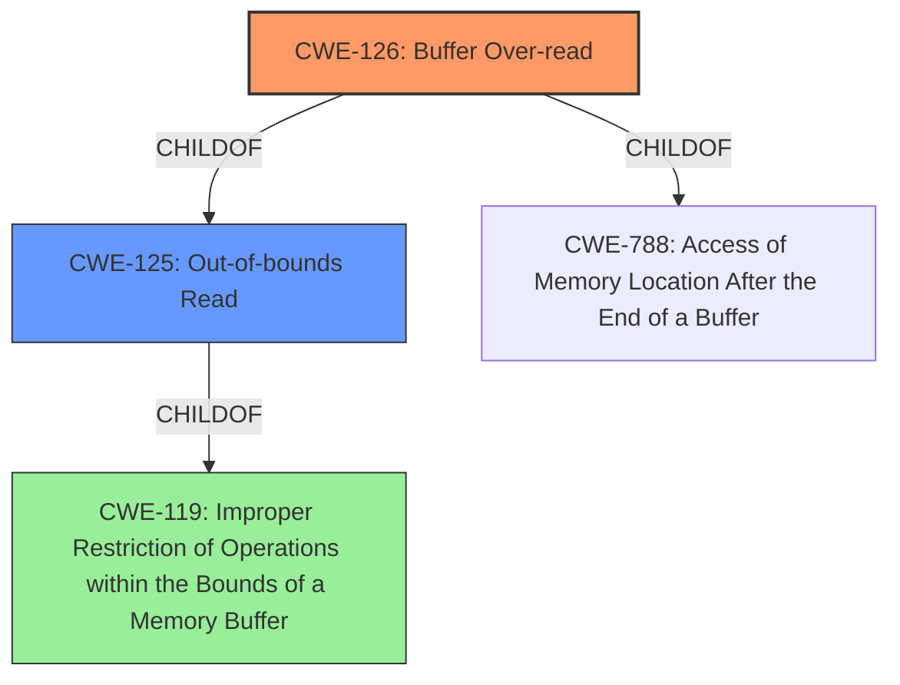

# Analysis Report for CVE-2022-4434

# Vulnerability Analysis Report: CVE-2022-4434

## Description


## Analysis (with Relationship Data)

# Summary
| CWE ID | CWE Name | Confidence | CWE Abstraction Level | CWE Vulnerability Mapping Label | CWE-Vulnerability Mapping Notes |
|---|---|---|---|---|---|
| CWE-126 | Buffer Over-read | 1.0 | Variant | Allowed | Primary CWE |

## Evidence and Confidence

*   **Confidence Score:** 1.0
*   **Evidence Strength:** HIGH

## Relationship Analysis
The primary relationship that influenced the decision was the ChildOf relationship between CWE-126 and CWE-125 (Out-of-bounds Read), and CWE-126 and CWE-788. CWE-126 is a variant of CWE-125, indicating that it is a more specific type of out-of-bounds read. The description explicitly states a "**buffer over-read**" vulnerability. The variant CWE-126 describes reading past the end of a buffer, aligning perfectly with the vulnerability description. CWE-119 is a Class-level CWE and is too general as the description allows for a more specific CWE.



## Vulnerability Chain
The chain of events is as follows:
1.  **Root Cause:** **Buffer over-read** (CWE-126) in the ThinkPadX13s BIOS driver.
2.  **Impact:** Information disclosure.

## Summary of Analysis
The initial analysis focused on identifying the root cause of the vulnerability. The vulnerability description clearly states a "**buffer over-read**" vulnerability. The primary CWE candidate was CWE-126 (Buffer Over-read), which aligns directly with the described vulnerability.

The retriever results also listed CWE-126 (Buffer Over-read) as the top combined result.

The relationship analysis confirmed that CWE-126 is a variant of CWE-125 (Out-of-bounds Read), providing a more specific classification than the more general CWE-119 (Improper Restriction of Operations within the Bounds of a Memory Buffer). The mapping guidance for CWE-126 allows its usage and rationale states that "This CWE entry is at the Variant level of abstraction, which is a preferred level of abstraction for mapping to the root causes of vulnerabilities."

The decision to select CWE-126 was based on the direct evidence from the vulnerability description, the retriever results, and the relationship analysis, all of which support the selection of this specific CWE.

CWE-125 (Out-of-bounds Read) was considered, but CWE-126 (Buffer Over-read) was chosen because it is a more specific variant that accurately describes the vulnerability. CWE-119 (Improper Restriction of Operations within the Bounds of a Memory Buffer) was also considered, but it is a more general class of vulnerability, and the description provides enough information to select the more specific CWE-126.


## CWE Relationship Analysis

Current CWEs represent these abstraction levels: .


### Vulnerability Chain Analysis

**Chain starting from CWE-126:**
- 126 (Buffer Over-read) - ROOT


**Chain starting from CWE-119:**
- 119 (Improper Restriction of Operations within the Bounds of a Memory Buffer) - ROOT


### CWE Relationship Diagram

```mermaid
graph TD
    classDef primary fill:#f96,stroke:#333,stroke-width:2px
    classDef secondary fill:#69f,stroke:#333
    classDef tertiary fill:#9e9,stroke:#333
```


*Report generated on 2025-03-31 04:26:56*
