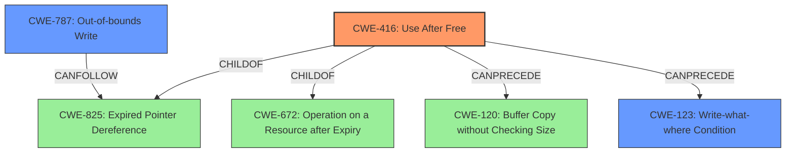

# Analysis Report for CVE-2022-4438

# Vulnerability Analysis Report: CVE-2022-4438

## Description


## Analysis (with Relationship Data)

# Summary
| CWE ID  | CWE Name                       | Confidence | CWE Abstraction Level | CWE Vulnerability Mapping Label | CWE-Vulnerability Mapping Notes |
| :------- | :----------------------------- | :--------- | :---------------------- | :------------------------------ | :----------------------------- |
| CWE-416 | Use After Free                 | 1          | Variant               | Primary CWE                     | Allowed                       |
| CWE-787 | Out-of-bounds Write            | 0.5        | Base                  | Secondary Candidate             | Allowed                       |
| CWE-123 | Write-what-where Condition    | 0.5        | Base                  | Secondary Candidate             | Allowed                       |

## Evidence and Confidence

*   **Confidence Score:** 0.8
*   **Evidence Strength:** HIGH

## Relationship Analysis
The primary CWE, CWE-416, is a variant of CWE-825 (Expired Pointer Dereference) and CWE-672 (Operation on a Resource after Expiry). It can be preceded by CWE-120 (Buffer Copy without Checking Size) and CWE-123 (Write-what-where Condition). These relationships suggest a potential chain of exploitation, where a buffer overflow or write-what-where condition could lead to a use-after-free vulnerability. The choice of CWE-416 is based on its direct mention in the vulnerability description. CWE-787 and CWE-123 are potential secondary candidates due to heap corruption.



## Vulnerability Chain
The vulnerability chain starts with a crafted HTML page, which leads to a use-after-free condition, potentially resulting in heap corruption.

Crafted HTML Page -> Use After Free (CWE-416) -> Heap Corruption -> Out-of-bounds Write (CWE-787) or Write-what-where Condition (CWE-123).

## Summary of Analysis
The analysis strongly supports CWE-416 (Use After Free) as the primary CWE, given its explicit mention in both the vulnerability description and the CVE reference links. The vulnerability description key phrases also highlight "use after free" as the root cause. The retriever results also list CWE-416 as the top combined result. The confidence score is high because of this direct evidence.

The selection of CWE-416 is at the optimal level of specificity, as it is a variant that accurately describes the weakness.

The other CWEs considered, such as CWE-787 (Out-of-bounds Write) and CWE-123 (Write-what-where Condition), are potentially related to the exploitation of the use-after-free vulnerability, but there is not enough evidence to confirm.

Relevant CWE Information:

# Enhanced Context (25 CWEs)

## CWE-416: Use After Free
**Abstraction:** Variant
**Status:** Stable

### Description
The product reuses or references memory after it has been freed. At some point afterward, the memory may be allocated again and saved in another pointer, while the original pointer references a location somewhere within the new allocation. Any operations using the original pointer are no longer valid because the memory "belongs" to the code that operates on the new pointer.

### Observed Examples
- **CVE-2022-2621:** Chain: two threads in a web browser use the same resource (CWE-366), but one of those threads can destroy the resource before the other has completed (CWE-416).
- **CVE-2021-0920:** Chain: mobile platform race condition (CWE-362) leading to use-after-free (CWE-416), as exploited in the wild per CISA KEV.

The vulnerability description states: "**Use after free** in Blink Frames in Google Chrome prior to 108.0.5359.124 allowed a remote attacker who convinced the user to engage in specific UI interactions to potentially exploit **heap corruption** via a crafted HTML page."

The **rootcause** is **use after free** which causes **heap corruption**.

This aligns with the description of CWE-416. The vulnerability could allow a remote attacker to exploit the use-after-free condition by crafting a malicious HTML page, which is consistent with the description and observed examples of CWE-416.

CWE-787 (Out-of-bounds Write) was considered due to the mention of heap corruption. Heap corruption could lead to out-of-bounds writes, but the primary weakness is the use-after-free.

CWE-123 (Write-what-where Condition) was also considered as a possible consequence of heap corruption, but again, the direct root cause is the use-after-free.


## CWE Relationship Analysis

Current CWEs represent these abstraction levels: .


### Vulnerability Chain Analysis

**Chain starting from CWE-825:**
- 825 (Expired Pointer Dereference) - ROOT


**Chain starting from CWE-672:**
- 672 (Operation on a Resource after Expiration or Release) - ROOT


### CWE Relationship Diagram

```mermaid
graph TD
    classDef primary fill:#f96,stroke:#333,stroke-width:2px
    classDef secondary fill:#69f,stroke:#333
    classDef tertiary fill:#9e9,stroke:#333
```


*Report generated on 2025-03-30 19:01:21*
