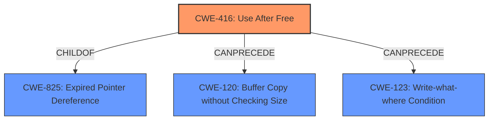

# Enhanced Analysis for CVE-2022-4439

# Summary
| CWE ID | CWE Name | Confidence | CWE Abstraction Level | CWE Vulnerability Mapping Label | CWE-Vulnerability Mapping Notes |
|---|---|---|---|---|---|
| CWE-416 | Use After Free | 1.0 | Variant | Allowed | Primary CWE |

## Evidence and Confidence

*   **Confidence Score:** 1.0
*   **Evidence Strength:** HIGH

## Relationship Analysis
The primary relationship influencing the decision is the hierarchical relationship where CWE-416 (Use After Free) is a Variant of CWE-825 (Expired Pointer Dereference). While other CWEs like CWE-366 (Race Condition within a Thread) were considered, the direct match of "use after free" in both the vulnerability description and the CWE name made CWE-416 the most appropriate choice. The "CanPrecede" relationship of CWE-416 to CWE-120 (Buffer Copy without Checking Size) and CWE-123 (Write-what-where Condition) suggests potential exploitation paths, but these are not explicitly mentioned in the vulnerability description.



## Vulnerability Chain
The vulnerability chain starts with a **use after free** condition (CWE-416), which can lead to **heap corruption**. The attacker exploits this through specific UI interactions.

## Summary of Analysis
The analysis is primarily based on the explicit mention of "**use after free**" in both the vulnerability description and the CVE Reference Links Content Summary.

"Vulnerability Description: Use after free in Aura in Google Chrome on Windows prior to 108.0.5359.124 allowed a remote attacker who convinced the user to engage in specific UI interactions to potentially exploit **heap corruption** via specific UI interactions."

"CVE Reference Links Content Summary: ...root_cause: Use after free vulnerability in Aura....weaknesses: [\"Use after free\"]"

The Retriever Results also strongly support CWE-416 as the top candidate. The hierarchical relationships confirm that choosing the Variant level CWE-416 is more specific and appropriate than choosing a more general Class level CWE. The mapping guidance for CWE-416 explicitly allows its use, reinforcing the decision.

Relevant CWE Information:

# Enhanced Context (25 CWEs)
The following CWEs were identified as potentially relevant to this vulnerability:

## CWE-356: Product UI does not Warn User of Unsafe Actions
**Abstraction Level**: Base
**Similarity Score**: 0.80
**Source**: dense

## CWE-404: Improper Resource Shutdown or Release
**Abstraction Level**: Class
**Similarity Score**: 0.79
**Source**: dense

## CWE-366: Race Condition within a Thread
**Abstraction Level**: Base
**Similarity Score**: 0.78
**Source**: dense

## CWE-667: Improper Locking
**Abstraction Level**: Class
**Similarity Score**: 0.78
**Source**: dense

## CWE-226: Sensitive Information in Resource Not Removed Before Reuse
**Abstraction Level**: Base
**Similarity Score**: 0.77
**Source**: dense

## CWE-754: Improper Check for Unusual or Exceptional Conditions
**Abstraction Level**: Class
**Similarity Score**: 0.77
**Source**: dense

## CWE-451: User Interface (UI) Misrepresentation of Critical Information
**Abstraction Level**: Class
**Similarity Score**: 0.77
**Source**: dense

## CWE-1289: Improper Validation of Unsafe Equivalence in Input
**Abstraction Level**: Base
**Similarity Score**: 0.76
**Source**: dense

## CWE-367: Time-of-check Time-of-use (TOCTOU) Race Condition
**Abstraction Level**: Base
**Similarity Score**: 0.76
**Source**: dense

## CWE-362: Concurrent Execution using Shared Resource with Improper Synchronization ('Race Condition')
**Abstraction Level**: Class
**Similarity Score**: 0.76
**Source**: dense

## CWE-362: Concurrent Execution using Shared Resource with Improper Synchronization ('Race Condition')
**Abstraction Level**: Class
**Similarity Score**: 4610.38
**Source**: sparse

## CWE-367: Time-of-check Time-of-use (TOCTOU) Race Condition
**Abstraction Level**: Base
**Similarity Score**: 4462.79
**Source**: sparse

## CWE-667: Improper Locking
**Abstraction Level**: Class
**Similarity Score**: 4459.02
**Source**: sparse

## CWE-364: Signal Handler Race Condition
**Abstraction Level**: Base
**Similarity Score**: 4433.70
**Source**: sparse

## CWE-404: Improper Resource Shutdown or Release
**Abstraction Level**: Class
**Similarity Score**: 4426.50
**Source**: sparse

## CWE-123: Write-what-where Condition
**Abstraction Level**: base
**Similarity Score**: 4.82
**Source**: graph

## CWE-416: Use After Free
**Abstraction Level**: variant
**Similarity Score**: 4.33
**Source**: graph

## CWE-364: Signal Handler Race Condition
**Abstraction Level**: base
**Similarity Score**: 4.33
**Source**: graph

## CWE-120: Buffer Copy without Checking Size of Input ('Classic Buffer Overflow')
**Abstraction Level**: base
**Similarity Score**: 4.33
**Source**: graph

## CWE-825: Expired Pointer Dereference
**Abstraction Level**: base
**Similarity Score**: 4.33
**Source**: graph

## CWE-476: NULL Pointer Dereference
**Abstraction Level**: base
**Similarity Score**: 4.33
**Source**: graph

## CWE-252: Unchecked Return Value
**Abstraction Level**: base
**Similarity Score**: 4.33
**Source**: graph

## CWE-787: Out-of-bounds Write
**Abstraction Level**: base
**Similarity Score**: 4.33
**Source**: graph

## CWE-170: Improper Null Termination
**Abstraction Level**: base
**Similarity Score**: 4.33
**Source**: graph

## CWE-190: Integer Overflow or Wraparound
**Abstraction Level**: base
**Similarity Score**: 4.33
**Source**: graph

The other CWEs considered from the Retriever Results, such as CWE-366 (Race Condition within a Thread), CWE-843 (Access of Resource Using Incompatible Type), and CWE-123 (Write-what-where Condition), did not have the same direct match as CWE-416. While they might be related to the exploitation or impact of the vulnerability, they are not the root cause. Therefore, they were not selected as primary CWEs.


## CWE Relationship Analysis

Current CWEs represent these abstraction levels: .


### Vulnerability Chain Analysis

**Chain starting from CWE-356:**
- 356 (Product UI does not Warn User of Unsafe Actions) - ROOT


**Chain starting from CWE-366:**
- 366 (Race Condition within a Thread) - ROOT


### CWE Relationship Diagram

```mermaid
graph TD
    classDef primary fill:#f96,stroke:#333,stroke-width:2px
    classDef secondary fill:#69f,stroke:#333
    classDef tertiary fill:#9e9,stroke:#333
```