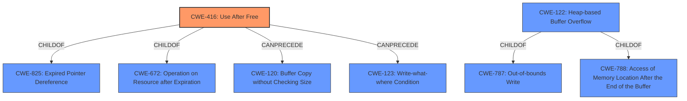

# Enhanced Analysis for CVE-2022-4440

# Summary
| CWE ID | CWE Name | Confidence | CWE Abstraction Level | CWE Vulnerability Mapping Label | CWE-Vulnerability Mapping Notes |
|---|---|---|---|---|---|
| CWE-416 | Use After Free | 1.0 | Variant | Allowed | Primary CWE |
| CWE-122 | Heap-based Buffer Overflow | 0.5 | Variant | Allowed | Secondary Candidate |

## Evidence and Confidence

*   **Confidence Score:** 0.9
*   **Evidence Strength:** HIGH

## Relationship Analysis
The primary CWE identified is CWE-416, Use After Free, which is a Variant level weakness. Several other CWEs were considered including CWE-122 (Heap-based Buffer Overflow), CWE-843 (Type Confusion), CWE-366 (Race Condition within a Thread), and CWE-911 (Improper Update of Reference Count). CWE-416 is a child of CWE-825 (Expired Pointer Dereference) and CWE-672 (Operation on Resource after Expiration). It can precede CWE-120 (Buffer Copy without Checking Size) and CWE-123 (Write-what-where Condition). CWE-122 is a child of CWE-788 (Access of Memory Location After the End of the Buffer) and CWE-787 (Out-of-bounds Write). The other CWEs are either at the Class level and too abstract (CWE-362) or don't fully describe the vulnerability (CWE-843, CWE-366, CWE-911).



## Vulnerability Chain
The vulnerability chain starts with a **use after free** condition (CWE-416), leading to potential **heap corruption**. An attacker can exploit this by crafting an HTML page to trigger the vulnerability.

## Summary of Analysis
The primary weakness is clearly a **use after free** (CWE-416), as stated in the vulnerability description key phrases and CVE reference content summary. The **heap corruption** is a consequence of this **use after free**, but the root cause is accessing memory that has already been freed.

The analysis considered the retriever results, particularly CWE-416 (Use After Free), CWE-843 (Access of Resource Using Incompatible Type), CWE-366 (Race Condition within a Thread), CWE-122 (Heap-based Buffer Overflow) and CWE-911 (Improper Update of Reference Count).

CWE-416 is the most accurate because the description explicitly mentions **use after free**. CWE-122 (Heap-based Buffer Overflow) could also be considered a secondary weakness, since **heap corruption** is mentioned, and a **use after free** can sometimes lead to a heap overflow.

The evidence supporting this is:
*   "**rootcause:** **use after free**" from the Vulnerability Description Key Phrases.
*   "The vulnerability is a "use-after-free" error. This occurs when a program attempts to access memory after it has been freed, leading to unpredictable behavior." from the CVE Reference Links Content Summary.
*   "**Weaknesses/Vulnerabilities Present:** - Use-after-free vulnerability in the "Profiles" component of the software." from the CVE Reference Links Content Summary.
*   "Use after free in Profiles in Google Chrome prior to 108.0.5359.124 allowed a remote attacker to potentially exploit **heap corruption** via a crafted HTML page." from the Vulnerability Description.

CWE-416 is at the Variant level of abstraction, which is the preferred level.
CWE-122 is at the Variant level of abstraction, which is the preferred level.

CWE-843 (Access of Resource Using Incompatible Type) was not selected because the vulnerability description does not suggest type confusion. CWE-366 (Race Condition within a Thread) was not selected because there's no direct evidence of a race condition, though UAFs can sometimes be related to concurrency issues. CWE-911 (Improper Update of Reference Count) was not selected because there's no mention of reference counting issues.

**CWEs Considered But Not Used:**

*   **CWE-843: Access of Resource Using Incompatible Type ('Type Confusion')** - While memory corruption is possible, the root cause isn't necessarily due to type confusion. The primary issue is accessing freed memory, not interpreting memory as the wrong type.
*   **CWE-366: Race Condition within a Thread** - Although race conditions can sometimes lead to use-after-free vulnerabilities, there's no direct evidence of a race condition in this particular case.
*   **CWE-911: Improper Update of Reference Count** - There is no information about reference counting errors.
*   **CWE-451: User Interface (UI) Misrepresentation of Critical Information** - Irrelevant; the vulnerability isn't related to UI misrepresentation.
*   **CWE-356: Product UI does not Warn User of Unsafe Actions** - Irrelevant; the vulnerability isn't related to warning the user about unsafe actions.
*   **CWE-123: Write-what-where Condition** - Although a UAF can lead to an arbitrary write, the UAF is the direct cause, not the write-what-where condition itself.
*   **CWE-415: Double Free** - No evidence of a double free.


## CWE Relationship Analysis

Current CWEs represent these abstraction levels: .


### Vulnerability Chain Analysis

**Chain starting from CWE-825:**
- 825 (Expired Pointer Dereference) - ROOT


**Chain starting from CWE-362:**
- 362 (Concurrent Execution using Shared Resource with Improper Synchronization ('Race Condition')) - ROOT


### CWE Relationship Diagram

```mermaid
graph TD
    classDef primary fill:#f96,stroke:#333,stroke-width:2px
    classDef secondary fill:#69f,stroke:#333
    classDef tertiary fill:#9e9,stroke:#333
```