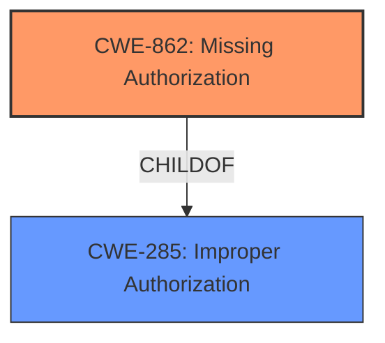

# Enhanced Analysis for CVE-2022-44422

# Summary
| CWE ID | CWE Name | Confidence | CWE Abstraction Level | CWE Vulnerability Mapping Label | CWE-Vulnerability Mapping Notes |
|---|---|---|---|---|---|
| CWE-862 | Missing Authorization | 1.0 | Class | Allowed-with-Review | Primary CWE |

## Evidence and Confidence

*   **Confidence Score:** 1.0
*   **Evidence Strength:** HIGH

## Relationship Analysis
The primary CWE, CWE-862 [Missing Authorization], is a Class-level CWE and child of CWE-285 [Improper Authorization]. There are no child CWEs listed in the results or specifications that offer a more specific description of the **missing permission check**.



## Vulnerability Chain
The vulnerability chain consists of:
  1.  Root Cause: **Missing permission check** (CWE-862)
  2.  Impact: Local denial of service

## Summary of Analysis
The vulnerability description clearly indicates a **missing permission check**, which directly corresponds to CWE-862 [Missing Authorization]. The primary CWE match from the provided data is CWE-862, which aligns with the vulnerability description.

The description states: "In music service, there is a **missing permission check**. This could lead to local denial of service in contacts service with no additional execution privileges needed."

The retriever results also list CWE-862 as the top combined result. The Complete CWE Specifications for CWE-862 describes it as: "The product does not perform an authorization check when an actor attempts to access a resource or perform an action." This aligns directly with the **missing permission check** described in the vulnerability.

Other CWEs, like CWE-732 [Incorrect Permission Assignment for Critical Resource], were considered but deemed less appropriate because the vulnerability is due to a **missing permission check** rather than an incorrect assignment of permissions. CWE-732 is also often misused for vulnerabilities in which permissions are not checked.

CWE-20 [Improper Input Validation] was also considered, but the root cause is not related to validating an input but rather the absence of an authorization check.

CWE-862 is selected as the primary CWE because it accurately captures the root cause of the vulnerability, which is a **missing permission check**. The evidence directly supports this classification, and the available information does not suggest a more specific CWE. The final selection is based on the provided evidence only.


## CWE Relationship Analysis

Current CWEs represent these abstraction levels: .


### Vulnerability Chain Analysis

**Chain starting from CWE-862:**
- 862 (Missing Authorization) - ROOT


**Chain starting from CWE-285:**
- 285 (Improper Authorization) - ROOT


### CWE Relationship Diagram

```mermaid
graph TD
    classDef primary fill:#f96,stroke:#333,stroke-width:2px
    classDef secondary fill:#69f,stroke:#333
    classDef tertiary fill:#9e9,stroke:#333
```