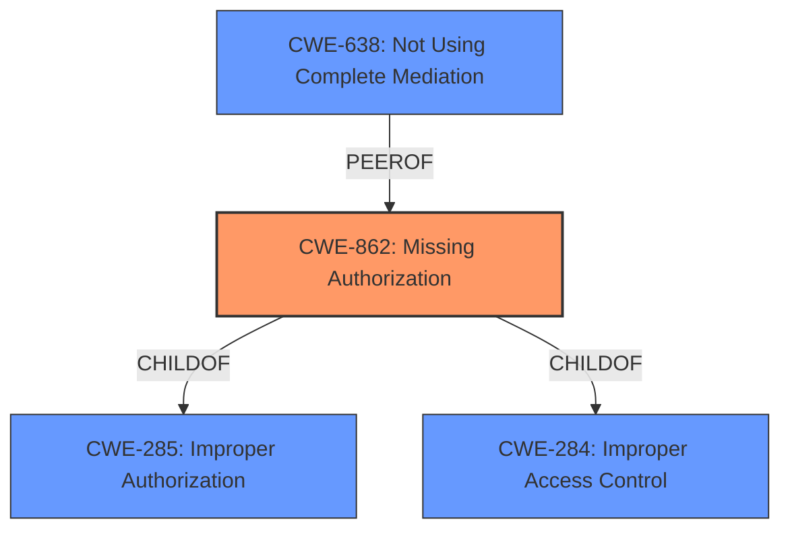

# Analysis Report for CVE-2022-44424

# Vulnerability Analysis Report: CVE-2022-44424

## Description


## Analysis (with Relationship Data)

# Summary
| CWE ID | CWE Name | Confidence | CWE Abstraction Level | CWE Vulnerability Mapping Label | CWE-Vulnerability Mapping Notes |
|---|---|---|---|---|---|
| CWE-862 | Missing Authorization | 1.0 | Class | Allowed-with-Review | Primary CWE |

## Evidence and Confidence

*   **Confidence Score:** 1.0
*   **Evidence Strength:** HIGH

## Relationship Analysis
The primary CWE, CWE-862 [CWE-862: Missing Authorization], is a Class-level CWE. It has child relationships with CWE-284 [CWE-284: Improper Access Control] and CWE-285 [CWE-285: Improper Authorization]. The weakness describes a **missing permission check**, which directly aligns with the description of CWE-862 [CWE-862: Missing Authorization]. The related Class CWE-638 [CWE-638: Not Using Complete Mediation] which is peer of CWE-862 [CWE-862: Missing Authorization], could be considered, but is less descriptive of the root cause.



## Vulnerability Chain
The vulnerability chain starts with the **missing permission check** (CWE-862 [CWE-862: Missing Authorization]) which leads to a local denial of service.

## Summary of Analysis
The vulnerability description clearly states a **missing permission check** in a music service, leading to a local denial of service. The primary CWE match from similar CVE descriptions is CWE-862 [CWE-862: Missing Authorization], which aligns directly with the root cause. The Retriever Results also list CWE-862 [CWE-862: Missing Authorization] as the top combined result.

The evidence for this assessment is:
*   "**missing permission check**" from the **Vulnerability Description Key Phrases**
*   "This could lead to local denial of service" from the **Vulnerability Description**
*   Primary CWE Match is CWE-862 [CWE-862: Missing Authorization] from **CWE for similar CVE Descriptions**

The selection of CWE-862 [CWE-862: Missing Authorization] is at an appropriate level of specificity and accurately represents the weakness described in the vulnerability. Although the retriever also found CWE-638 [CWE-638: Not Using Complete Mediation], the **missing permission check** is more accurately described by CWE-862 [CWE-862: Missing Authorization]. Other CWEs, like those related to input validation (CWE-20 [CWE-20: Improper Input Validation], CWE-1284 [CWE-1284: Improper Validation of Specified Quantity in Input]) or path manipulation (CWE-22 [CWE-22: Improper Limitation of a Pathname to a Restricted Directory ('Path Traversal')], CWE-73 [CWE-73: External Control of File Name or Path]), are not relevant to the **missing permission check**.


## CWE Relationship Analysis

Current CWEs represent these abstraction levels: .


### Vulnerability Chain Analysis

**Chain starting from CWE-862:**
- 862 (Missing Authorization) - ROOT


**Chain starting from CWE-20:**
- 20 (Improper Input Validation) - ROOT


### CWE Relationship Diagram

```mermaid
graph TD
    classDef primary fill:#f96,stroke:#333,stroke-width:2px
    classDef secondary fill:#69f,stroke:#333
    classDef tertiary fill:#9e9,stroke:#333
```


*Report generated on 2025-03-31 00:09:00*
