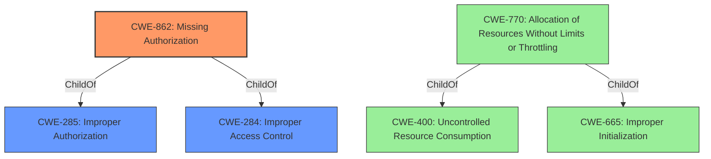

# Analysis for CVE-2022-44437

# Summary

| CWE ID | CWE Name | Confidence | CWE Abstraction Level | CWE Vulnerability Mapping Label | CWE-Vulnerability Mapping Notes |
|---|---|---|---|---|---|
| CWE-862 | Missing Authorization | 1.0 | Class | Allowed-with-Review | Primary CWE |
| CWE-770 | Allocation of Resources Without Limits or Throttling | 0.7 | Base | Allowed | Secondary Candidate |

## Evidence and Confidence

*   **Confidence Score:** 1.0
*   **Evidence Strength:** HIGH

## Relationship Analysis

The primary CWE selected is CWE-862, Missing Authorization, which is a Class-level CWE. The description clearly indicates a **missing permission check**, which aligns directly with the concept of missing authorization. It is a child of CWE-285 and CWE-284, which deal with improper authorization and access control. CWE-770, Allocation of Resources Without Limits or Throttling, is a base level CWE, which is a child of CWE-400 (Resource Consumption) and CWE-665 (Improper Initialization). The relationship between CWE-862 and its parents emphasizes the importance of proper access control mechanisms to prevent unauthorized actions.

## Vulnerability Chain

The vulnerability chain starts with a **missing permission check**, which leads to a local denial of service. The root cause is the absence of proper authorization, and the impact is the denial of service.

## Summary of Analysis

The initial analysis pointed towards CWE-862 due to the **missing permission check**. The Unisoc webpage was unrelated, but the "Vulnerability Description Key Phrases" section clearly stated the root cause. The retriever results also listed CWE-862 as the top candidate.

The final decision is strongly based on the provided evidence, specifically the "**missing permission check**" phrase in the "Vulnerability Description Key Phrases" section. This directly corresponds to the definition of CWE-862, which is a Class-level weakness. The relationship graph highlights that it is a child of CWE-285 and CWE-284.

The selected CWE is at an optimal level of specificity because it directly reflects the **missing permission check** which is the root cause.

Relevant CWE Information:

# Enhanced Context (25 CWEs)

## CWE-862: Missing Authorization
**Abstraction:** Class
**Similarity Score**: 0.269

### Description
The product does not perform an authorization check when an actor attempts to access a resource or perform an action.

### Evidence
The vulnerability description states there is a "**missing permission check**".

### Justification
This CWE aligns directly with the vulnerability description's "**missing permission check**". The security implication is that unauthorized users can access resources or perform actions they should not be allowed to, leading to a denial of service. The description for CWE-862 is: "The product does not perform an authorization check when an actor attempts to access a resource or perform an action."

## CWE-770: Allocation of Resources Without Limits or Throttling
**Abstraction:** Base
**Similarity Score**: 0.188

### Description
The product allocates a reusable resource or group of resources on behalf of an actor without imposing any restrictions on the size or number of resources that can be allocated, in violation of the intended security policy for that actor.

### Evidence
The vulnerability leads to a local denial of service which can be cause by uncontrolled allocation of resource.

### Justification
This could be a secondary weakness. The lack of permission check might allow a user to allocate an excessive amount of resources, leading to a denial of service. The CWE definition is: "The product allocates a reusable resource or group of resources on behalf of an actor without imposing any restrictions on the size or number of resources that can be allocated, in violation of the intended security policy for that actor."
## Other CWEs Considered But Not Used

*   **CWE-927: Use of Implicit Intent for Sensitive Communication**: This CWE is specific to Android applications and implicit intents, which is not mentioned in the vulnerability description.
*   **CWE-1021: Improper Restriction of Rendered UI Layers or Frames**: This CWE relates to UI rendering and clickjacking attacks, which is irrelevant to the description.
*   **CWE-732: Incorrect Permission Assignment for Critical Resource**: While related to permissions, this CWE focuses on *incorrect* assignments, whereas the description highlights a *missing* check, making CWE-862 more appropriate.
*   **CWE-638: Not Using Complete Mediation**: This is a Class-level CWE and less specific than CWE-862. Also the root cause is a missing permission check so not really remediation.
*   **CWE-22: Improper Limitation of a Pathname to a Restricted Directory ('Path Traversal')**: Path traversal is not relevant to this vulnerability description.
*   **CWE-1284: Improper Validation of Specified Quantity in Input**: This CWE is not relevant as there is no mention of quantity specification in the vulnerability description.
*   **CWE-20: Improper Input Validation**: This is too general and doesn't fit the specific **missing permission check**.
*   **CWE-941: Incorrectly Specified Destination in a Communication Channel**: This is related to communication channels and destinations, which is not relevant to this description.
*   **CWE-41: Improper Resolution of Path Equivalence**: Path equivalence is not relevant to this vulnerability description.