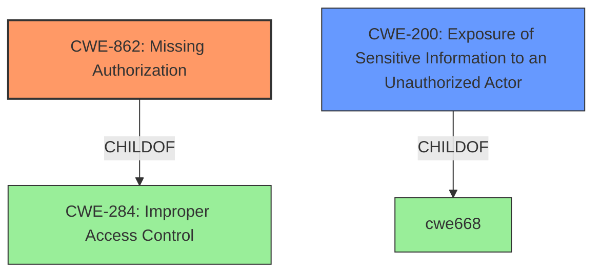

# Raw Analyzer Response for CVE-2022-44565

# Summary
| CWE ID | CWE Name | Confidence | CWE Abstraction Level | CWE Vulnerability Mapping Label | CWE-Vulnerability Mapping Notes |
|---|---|---|---|---|---|
| CWE-862 | Missing Authorization | 0.9 | Base | Primary | Allowed |
| CWE-200 | Exposure of Sensitive Information to an Unauthorized Actor | 0.6 | Class | Secondary | Discouraged |

## Evidence and Confidence

*   **Confidence Score:** 0.75
*   **Evidence Strength:** HIGH

## Relationship Analysis
The primary CWE is CWE-862, which is a child of CWE-284 (Improper Access Control). CWE-862 represents the specific case where authorization is missing, aligning with the vulnerability description of "**improper access validation**". CWE-200 (Exposure of Sensitive Information to an Unauthorized Actor) is a potential secondary weakness because the **impact** of the vulnerability is the ability to **retrieve status and usage data**, implying sensitive information exposure. However, CWE-200 is a high-level class and is often misused; the root cause is the missing authorization, making CWE-862 the more appropriate primary classification.

## Vulnerability Chain
The chain of events is as follows:
1.  **Root Cause:** **Missing Authorization** (CWE-862) - The application **fails to validate** whether the actor has the appropriate permissions to access the resource.
2.  **Impact:** **Exposure of Sensitive Information** (CWE-200) - As a result of the missing authorization, a malicious actor is able to **retrieve status and usage data**, which represents sensitive information.

## Summary of Analysis
The initial analysis identified "**improper access validation**" as the root cause of the vulnerability. This maps directly to **CWE-862 [Missing Authorization]**, which represents the specific scenario where authorization checks are absent. The **impact**, i.e., the ability to retrieve sensitive data, suggests a possible CWE-200 [Exposure of Sensitive Information to an Unauthorized Actor].

The retriever results listed CWE-284 [Improper Access Control], CWE-200 [Exposure of Sensitive Information to an Unauthorized Actor], and other potentially related weaknesses. However, CWE-284 is a very high-level "Pillar" CWE and the mapping guidance recommends against using it and to consider descendants such as CWE-862 or CWE-863. The **Vulnerability Description Key Phrases** state the root cause as "**improper access validation**" that allows an attacker to **retrieve status and usage data**. CWE-862 is the most appropriate, specific CWE to classify this root cause.

The final decision is based on the provided evidence, specifically the root cause "**improper access validation**," which directly aligns with the definition of **CWE-862 [Missing Authorization]**. The impact (data retrieval) suggests a potential secondary weakness (CWE-200), but the primary focus should be on the root cause (CWE-862). The selected CWE is at the optimal level of specificity, representing the lack of authorization.

Relevant CWE Information:
*   **CWE-862 [Missing Authorization]**: The product does not perform any authorization checks when an actor attempts to access a resource or perform an action. This aligns with the root cause identified in the vulnerability description, "**improper access validation**". The security implication is that unauthorized actors can access sensitive information or perform privileged actions, as seen in the vulnerability's impact (retrieving status and usage data).
*   **CWE-200 [Exposure of Sensitive Information to an Unauthorized Actor]**: The product exposes sensitive information to an actor that is not explicitly authorized to have access to that information. While this is a consequence of the missing authorization, it is not the primary weakness. The mapping guidance discourages using CWE-200 as a primary mapping and suggests focusing on the root cause, which is the missing authorization (CWE-862).
*   **CWE-284 [Improper Access Control]**: The product does not restrict or incorrectly restricts access to a resource from an unauthorized actor. This is a high-level category, and the mapping guidance recommends using more specific descendants such as CWE-862 [Missing Authorization] or CWE-863 [Incorrect Authorization]. Since the vulnerability description indicates a complete **lack of validation** (missing authorization), CWE-862 is a more precise mapping than CWE-284.