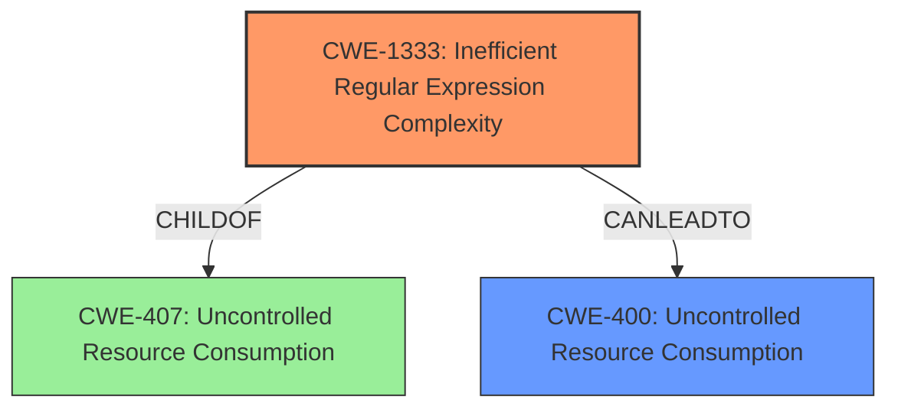

# Analysis for CVE-2022-44570

# Summary
| CWE ID    | CWE Name                                                    | Confidence | CWE Abstraction Level | CWE Vulnerability Mapping Label | CWE-Vulnerability Mapping Notes |
| :-------- | :---------------------------------------------------------- | :--------- | :-------------------- | :------------------------------ | :------------------------------ |
| CWE-1333  | Inefficient Regular Expression Complexity                   | 1.0        | Base                  | Primary                         | Allowed                         |
| CWE-400 | Uncontrolled Resource Consumption ('Denial of Service') | 0.7 | Class                  | Secondary                       | Allowed-with-Review  |

## Evidence and Confidence

*   **Confidence Score:** 0.9
*   **Evidence Strength:** HIGH

## Relationship Analysis
The primary relationship that impacted my decision was the child-of relationship between CWE-1333 and CWE-407 (Uncontrolled Resource Consumption). While CWE-1333 directly addresses the **inefficient regular expression**, CWE-400 is the broader impact. The chain starts with an inefficient regular expression (CWE-1333) leading to excessive CPU consumption and finally a **denial of service** (CWE-400). CWE-1333 is a base level CWE which is more specific than its parent.

## Vulnerability Chain
The chain of root cause and weaknesses is as follows:
1.  Root Cause: **Inefficient regular expression** (CWE-1333) in the Range header parsing component.
2.  Weakness: Excessive CPU consumption due to catastrophic backtracking.
3.  Impact: **Denial of Service** (CWE-400) making the application unresponsive.

## Summary of Analysis
The initial analysis focused on the **denial of service** vulnerability and the Range header parsing component in Rack. The CVE Reference Links Content Summary clearly states that the vulnerability is due to a **regular expression** used for parsing the Range header, which can lead to excessive processing time when given specially crafted inputs, thus leading to a ReDoS.

The Retriever Results strongly suggest CWE-1333 (Inefficient Regular Expression Complexity) as the primary candidate, supported by its high similarity score and the description matching the vulnerability's root cause. The relationships confirm that CWE-1333 is a child of CWE-407 (Uncontrolled Resource Consumption) and can lead to CWE-400 (**Denial of Service**), reinforcing the link between the **inefficient regular expression** and the resulting impact.

The selection of CWE-1333 is based on the evidence from the vulnerability description, which highlights the use of a regular expression that can cause excessive CPU consumption. The mapping guidance for CWE-1333 allows its usage, and the description aligns perfectly with the vulnerability's characteristics. Therefore, CWE-1333 is the most specific and appropriate choice.

CWE-400 is added as the secondary CWE because it describes the resulting impact of the vulnerability.

Other CWEs Considered but Not Used:

*   CWE-835 (Loop with Unreachable Exit Condition ('Infinite Loop')): While an **inefficient regular expression** can lead to an infinite loop-like behavior, the root cause is specifically the **complexity** of the regular expression, not necessarily a loop.
*   CWE-125 (Out-of-bounds Read): This CWE is not relevant as the vulnerability is not related to reading data outside the intended buffer.
*   CWE-674 (Uncontrolled Recursion): While recursion could be related, the more specific **inefficient regular expression** is a better fit.
*   CWE-410 (Insufficient Resource Pool): This is more related to the exhaustion of a resource pool, rather than the excessive consumption of CPU due to the regular expression's complexity.
*   CWE-79 (Improper Neutralization of Input During Web Page Generation ('Cross-site Scripting')): This is not applicable since the vulnerability does not involve injecting malicious script into a web page.
*   CWE-1284 (Improper Validation of Specified Quantity in Input): The vulnerability is not directly related to the improper validation of a specified quantity in input.
*   CWE-1286 (Improper Validation of Syntactic Correctness of Input): The vulnerability is not directly related to the improper validation of syntactic correctness of input.
*   CWE-122 (Heap-based Buffer Overflow): The vulnerability is not related to a buffer overflow.

**CWE-1333: Inefficient Regular Expression Complexity**
*Technical Explanation:* The vulnerability lies in the **inefficient regular expression** used for parsing the Range header. This **inefficiency** leads to catastrophic backtracking, causing excessive CPU consumption and ultimately resulting in a **denial of service**.
*Security Implications:* An attacker can exploit this vulnerability by sending a crafted Range header, causing the server to expend excessive resources, leading to a **denial of service**.
*Relationship Analysis:* CWE-1333 is a child of CWE-407 (Uncontrolled Resource Consumption) and can lead to CWE-400 (**Denial of Service**).
*Mapping Guidance Influence:* The mapping guidance for CWE-1333 allows its usage, and the description aligns perfectly with the vulnerability's characteristics.
*Primary/Secondary:* Primary

**CWE-400: Uncontrolled Resource Consumption ('Denial of Service')**
*Technical Explanation:* The crafted input to the Range header parser leads to excessive CPU consumption, which is a form of uncontrolled resource consumption that results in a **denial of service**.
*Security Implications:* The application becomes unresponsive, leading to a **denial of service**.
*Relationship Analysis:* CWE-400 is the impact of CWE-1333.
*Mapping Guidance Influence:* This CWE describes the impact, but a more specific CWE is present.
*Primary/Secondary:* Secondary