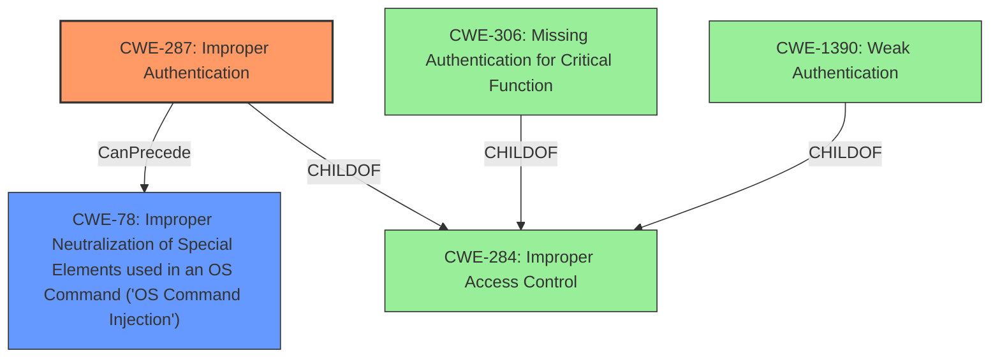

# Enhanced Analysis for CVE-2022-44620

# Summary
| CWE ID | CWE Name | Confidence | CWE Abstraction Level | CWE Vulnerability Mapping Label | CWE-Vulnerability Mapping Notes |
|---|---|---|---|---|---|
| CWE-287 | Improper Authentication | 0.9 | Class | Primary | Discouraged - Consider children or descendants, beginning with CWE-1390: Weak Authentication or CWE-306: Missing Authentication for Critical Function. |
| CWE-78 | Improper Neutralization of Special Elements used in an OS Command ('OS Command Injection') | 0.7 | Base | Secondary | Allowed - OS Command Injection is a likely consequence of improper authentication, allowing attackers to execute arbitrary commands. |

## Evidence and Confidence

*   **Confidence Score:** 0.8
*   **Evidence Strength:** HIGH

## Relationship Analysis
The primary weakness is **CWE-287 (Improper Authentication)**. This is a Class-level CWE, and the mapping guidance suggests considering more specific children like CWE-306 (Missing Authentication for Critical Function) or CWE-1390 (Weak Authentication). However, the provided information does not give enough specifics to determine if authentication is completely missing or just weak. The secondary weakness, **CWE-78 (Improper Neutralization of Special Elements used in an OS Command ('OS Command Injection'))**, is linked as a consequence of the **improper authentication**. The attacker, once authenticated (or having bypassed authentication), can then inject commands.



## Vulnerability Chain
The vulnerability chain starts with:
1.  **Improper Authentication (CWE-287)**: The device fails to properly authenticate users.
2.  **OS Command Injection (CWE-78)**: An authenticated attacker can then inject and execute arbitrary OS commands.

## Summary of Analysis
The initial assessment identified **CWE-287 (Improper Authentication)** as the primary weakness based on the vulnerability description stating "**Improper authentication** vulnerability...". The CVE Reference Links Content Summary reinforces this, stating, "The root cause is **Improper Authentication (CWE-287)**". The impact of this **improper authentication** allows a remote authenticated attacker to execute arbitrary OS commands, leading to the secondary weakness **CWE-78 (Improper Neutralization of Special Elements used in an OS Command ('OS Command Injection'))**. The JPCERT/CC analysis in CVE Reference Links Content Summary, assumes that the OS command injection would be executed using authentication information obtained through this vulnerability.

The graph relationships highlight that **CWE-287** is a child of **CWE-284 (Improper Access Control)**, but **CWE-284** is too abstract. More specific children of **CWE-287**, such as **CWE-306 (Missing Authentication for Critical Function)** and **CWE-1390 (Weak Authentication)**, were considered, but the provided details are insufficient to determine if authentication is missing entirely or simply weak. Therefore, **CWE-287** is the most appropriate choice given the available evidence.

The selection of **CWE-78** is justified by the vulnerability description's impact: "...execute an arbitrary OS command on the device...". This aligns with the definition of **CWE-78**.

The selected CWEs are at the optimal level of specificity because they directly address the root cause (**improper authentication**) and the immediate impact (**OS command injection**) described in the vulnerability. Higher-level CWEs would be too general, while lower-level CWEs would require more specific details not provided in the description.


## CWE Relationship Analysis

Current CWEs represent these abstraction levels: .


### Vulnerability Chain Analysis

**Chain starting from CWE-1390:**
- 1390 (Weak Authentication) - ROOT


**Chain starting from CWE-78:**
- 78 (Improper Neutralization of Special Elements used in an OS Command ('OS Command Injection')) - ROOT


### CWE Relationship Diagram

```mermaid
graph TD
    classDef primary fill:#f96,stroke:#333,stroke-width:2px
    classDef secondary fill:#69f,stroke:#333
    classDef tertiary fill:#9e9,stroke:#333
```