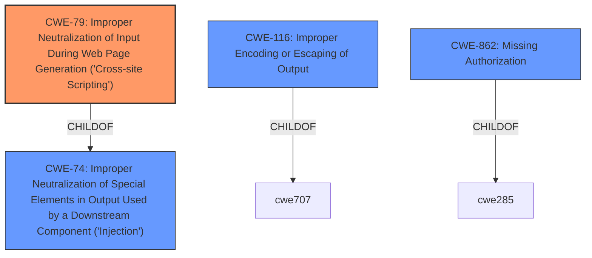

# Enhanced Analysis for CVE-2022-4466

# Summary
| CWE ID  | CWE Name                                                                        | Confidence | CWE Abstraction Level | CWE Vulnerability Mapping Label | CWE-Vulnerability Mapping Notes |
| :-------- | :------------------------------------------------------------------------------ | :---------- | :---------------------- | :------------------------------ | :------------------------------ |
| CWE-79  | Improper Neutralization of Input During Web Page Generation ('Cross-site Scripting') | 1.0        | Base                    | Primary CWE                     | Allowed                       |

## Evidence and Confidence

*   **Confidence Score:** 1.0
*   **Evidence Strength:** HIGH

## Relationship Analysis
The primary CWE selected is CWE-79 [Improper Neutralization of Input During Web Page Generation ('Cross-site Scripting')], a Base level CWE. This aligns with the vulnerability description, as the root cause is the **lack of validation and escaping** of shortcode attributes, leading to stored XSS. Other CWEs, such as CWE-116 [Improper Encoding or Escaping of Output] (Class) and CWE-862 [Missing Authorization] (Class), were considered but deemed less specific. CWE-79 is a child of CWE-74 [Improper Neutralization of Special Elements in Output Used by a Downstream Component ('Injection')], but CWE-79 provides a more accurate description of the vulnerability's context (web page generation).



## Vulnerability Chain
The vulnerability chain starts with the **lack of validation and escaping** of shortcode attributes in the WordPress plugin. This leads to the injection of malicious scripts into the web page output, resulting in Stored Cross-Site Scripting (XSS).

## Summary of Analysis
The analysis is based on the vulnerability description, which clearly states the root cause as the **lack of validation and escaping** of shortcode attributes. The CVE Reference Links Content Summary confirms that the plugin fails to properly validate and escape shortcode attributes before outputting them. This allows for the injection of malicious scripts, leading to Stored Cross-Site Scripting (XSS). The primary CWE match suggested for similar CVE Descriptions is CWE-79 [Improper Neutralization of Input During Web Page Generation ('Cross-site Scripting')], which aligns perfectly with the vulnerability. The relationship graph shows that while CWE-79 is a child of CWE-74 [Improper Neutralization of Special Elements in Output Used by a Downstream Component ('Injection')], CWE-79 [Improper Neutralization of Input During Web Page Generation ('Cross-site Scripting')] provides a more specific and accurate description in the context of web page generation. The selected CWE is at the optimal level of specificity, as it directly addresses the **lack of input neutralization** during web page generation, leading to XSS. Other CWEs considered such as CWE-116 [Improper Encoding or Escaping of Output] and CWE-862 [Missing Authorization] were deemed less appropriate because the primary issue is the **improper handling of user-controllable input** in the context of web page generation leading to XSS, rather than a general encoding issue or an authorization bypass.

Relevant CWE Information:

# Enhanced Context (25 CWEs)
The following CWEs were identified as potentially relevant to this vulnerability:

## CWE-639: Authorization Bypass Through User-Controlled Key
**Abstraction Level**: Base
**Similarity Score**: 0.76
**Source**: dense

**Description**:
The system's authorization functionality does not prevent one user from gaining access to another user's data or record by modifying the key value identifying the data.

**Mapping Guidance**:
- Usage: Allowed
- Rationale: This CWE entry is at the Base level of abstraction, which is a preferred level of abstraction for mapping to the root causes of vulnerabilities.

*Not Selected:* This CWE is focused on authorization bypass via modifying keys, which is not the primary issue in this case. The vulnerability is about XSS due to **lack of validation**.

## CWE-1289: Improper Validation of Unsafe Equivalence in Input
**Abstraction Level**: Base
**Similarity Score**: 0.75
**Source**: dense

**Description**:
The product receives an input value that is used as a resource identifier or other type of reference, but it does not validate or incorrectly validates that the input is equivalent to a potentially-unsafe value.

**Mapping Guidance**:
- Usage: Allowed
- Rationale: This CWE entry is at the Base level of abstraction, which is a preferred level of abstraction for mapping to the root causes of vulnerabilities.

*Not Selected:* While there is a **lack of validation**, CWE-1289 is too generic for this specific case of web page generation.

## CWE-74: Improper Neutralization of Special Elements in Output Used by a Downstream Component ('Injection')
**Abstraction Level**: Class
**Similarity Score**: 0.75
**Source**: dense

**Description**:
The product constructs all or part of a command, data structure, or record using externally-influenced input from an upstream component, but it does not neutralize or incorrectly neutralizes special elements that could modify how it is parsed or interpreted when it is sent to a downstream component.

**Mapping Guidance**:
- Usage: Discouraged
- Rationale: CWE-74 is high-level and often misused when lower-level weaknesses are more appropriate.

*Not Selected:* CWE-74 is a Class and too general. CWE-79 [Improper Neutralization of Input During Web Page Generation ('Cross-site Scripting')] is a child of CWE-74 and is a better, more specific fit.

## CWE-184: Incomplete List of Disallowed Inputs
**Abstraction Level**: Base
**Similarity Score**: 0.75
**Source**: dense

**Description**:
The product implements a protection mechanism that relies on a list of inputs (or properties of inputs) that are not allowed by policy or otherwise require other action to neutralize before additional processing takes place, but the list is incomplete.

**Mapping Guidance**:
- Usage: Allowed
- Rationale: This CWE entry is at the Base level of abstraction, which is a preferred level of abstraction for mapping to the root causes of vulnerabilities.

*Not Selected:* The issue is not an incomplete list of disallowed inputs but rather the **complete lack of validation and escaping**.

## CWE-274: Improper Handling of Insufficient Privileges
**Abstraction Level**: Base
**Similarity Score**: 0.75
**Source**: dense

**Description**:
The product does not handle or incorrectly handles when it has insufficient privileges to perform an operation, leading to resultant weaknesses.

**Mapping Guidance**:
- Usage: Discouraged
- Rationale: This CWE entry could be deprecated in a future version of CWE.

*Not Selected:* This CWE is not relevant as the vulnerability is not related to insufficient privileges.

## CWE-472: External Control of Assumed-Immutable Web Parameter
**Abstraction Level**: Base
**Similarity Score**: 0.75
**Source**: dense

**Description**:
The web application does not sufficiently verify inputs that are assumed to be immutable but are actually externally controllable, such as hidden form fields.

**Mapping Guidance**:
- Usage: Allowed
- Rationale: This CWE entry is at the Base level of abstraction, which is a preferred level of abstraction for mapping to the root causes of vulnerabilities.

*Not Selected:* While related to external control, this CWE is less specific than CWE-79 [Improper Neutralization of Input During Web Page Generation ('Cross-site Scripting')], which directly addresses the XSS issue.

## CWE-807: Reliance on Untrusted Inputs in a Security Decision
**Abstraction Level**: Base
**Similarity Score**: 0.75
**Source**: dense

**Description**:
The product uses a protection mechanism that relies on the existence or values of an input, but the input can be modified by an untrusted actor in a way that bypasses the protection mechanism.

**Mapping Guidance**:
- Usage: Allowed
- Rationale: This CWE entry is at the Base level of abstraction, which is a preferred level of abstraction for mapping to the root causes of vulnerabilities.

*Not Selected:* This CWE is related to security decisions based on untrusted inputs, which is not the primary issue. The vulnerability is about XSS due to **lack of validation and escaping**.

## CWE-280: Improper Handling of Insufficient Permissions or Privileges 
**Abstraction Level**: Base
**Similarity Score**:


## CWE Relationship Analysis

Current CWEs represent these abstraction levels: .


### Vulnerability Chain Analysis

**Chain starting from CWE-862:**
- 862 (Missing Authorization) - ROOT


**Chain starting from CWE-472:**
- 472 (External Control of Assumed-Immutable Web Parameter) - ROOT


### CWE Relationship Diagram

```mermaid
graph TD
    classDef primary fill:#f96,stroke:#333,stroke-width:2px
    classDef secondary fill:#69f,stroke:#333
    classDef tertiary fill:#9e9,stroke:#333
```