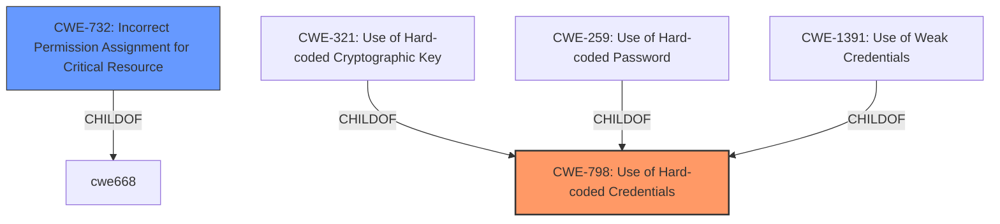

# Analysis for CVE-2022-44725

# Summary
| CWE ID  | CWE Name | Confidence | CWE Abstraction Level | CWE Vulnerability Mapping Label | CWE-Vulnerability Mapping Notes |
|-----------------|-----------------------------------------------------------|-------------------|--------------------------|-----------------------------------|-----------------------------------|
| **CWE-798** | Use of Hard-coded Credentials | 1.0 | Base | Primary | Allowed |
| CWE-732 | Incorrect Permission Assignment for Critical Resource | 0.7 | Class | Secondary | Allowed-with-Review |

## Evidence and Confidence

*   **Confidence Score:** 0.9
*   **Evidence Strength:** HIGH

## Relationship Analysis
The primary weakness is CWE-798, the **use of a hard-coded file path to a configuration file**. CWE-798 is a Base level CWE. CWE-321, Use of Hard-coded Cryptographic Key, CWE-259, Use of Hard-coded Password, and CWE-1391, Use of Weak Credentials are all children of CWE-798, but they are not as applicable as CWE-798 because the vulnerability is about a hard-coded file path, not specifically a password or key. While the vulnerability involves reading a configuration file, leading to a potential Incorrect Permission Assignment (CWE-732), the root cause is the hard-coded path itself. The hardcoded path is the key weakness that enables the vulnerability.

## Vulnerability Chain
The vulnerability chain starts with the **hard-coded file path** (CWE-798), which leads to a situation where a normal user can create a malicious configuration file. Because the application **incorrectly assigns permissions to the configuration file** (CWE-732) due to the hardcoded path, the malicious file is loaded by the LDS running with high privileges, potentially leading to privilege escalation and arbitrary code execution.

## Summary of Analysis
The primary weakness is the **hard-coded file path** (CWE-798) which enables a normal user to create a malicious configuration file.
The vulnerability description states that the "OPC Foundation Local Discovery Server (LDS) through 1.04.403.478 uses a **hard-coded file path to a configuration file**."
The "CVE Reference Links Content Summary" states that "the Local Discovery Server (LDS) loads a configuration file from a hardcoded path, C:\Build\Projects\UA-LDS\stack\openssl\ssl".
Because of the **hard-coded path**, the application **incorrectly assigns permissions to the configuration file** (CWE-732) which allows the malicious file to be loaded by the LDS running with high privileges, potentially leading to privilege escalation and arbitrary code execution.

CWE-798 is at the optimal level of specificity because it directly addresses the root cause of the vulnerability, which is the use of a **hard-coded file path**.
CWE-732 is a secondary weakness that arises due to the **hard-coded path**, as it allows a normal user to create a malicious configuration file that can be loaded by the LDS running with high privileges.

Relevant CWE Information:

# Enhanced Context (25 CWEs)
The following CWEs were identified as potentially relevant to this vulnerability:

## CWE-798: Use of Hard-coded Credentials
**Abstraction Level**: Base
**Similarity Score**: 0.77
**Source**: dense

**Description**:
The product contains hard-coded credentials, such as a password or cryptographic key.

**Mapping Guidance**:
- Usage: Allowed
- Rationale: This CWE entry is at the Base level of abstraction, which is a preferred level of abstraction for mapping to the root causes of vulnerabilities.

**Analysis:** This is the primary CWE because the root cause is a **hard-coded file path**, which can be considered a type of **hard-coded credential**.

## CWE-1391: Use of Weak Credentials
**Abstraction Level**: Class
**Similarity Score**: 0.77
**Source**: dense

**Description**:
The product uses weak credentials (such as a default key or hard-coded password) that can be calculated, derived, reused, or guessed by an attacker.

**Mapping Guidance**:
- Usage: Allowed-with-Review
- Rationale: This CWE entry is a Class and might have Base-level children that would be more appropriate

**Analysis:** While this CWE is related, it is not as specific as CWE-798 because it focuses on weak credentials in general, whereas the vulnerability is about a specific **hard-coded file path**.

## CWE-1188: Initialization of a Resource with an Insecure Default
**Abstraction Level**: Base
**Similarity Score**: 0.76
**Source**: dense

**Description**:
The product initializes or sets a resource with a default that is intended to be changed by the administrator, but the default is not secure.

**Mapping Guidance**:
- Usage: Allowed
- Rationale: This CWE entry is at the Base level of abstraction, which is a preferred level of abstraction for mapping to the root causes of vulnerabilities.

**Analysis:** This CWE is not directly applicable because the vulnerability is not about an insecure default value, but rather a **hard-coded file path**.

## CWE-41: Improper Resolution of Path Equivalence
**Abstraction Level**: Base
**Similarity Score**: 0.76
**Source**: dense

**Description**:
The product is vulnerable to file system contents disclosure through path equivalence. Path equivalence involves the use of special characters in file and directory names. The associated manipulations are intended to generate multiple names for the same object.

**Mapping Guidance**:
- Usage: Allowed
- Rationale: This CWE entry is at the Base level of abstraction, which is a preferred level of abstraction for mapping to the root causes of vulnerabilities.

**Analysis:** This CWE is not applicable because the vulnerability is not about path equivalence issues, but rather the **use of a hard-coded file path**.

## CWE-668: Exposure of Resource to Wrong Sphere
**Abstraction Level**: Class
**Similarity Score**: 0.76
**Source**: dense

**Description**:
The product exposes a resource to the wrong control sphere, providing unintended actors with inappropriate access to the resource.

**Mapping Guidance**:
- Usage: Discouraged
- Rationale: CWE-668 is high-level and is often misused as a catch-all when lower-level CWE IDs might be applicable. It is sometimes used for low-information vulnerability reports [REF-1287]. It is a level-1 Class (i.e., a child of a Pillar). It is not useful for trend analysis.

**Analysis:** This CWE is too general and does not accurately capture the specific weakness of a **hard-coded file path**.

## CWE-1392: Use of Default Credentials
**Abstraction Level**: Base
**Similarity Score**: 0.75
**Source**: dense

**Description**:
The product uses default credentials (such as passwords or cryptographic keys) for potentially critical functionality.

**Mapping Guidance**:
- Usage: Allowed
- Rationale: This CWE entry is at the Base level of abstraction, which is a preferred level of abstraction for mapping to the root causes of vulnerabilities.

**Analysis:** While related to credentials, this CWE focuses on *default* credentials, not the *hard-coded* nature of the file path.

## CWE-23: Relative Path Traversal
**Abstraction Level**: Base
**Similarity Score**: 0.75
**Source**: dense

**Description**:
The product uses external input to construct a pathname that should be within a restricted directory, but it does not properly neutralize sequences such as ".." that can resolve to a location that is outside of that directory.

**Mapping Guidance**:
- Usage: Allowed
- Rationale: This CWE entry is at the Base level of abstraction, which is a preferred level of abstraction for mapping to the root causes of vulnerabilities.

**Analysis:** This is not about path traversal but about the **hard-coded file path** itself.

## CWE-807: Reliance on Untrusted Inputs in a Security Decision
**Abstraction Level**: Base
**Similarity Score**: 0.75
**Source**: dense

**Description**:
The product uses a protection mechanism that relies on the existence or values of an input, but the input can be modified by an