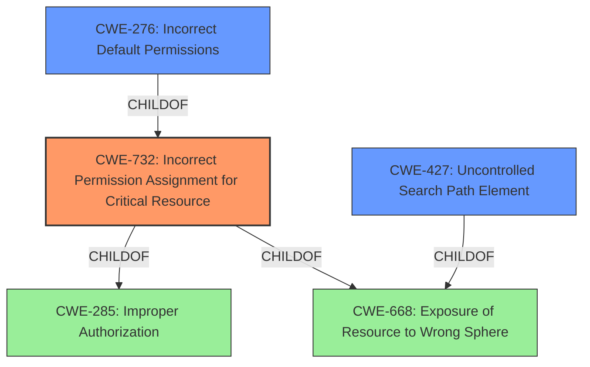

# Raw Analyzer Response for CVE-2022-44733

# Summary
| CWE ID | CWE Name | Confidence | CWE Abstraction Level | CWE Vulnerability Mapping Label | CWE-Vulnerability Mapping Notes |
|---|---|---|---|---|---|
| CWE-732 | Incorrect Permission Assignment for Critical Resource | 0.9 | Class | Allowed-with-Review | Primary CWE |
| CWE-276 | Incorrect Default Permissions | 0.7 | Base | Allowed | Secondary Candidate |
| CWE-427 | Uncontrolled Search Path Element | 0.6 | Base | Allowed | Secondary Candidate |

## Evidence and Confidence

*   **Confidence Score:** 0.8
*   **Evidence Strength:** HIGH

## Relationship Analysis
The primary CWE selected is CWE-732 which is a Class level CWE. It has a ChildOf relationship with CWE-285 (Improper Authorization) and CWE-668 (Exposure of Resource to Wrong Sphere). CWE-276 (Incorrect Default Permissions) is a Base level CWE and is also a child of CWE-732. CWE-427 (Uncontrolled Search Path Element) is a Base level CWE and is also a child of CWE-668. The relationship between these CWEs highlights how a more specific CWE can be selected to describe the vulnerability but in this case, the class level CWE-732 is more appropriate.

## Vulnerability Chain
The chain of weaknesses is as follows:
1.  **Root Cause:** **Insecure folder permissions** (CWE-732)
2.  **Impact:** Local privilege escalation

## Summary of Analysis
The vulnerability is due to **insecure folder permissions** in Acronis Cyber Protect Home Office (Windows) before build 39900, leading to local privilege escalation.

The primary CWE selected is CWE-732 (Incorrect Permission Assignment for Critical Resource). This aligns well with the vulnerability description, which explicitly mentions "**insecure folder permissions**". The CWE description states: "The product specifies permissions for a security-critical resource in a way that allows that resource to be read or modified by unintended actors." In this case, the folders are the critical resources, and the **insecure permissions** allow unintended actors to potentially modify them, leading to privilege escalation.

CWE-276 (Incorrect Default Permissions) was also considered as a possibility, since it refers to **incorrect permissions** set during installation. However, the description doesn't provide enough details to confirm that the **insecure permissions** were set during installation. Therefore, CWE-732 is a better fit.

CWE-427 (Uncontrolled Search Path Element) refers to a situation where the product uses a fixed or controlled search path, but one or more locations in that path can be under the control of unintended actors. While this could be related to privilege escalation, it doesn't directly address the **insecure folder permissions** mentioned in the vulnerability description.

The MITRE mapping guidance for CWE-732 suggests "Allowed-with-Review" because it is often misused for vulnerabilities in which "permissions" are not checked, which is an "authorization" weakness. However, in this case, the vulnerability is specifically about **incorrect permission assignment**, not a missing authorization check. Therefore, CWE-732 is an appropriate choice.

The final decision is based on direct evidence from the vulnerability description, specifically the phrase "**insecure folder permissions**". CWE-732 accurately reflects this weakness, making it the most appropriate mapping.