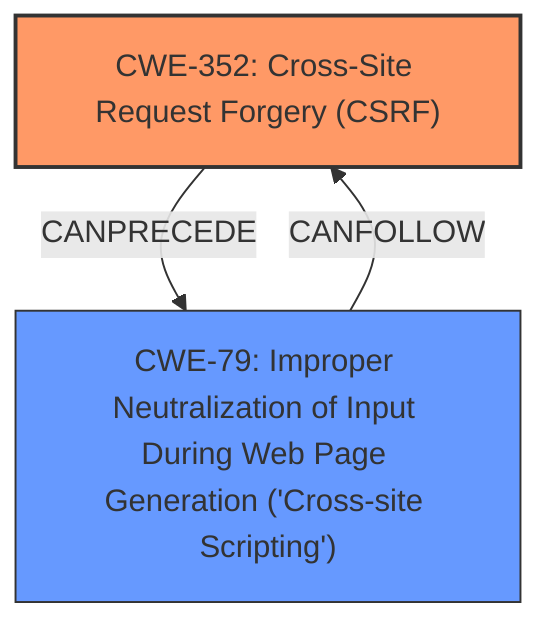

# Analysis for CVE-2022-44741

# Summary
| CWE ID | CWE Name | Confidence | CWE Abstraction Level | CWE Vulnerability Mapping Label | CWE-Vulnerability Mapping Notes |
|---|---|---|---|---|---|
| CWE-352 | Cross-Site Request Forgery (CSRF) | 1.0 | Compound | Allowed | Primary CWE.  The vulnerability stems from a **lack of CSRF protection** in the plugin, specifically the missing nonce check. |
| CWE-79 | Improper Neutralization of Input During Web Page Generation ('Cross-site Scripting') | 1.0 | Base | Allowed | Secondary CWE. The CSRF vulnerability can lead to Cross-Site Scripting (XSS) because an attacker could manipulate the plugin's admin area by tricking an admin into clicking a malicious link and inputting arbitrary HTML. |

## Evidence and Confidence

*   **Confidence Score:** 1.0
*   **Evidence Strength:** HIGH

## Relationship Analysis
The primary weakness is CWE-352, Cross-Site Request Forgery (CSRF). The impact of this weakness can lead to CWE-79, Improper Neutralization of Input During Web Page Generation ('Cross-site Scripting'). CWE-352 is a compound weakness that requires multiple conditions to be met, while CWE-79 is a base weakness that describes the improper handling of user-controllable input, leading to XSS.

## Vulnerability Chain
The chain of vulnerabilities is as follows:
1.  **Root Cause:** **Lack of CSRF protection** (CWE-352) due to a missing nonce check.
2.  **Impact:** An attacker can trick a logged-in administrator into performing unwanted actions.
3.  **Result:** Input of arbitrary HTML into the plugin's admin area, leading to Cross-Site Scripting (CWE-79).

## Summary of Analysis
The initial analysis identified the **lack of CSRF protection** as the primary weakness, leading to potential XSS. The analysis is strongly based on the provided evidence, specifically:
*   "The vulnerability stems from a missing nonce check within the Testimonial Slider plugin, specifically in versions 1.3.1 and earlier. This absence of a nonce allows Cross-Site Request Forgery (CSRF) attacks."
*   "An attacker could potentially manipulate the plugin's admin area page by tricking a logged-in administrator into clicking a malicious link. Specifically, the attacker could input arbitrary HTML into the plugin's admin area, which could lead to further attacks like XSS."

The graph relationships confirm that CSRF can precede XSS.

CWE-352 is at the Compound level, which is appropriate because it represents a combination of weaknesses that lead to CSRF. CWE-79 is at the Base level, representing the specific weakness of improper neutralization of input leading to XSS.

Other CWEs Considered but Not Used:

*   CWE-601 (URL Redirection to Untrusted Site ('Open Redirect')): While redirection could be part of a CSRF attack, it's not the core issue. The primary problem is the **lack of CSRF protection**, not necessarily an open redirect.
*   CWE-425 (Direct Request ('Forced Browsing')): While direct requests are relevant to access control, they don't fully capture the **lack of CSRF protection** that allows actions to be performed without proper validation.
*   CWE-434 (Unrestricted Upload of File with Dangerous Type): This is not relevant as the vulnerability doesn't involve file uploads.
*   CWE-89 (Improper Neutralization of Special Elements used in an SQL Command ('SQL Injection')): This is not relevant as the vulnerability doesn't involve SQL injection.
*   CWE-116: (Improper Encoding or Escaping of Output) This is not the primary issue. While improper encoding/escaping might exacerbate XSS, the root cause is the **lack of CSRF protection** and subsequent injection of malicious HTML.
*   CWE-1004: (Sensitive Cookie Without 'HttpOnly' Flag) This is not the primary issue, since the main issue is the **lack of CSRF protection**.
*   CWE-862: (Missing Authorization) While related to access control, this is not the most accurate description. The vulnerability is that an attacker can make requests on behalf of an authenticated user.
*   CWE-471: (Modification of Assumed-Immutable Data (MAID)) This is not the primary issue. The core problem is the missing CSRF protection.