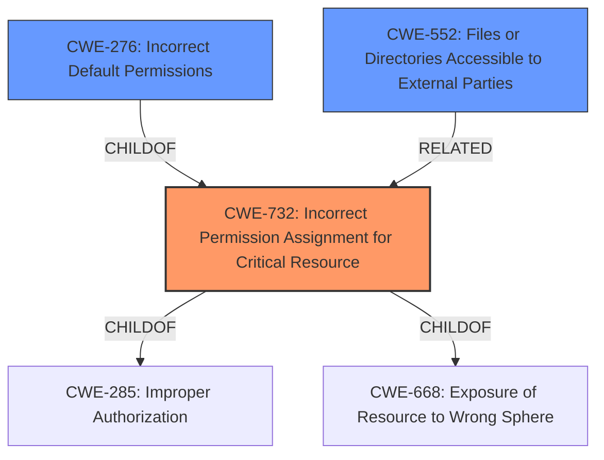

# Raw Analyzer Response for CVE-2022-44746

# Summary
| CWE ID | CWE Name | Confidence | CWE Abstraction Level | CWE Vulnerability Mapping Label | CWE-Vulnerability Mapping Notes |
|---|---|---|---|---|---|
| CWE-732 | Incorrect Permission Assignment for Critical Resource | 0.9 | Class | Allowed-with-Review | Primary CWE |
| CWE-276 | Incorrect Default Permissions | 0.7 | Base | Allowed | Secondary Candidate |
| CWE-552 | Files or Directories Accessible to External Parties | 0.6 | Base | Allowed | Secondary Candidate |

## Evidence and Confidence

*   **Confidence Score:** 0.8
*   **Evidence Strength:** MEDIUM

## Relationship Analysis
The primary CWE, CWE-732 [Incorrect Permission Assignment for Critical Resource], is a Class-level CWE that is child of CWE-285 [Improper Authorization] and CWE-668 [Exposure of Resource to Wrong Sphere]. CWE-276 [Incorrect Default Permissions] is a Base-level CWE and a child of CWE-732. The hierarchical relationship between CWE-732 and CWE-276 indicates that CWE-276 is a more specific case of CWE-732. However, without more specifics on whether the **insecure folder permissions** were due to incorrect defaults, CWE-732 is the more appropriate choice. CWE-552 [Files or Directories Accessible to External Parties] could be related as it describes the impact of the insecure permissions.

## Vulnerability Chain
The vulnerability chain starts with the **insecure folder permissions** (CWE-732), which leads to sensitive information disclosure. The root cause is the **insecure folder permissions** that allows unauthorized access.

## Summary of Analysis
The initial analysis identified CWE-732 [Incorrect Permission Assignment for Critical Resource] as the primary weakness due to the **insecure folder permissions**. This is based on the vulnerability description that highlights sensitive information disclosure due to **insecure folder permissions**.

The description states: "Sensitive information disclosure due to **insecure folder permissions**." This statement directly supports the selection of CWE-732, which focuses on the incorrect assignment of permissions for critical resources.

CWE-732 is selected as the primary CWE because it directly addresses the root cause of the vulnerability: **insecure folder permissions**. The retriever results and similar CVE descriptions also support this selection, though CWE-862 [Missing Authorization] was identified as the Primary CWE Match and is related to authorization problems. However, the evidence points more towards permissions than authorization.

CWE-276 [Incorrect Default Permissions] was considered as a secondary CWE. This could be the case if the **insecure folder permissions** were the default settings. However, this is not explicitly stated, so CWE-732 is preferred.

CWE-552 [Files or Directories Accessible to External Parties] was considered as a potential impact of the root cause, but it is not the root cause itself.

The selected CWEs are at the optimal level of specificity, with CWE-732 being a Class-level CWE, while CWE-276 and CWE-552 are Base-level CWEs.

CWE-862 [Missing Authorization], the Primary CWE Match for similar CVE descriptions, was considered but not selected because the vulnerability description highlights **insecure folder permissions** rather than a missing authorization check. While related, the focus is more on the incorrect permissions than the absence of authorization.