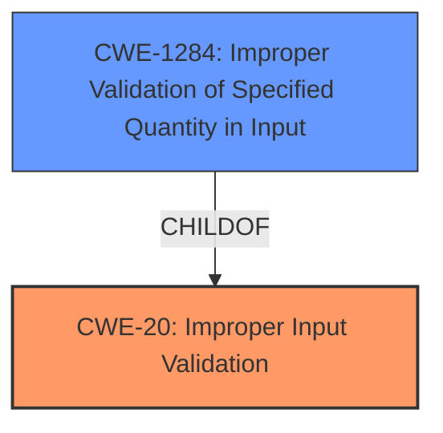

# Raw Analyzer Response for CVE-2022-44756

# Summary

| CWE ID | CWE Name | Confidence | CWE Abstraction Level | CWE Vulnerability Mapping Label | CWE-Vulnerability Mapping Notes |
|---|---|---|---|---|---|
| CWE-20 | Improper Input Validation | 0.75 | Class | Primary | Discouraged |
| CWE-1284 | Improper Validation of Specified Quantity in Input | 0.6 | Base | Secondary | Allowed |

## Evidence and Confidence

*   **Confidence Score:** 0.7
*   **Evidence Strength:** MEDIUM

## Relationship Analysis

The primary relationship influencing my decision is the parent-child relationship between CWE-20 and CWE-1284. CWE-20 is a class-level CWE representing **improper input validation**, while CWE-1284 is a base-level CWE focusing on the **improper validation of a specified quantity in input**.

## Vulnerability Chain

The vulnerability chain starts with the **improper input validation** (CWE-20), which could lead to information disclosure. While the description doesn't explicitly specify the type of input being validated, the related CWEs from the Retriever results, such as CWE-1284, suggest that the vulnerability might involve a specified quantity.

## Summary of Analysis

Initially, the vulnerability description points to **improper input validation** which maps to CWE-20. The description "Insights for Vulnerability Remediation (IVR) is vulnerable to **improper input validation**. This may lead to information disclosure" directly supports this. However, CWE-20 is a broad class, and the MITRE guidance discourages its use when more specific CWEs are available.

The Retriever Results suggest several more specific CWEs related to **improper input validation**, including CWE-1284, which is "Improper Validation of Specified Quantity in Input". Because the vulnerability description doesn't provide specific details about the type of input that is not being properly validated, it's hard to confirm this.

I am selecting CWE-20 as the primary CWE due to the direct evidence in the vulnerability description. However, because of the suggestions of CWE-1284 being related and potentially more specific, I am also including it as a secondary candidate.

Relevant CWE Information:

# Enhanced Context (25 CWEs)

## CWE-20: Improper Input Validation
**Abstraction:** Class

### Description
The product receives input or data, but it does not validate or incorrectly validates that the input has the properties that are required to process the data safely and correctly.

### Mapping Guidance
**Usage:** Discouraged
**Rationale:** CWE-20 is commonly misused in low-information vulnerability reports when lower-level CWEs could be used instead, or when more details about the vulnerability are available [REF-1287]. It is not useful for trend analysis. It is also a level-1 Class (i.e., a child of a Pillar).

## CWE-1284: Improper Validation of Specified Quantity in Input
**Abstraction:** Base

### Description
The product receives input that is expected to specify a quantity (such as size or length), but it does not validate or incorrectly validates that the quantity has the required properties.

### Mapping Guidance
**Usage:** Allowed
**Rationale:** This CWE entry is at the Base level of abstraction, which is a preferred level of abstraction for mapping to the root causes of vulnerabilities.