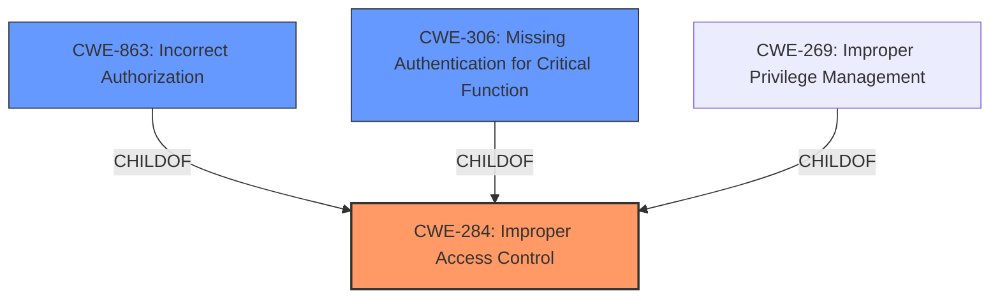

# Enhanced Analysis for CVE-2022-44929

# Summary
| CWE ID | CWE Name | Confidence | CWE Abstraction Level | CWE Vulnerability Mapping Label | CWE-Vulnerability Mapping Notes |
|---|---|---|---|---|---|
| CWE-284 | Improper Access Control | 0.75 | Pillar | Primary | Discouraged |
| CWE-863 | Incorrect Authorization | 0.6 | Class | Secondary | Allowed-with-Review |
| CWE-306 | Missing Authentication for Critical Function | 0.5 | Base | Secondary | Allowed |

## Evidence and Confidence

*   **Confidence Score:** 0.7
*   **Evidence Strength:** MEDIUM

## Relationship Analysis
The primary CWE chosen is CWE-284, which is a high-level Pillar. However, given the limited information, it's the most appropriate starting point. More specific Class or Base level CWEs like CWE-863 and CWE-306 were considered as potential refinements.

The relationship between CWE-284 and its children is important here. CWE-284 encompasses a wide range of access control issues, and the vulnerability description mentions an "access control issue". While the exact nature of the access control failure isn't explicitly detailed, the mention of privilege escalation suggests that authorization or authentication might be involved.



## Vulnerability Chain
The vulnerability chain starts with an **access control issue**, leading to the ability for unauthenticated attackers to escalate privileges by editing VoIP SIB profiles.

**Access Control Issue** -> **Privilege Escalation**

The initial flaw is the **improper access control**, which then leads to the impact of privilege escalation.

## Summary of Analysis
The initial assessment identified an **access control issue** allowing unauthenticated attackers to escalate privileges. The primary classification is CWE-284 (Improper Access Control), a high-level Pillar. While this is a broad classification, the evidence is not detailed enough to pinpoint a more specific Base or Variant CWE with high confidence.

The vulnerability description states "an **access control issue** in D-Link DVG-G5402SP GE_1.03 allows unauthenticated attackers to escalate privileges via arbitrarily editing VoIP SIB profiles".

CWE-284 is selected because it directly relates to the described **access control issue**. However, CWE-284 is a high-level category, and the MITRE mapping guidance discourages its use when more specific CWEs are available. Given the lack of specifics, a more detailed CWE cannot be confidently assigned.

CWE-863 (Incorrect Authorization) is considered because the vulnerability involves privilege escalation via editing VoIP SIB profiles. This suggests that the authorization mechanism is flawed, allowing unauthorized users to modify sensitive data. However, without more information, it's difficult to confirm that the authorization check is explicitly incorrect rather than simply missing.

CWE-306 (Missing Authentication for Critical Function) is considered because the attackers are unauthenticated. The vulnerability description mentions that "unauthenticated attackers" can escalate privileges.

The final selection balances the available evidence with the goal of providing the most accurate and specific classification possible. CWE-284 serves as the primary classification, while CWE-863 and CWE-306 are considered as secondary candidates that may be applicable depending on further details.
The confidence score is 0.7 because while the general area of weakness is clear, the specific root cause mechanism is not fully elucidated in the description.

Relevant CWE Information:

# Enhanced Context (25 CWEs)

## CWE-131: Incorrect Calculation of Buffer Size
**Abstraction Level**: Base
**Similarity Score**: 0.76
**Source**: dense

**Description**:
The product does not correctly calculate the size to be used when allocating a buffer, which could lead to a buffer overflow.

**Mapping Guidance**:
- Usage: Allowed
- Rationale: This CWE entry is at the Base level of abstraction, which is a preferred level of abstraction for mapping to the root causes of vulnerabilities.

*Not Applicable:* This CWE is related to buffer overflows, which are not mentioned in the vulnerability description.

## CWE-74: Improper Neutralization of Special Elements in Output Used by a Downstream Component ('Injection')
**Abstraction Level**: Class
**Similarity Score**: 0.76
**Source**: dense

**Description**:
The product constructs all or part of a command, data structure, or record using externally-influenced input from an upstream component, but it does not neutralize or incorrectly neutralizes special elements that could modify how it is parsed or interpreted when it is sent to a downstream component.

**Mapping Guidance**:
- Usage: Discouraged
- Rationale: CWE-74 is high-level and often misused when lower-level weaknesses are more appropriate.

*Not Applicable:* This CWE relates to injection vulnerabilities, which are not evident in the provided description.

## CWE-754: Improper Check for Unusual or Exceptional Conditions
**Abstraction Level**: Class
**Similarity Score**: 0.76
**Source**: dense

**Description**:
The product does not check or incorrectly checks for unusual or exceptional conditions that are not expected to occur frequently during day to day operation of the product.

**Mapping Guidance**:
- Usage: Allowed-with-Review
- Rationale: This CWE entry is a Class and might have Base-level children that would be more appropriate

*Not Applicable:* This CWE relates to error handling and exceptional conditions, which do not seem to be the root cause of the vulnerability.

## CWE-653: Improper Isolation or Compartmentalization
**Abstraction Level**: Class
**Similarity Score**: 0.76
**Source**: dense

**Description**:
The product does not properly compartmentalize or isolate functionality, processes, or resources that require different privilege levels, rights, or permissions.

**Mapping Guidance**:
- Usage: Allowed
- Rationale: This CWE entry is at the Base level of abstraction, which is a preferred level of abstraction for mapping to the root causes of vulnerabilities.

*Not Applicable:* While privilege escalation is mentioned, there's no clear indication of improper isolation or compartmentalization being the root cause.

## CWE-668: Exposure of Resource to Wrong Sphere
**Abstraction Level**: Class
**Similarity Score**: 0.76
**Source**: dense

**Description**:
The product exposes a resource to the wrong control sphere, providing unintended actors with inappropriate access to the resource.

**Mapping Guidance**:
- Usage: Discouraged
- Rationale: CWE-668 is high-level and is often misused as a catch-all when lower-level CWE IDs might be applicable. It is sometimes used for low-information vulnerability reports [REF-1287]. It is a level-1 Class (i.e., a child of a Pillar). It is not useful for trend analysis.

*Not Applicable:* Similar to CWE-653, the description doesn't explicitly point to resource exposure to the wrong sphere.

## CWE-41: Improper Resolution of Path Equivalence
**Abstraction Level**: Base
**Similarity Score**: 0.75
**Source**: dense

**Description**:
The product is vulnerable to file system contents disclosure through path equivalence. Path equivalence involves the use of special characters in file and directory names. The associated manipulations are intended to generate multiple names for the same object.

**Mapping Guidance**:
- Usage: Allowed
- Rationale: This CWE entry is at the Base level of abstraction, which is a preferred level of abstraction for mapping to the root causes of vulnerabilities.

*Not Applicable:* This CWE is specific to path equivalence issues, which are not relevant to the vulnerability description.

## CWE-667: Improper Locking
**Abstraction Level**: Class
**Similarity Score**: 0.75
**Source**: dense

**Description**:
The product does not properly acquire or release a lock on a resource, leading to unexpected resource state changes and behaviors.

**Mapping Guidance**:
- Usage: Allowed-with-Review
- Rationale: This CWE entry is a Class and might have Base-level children that would be more appropriate

*Not Applicable:* This CWE relates to concurrency issues and locking mechanisms, which are not apparent in the provided information.

## CWE-691: Insufficient Control Flow Management
**Abstraction Level**: Pillar
**Similarity Score**: 0.75
**Source**: dense

**Description**:
The code does not sufficiently manage its control flow during execution, creating conditions in which the control flow can be modified in unexpected ways.

**Mapping Guidance**:
- Usage: Discouraged
- Rationale: This CWE entry is extremely high-level, a Pillar. However, classification research is limited for weaknesses of this


## CWE Relationship Analysis

Current CWEs represent these abstraction levels: .


### Vulnerability Chain Analysis

**Chain starting from CWE-131:**
- 131 (Incorrect Calculation of Buffer Size) - ROOT


**Chain starting from CWE-41:**
- 41 (Improper Resolution of Path Equivalence) - ROOT


### CWE Relationship Diagram

```mermaid
graph TD
    classDef primary fill:#f96,stroke:#333,stroke-width:2px
    classDef secondary fill:#69f,stroke:#333
    classDef tertiary fill:#9e9,stroke:#333
```