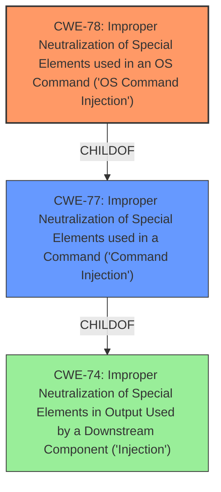

# Analysis Report for CVE-2022-45043

# Vulnerability Analysis Report: CVE-2022-45043

## Description


## Analysis (with Relationship Data)

# Summary

| CWE ID | CWE Name | Confidence | CWE Abstraction Level | CWE Vulnerability Mapping Label | CWE-Vulnerability Mapping Notes |
|---|---|---|---|---|---|
| CWE-78 | Improper Neutralization of Special Elements used in an OS Command ('OS Command Injection') | 1.0 | Base | Allowed | Primary CWE |

## Evidence and Confidence

*   **Confidence Score:** 1.0
*   **Evidence Strength:** HIGH

## Relationship Analysis

The primary relationship that influenced the decision was the ChildOf relationship between CWE-78 (OS Command Injection) and CWE-77 (Command Injection). Since the vulnerability specifically involves OS commands, CWE-78, being a base CWE, is the more appropriate and specific choice compared to the more general class CWE-77. The Retriever Results also indicated CWE-78 as a strong candidate.



## Vulnerability Chain

The vulnerability chain consists of:
1.  **Root Cause:** Lack of input validation on the `staticIp` parameter.
2.  **Weakness:** Improper Neutralization of Special Elements used in an OS Command (CWE-78).
3.  **Impact:** Arbitrary command execution, data exfiltration, and potential complete control of the device.

## Summary of Analysis

The initial analysis focused on identifying the root cause of the vulnerability based on the description and CVE reference. The description clearly states that the Tenda AX12 router is vulnerable to **command injection** via the `goform/fast_setting_internet_set` interface. The CVE Reference Links Content Summary provides more specific details, stating that the `sub_42581C` function fails to sanitize the `staticIp` parameter, leading to the **command injection**.

The Retriever Results suggested CWE-77 (Improper Neutralization of Special Elements used in a Command ('Command Injection')) as the top candidate, followed by CWE-78 (Improper Neutralization of Special Elements used in an OS Command ('OS Command Injection')). While CWE-77 is a valid consideration, the vulnerability description and CVE reference explicitly mention the ability to execute *system* commands. Therefore, CWE-78, which is more specific to OS commands, is the more accurate choice.

The relationship analysis reinforces this decision. CWE-78 is a child of CWE-77, indicating that it is a more specific type of command injection. Given the evidence of OS command execution, mapping to the base CWE-78 provides a more precise and granular classification of the weakness.

The final decision is based on the following evidence:

*   Vulnerability Description Key Phrases: "**weakness:** **command injection**"
*   CVE Reference Links Content Summary: "The vulnerability stems from the `fast_setting_internet_set` interface, where the function `sub_42581C` fails to sanitize the `staticIp` parameter passed by the user. This lack of input validation allows for command injection."
*   CVE Reference Links Content Summary: "Arbitrary command execution: An attacker can execute any system command on the router."

These excerpts provide strong evidence that the vulnerability is indeed an OS command injection issue. Therefore, CWE-78 is selected as the primary CWE with a confidence score of 1.0.

Relevant CWE Information:
*   CWE-78: Improper Neutralization of Special Elements used in an OS Command ('OS Command Injection')
    *   Description: The product constructs all or part of an OS command using externally-influenced input from an upstream component, but it does not neutralize or incorrectly neutralizes special elements that could modify the intended OS command when it is sent to a downstream component.
    *   This description aligns directly with the vulnerability, where the `staticIp` parameter is used to construct an OS command without proper neutralization.


## CWE Relationship Analysis

Current CWEs represent these abstraction levels: .


### Vulnerability Chain Analysis

**Chain starting from CWE-78:**
- 78 (Improper Neutralization of Special Elements used in an OS Command ('OS Command Injection')) - ROOT


**Chain starting from CWE-77:**
- 77 (Improper Neutralization of Special Elements used in a Command ('Command Injection')) - ROOT


### CWE Relationship Diagram

```mermaid
graph TD
    classDef primary fill:#f96,stroke:#333,stroke-width:2px
    classDef secondary fill:#69f,stroke:#333
    classDef tertiary fill:#9e9,stroke:#333
```


*Report generated on 2025-03-30 15:41:48*
