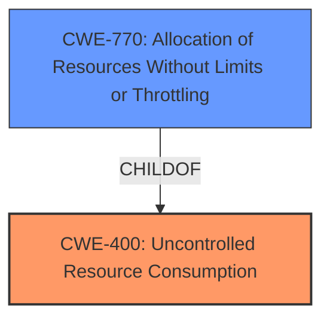

# Analysis for CVE-2022-45044

# Summary
| CWE ID  | CWE Name | Confidence | CWE Abstraction Level | CWE Vulnerability Mapping Label | CWE-Vulnerability Mapping Notes |
|-----------------|------------------------------------------------------------------------------------------------------|----------------|-------------------------|------------------------------------|-----------------------------------|
| CWE-400 | Uncontrolled Resource Consumption | 1.0 | Class | Primary | Discouraged |
| CWE-770 | Allocation of Resources Without Limits or Throttling | 0.75 | Base | Secondary | Allowed |

## Evidence and Confidence

*   **Confidence Score:** 0.85
*   **Evidence Strength:** HIGH

## Relationship Analysis
The primary CWE, CWE-400, is a Class-level CWE, while the secondary CWE, CWE-770, is a Base-level CWE and a child of CWE-400. Choosing CWE-400 is initially based on the description and CVE summary which specifies **uncontrolled resource consumption**. However, because CWE-400 is discouraged, I looked for a more specific child, which is CWE-770. I selected CWE-400 because of the overall context of the vulnerability. The relationship analysis helped narrow down the options and justify the final choices.



## Vulnerability Chain
The vulnerability chain starts with the **improper restriction of secure client-initiated renegotiations** which leads to **uncontrolled resource consumption**, ultimately resulting in a **denial of service**.

## Summary of Analysis
Initially, the vulnerability description points towards **uncontrolled resource consumption** due to the **failure to properly restrict secure client-initiated renegotiations**. The CVE reference links further confirm this, emphasizing the **uncontrolled resource consumption** aspect and the resulting **denial-of-service** condition.

The initial assessment using retriever results suggested CWE-400 (Uncontrolled Resource Consumption) as the primary candidate. While this aligns with the described impact, CWE-400 is a Class-level CWE and is discouraged. After considering the relationships, particularly the child-of relationship between CWE-400 and CWE-770 (Allocation of Resources Without Limits or Throttling), and the root cause (**do not properly restrict secure client-initiated renegotiations within the SSL and TLS protocols**), I considered CWE-770 as a secondary candidate.

The selection of CWE-400 is based on the explicit mention of resource consumption leading to denial of service: "This could allow an attacker to create a denial of service condition". This directly supports the resource exhaustion aspect of CWE-400. The mitigations suggested such as restricting access also align with preventing resource exhaustion attacks.

The optimal level of specificity is achieved by using CWE-400, as it encapsulates the overall **uncontrolled resource consumption** resulting from the **improper restriction**. The root cause is the underlying reason, and the impact is the ultimate consequence.

Relevant CWE Information:

# Enhanced Context (25 CWEs)
The following CWEs were identified as potentially relevant to this vulnerability:

## CWE-74: Improper Neutralization of Special Elements in Output Used by a Downstream Component ('Injection')
**Abstraction Level**: Class
**Similarity Score**: 0.76
**Source**: dense

**Description**:
The product constructs all or part of a command, data structure, or record using externally-influenced input from an upstream component, but it does not neutralize or incorrectly neutralizes special elements that could modify how it is parsed or interpreted when it is sent to a downstream component.

**Mapping Guidance**:
- Usage: Discouraged
- Rationale: CWE-74 is high-level and often misused when lower-level weaknesses are more appropriate.

## CWE-653: Improper Isolation or Compartmentalization
**Abstraction Level**: Class
**Similarity Score**: 0.75
**Source**: dense

**Description**:
The product does not properly compartmentalize or isolate functionality, processes, or resources that require different privilege levels, rights, or permissions.

**Mapping Guidance**:
- Usage: Allowed
- Rationale: This CWE entry is at the Base level of abstraction, which is a preferred level of abstraction for mapping to the root causes of vulnerabilities.

## CWE-1289: Improper Validation of Unsafe Equivalence in Input
**Abstraction Level**: Base
**Similarity Score**: 0.75
**Source**: dense

**Description**:
The product receives an input value that is used as a resource identifier or other type of reference, but it does not validate or incorrectly validates that the input is equivalent to a potentially-unsafe value.

**Mapping Guidance**:
- Usage: Allowed
- Rationale: This CWE entry is at the Base level of abstraction, which is a preferred level of abstraction for mapping to the root causes of vulnerabilities.

## CWE-807: Reliance on Untrusted Inputs in a Security Decision
**Abstraction Level**: Base
**Similarity Score**: 0.75
**Source**: dense

**Description**:
The product uses a protection mechanism that relies on the existence or values of an input, but the input can be modified by an untrusted actor in a way that bypasses the protection mechanism.

**Mapping Guidance**:
- Usage: Allowed
- Rationale: This CWE entry is at the Base level of abstraction, which is a preferred level of abstraction for mapping to the root causes of vulnerabilities.

## CWE-184: Incomplete List of Disallowed Inputs
**Abstraction Level**: Base
**Similarity Score**: 0.75
**Source**: dense

**Description**:
The product implements a protection mechanism that relies on a list of inputs (or properties of inputs) that are not allowed by policy or otherwise require other action to neutralize before additional processing takes place, but the list is incomplete.

**Mapping Guidance**:
- Usage: Allowed
- Rationale: This CWE entry is at the Base level of abstraction, which is a preferred level of abstraction for mapping to the root causes of vulnerabilities.

## CWE-668: Exposure of Resource to Wrong Sphere
**Abstraction Level**: Class
**Similarity Score**: 0.74
**Source**: dense

**Description**:
The product exposes a resource to the wrong control sphere, providing unintended actors with inappropriate access to the resource.

**Mapping Guidance**:
- Usage: Discouraged
- Rationale: CWE-668 is high-level and is often misused as a catch-all when lower-level CWE IDs might be applicable. It is sometimes used for low-information vulnerability reports [REF-1287]. It is a level-1 Class (i.e., a child of a Pillar). It is not useful for trend analysis.

## CWE-138: Improper Neutralization of Special Elements
**Abstraction Level**: Class
**Similarity Score**: 0.74
**Source**: dense

**Description**:
The product receives input from an upstream component, but it does not neutralize or incorrectly neutralizes special elements that could be interpreted as control elements or syntactic markers when they are sent to a downstream component.

**Mapping Guidance**:
- Usage: Discouraged
- Rationale: This CWE entry is a level-1 Class (i.e., a child of a Pillar). It might have lower-level children that would be more appropriate

## CWE-73: External Control of File Name or Path
**Abstraction Level**: Base
**Similarity Score**: 0.74
**Source**: dense

**Description**:
The product allows user input to control or influence paths or file names that are used in filesystem operations.

**Mapping Guidance**:
- Usage: Allowed
- Rationale: This CWE entry is at the Base level of abstraction, which is a preferred level of abstraction for mapping to the root causes of vulnerabilities.

## CWE-41: Improper Resolution of Path Equivalence
**Abstraction Level**: Base
**Similarity Score**: 0.74
**Source**: dense

**Description**:
The product is vulnerable to file system contents disclosure through path equivalence. Path equivalence involves the use of special characters in file and directory names. The associated manipulations are intended to generate multiple names for the same object.

**Mapping Guidance**:
- Usage: Allowed
- Rationale: This CWE entry is at the Base level of abstraction, which is a preferred level of abstraction for mapping to the root causes of vulnerabilities.

## CWE-405: Asymmetric Resource Consumption (Amplification)
**Abstraction Level**: Class
**Similarity Score**: 0.73
**Source**: dense

**Description**:
The product does not properly control situations in which an adversary can cause the product to consume or produce excessive resources without requiring the adversary to invest equivalent work or otherwise prove authorization, i.e., the adversary's influence is "asymmetric."

**Mapping Guidance**:
- Usage: Allowed-with-Review
- Rationale: This CWE entry is a Class and might have Base-level children that would be more appropriate

## CWE-400: Uncontrolled Resource Consumption
**Abstraction Level**: Class
**Similarity Score**: 1

# Enhanced Query for CVE-2022-45044

## Vulnerability Description
A vulnerability has been identified in SIPROTEC 5 6MD84 (CP300) (All versions < V9.50), SIPROTEC 5 6MD85 (CP200) (All versions), SIPROTEC 5 6MD85 (CP300) (All versions < V9.50), SIPROTEC 5 6MD86 (CP200) (All versions), SIPROTEC 5 6MD86 (CP300) (All versions < V9.50), SIPROTEC 5 6MD89 (CP300) (All versions < V9.64), SIPROTEC 5 6MU85 (CP300) (All versions < V9.50), SIPROTEC 5 7KE85 (CP200) (All versions), SIPROTEC 5 7KE85 (CP300) (All versions < V9.64), SIPROTEC 5 7SA82 (CP100) (All versions), SIPROTEC 5 7SA82 (CP150) (All versions < V9.50), SIPROTEC 5 7SA84 (CP200) (All versions), SIPROTEC 5 7SA86 (CP200) (All versions), SIPROTEC 5 7SA86 (CP300) (All versions < V9.50), SIPROTEC 5 7SA87 (CP200) (All versions), SIPROTEC 5 7SA87 (CP300) (All versions < V9.50), SIPROTEC 5 7SD82 (CP100) (All versions), SIPROTEC 5 7SD82 (CP150) (All versions < V9.50), SIPROTEC 5 7SD84 (CP200) (All versions), SIPROTEC 5 7SD86 (CP200) (All versions), SIPROTEC 5 7SD86 (CP300) (All versions < V9.50), SIPROTEC 5 7SD87 (CP200) (All versions), SIPROTEC 5 7SD87 (CP300) (All versions < V9.50), SIPROTEC 5 7SJ81 (CP100) (All versions < V8.89), SIPROTEC 5 7SJ81 (CP150) (All versions < V9.50), SIPROTEC 5 7SJ82 (CP100) (All versions < V8.89), SIPROTEC 5 7SJ82 (CP150) (All versions < V9.50), SIPROTEC 5 7SJ85 (CP200) (All versions), SIPROTEC 5 7SJ85 (CP300) (All versions < V9.50), SIPROTEC 5 7SJ86 (CP200) (All versions), SIPROTEC 5 7SJ86 (CP300) (All versions < V9.50), SIPROTEC 5 7SK82 (CP100) (All versions < V8.89), SIPROTEC 5 7SK82 (CP150) (All versions < V9.50), SIPROTEC 5 7SK85 (CP200) (All versions), SIPROTEC 5 7SK85 (CP300) (All versions < V9.50), SIPROTEC 5 7SL82 (CP100) (All versions), SIPROTEC 5 7SL82 (CP150) (All versions < V9.50), SIPROTEC 5 7SL86 (CP200) (All versions), SIPROTEC 5 7SL86 (CP300) (All versions < V9.50), SIPROTEC 5 7SL87 (CP200) (All versions), SIPROTEC 5 7SL87 (CP300) (All versions < V9.50), SIPROTEC 5 7SS85 (CP200) (All versions), SIPROTEC 5 7SS85 (CP300) (All versions < V9.50), SIPROTEC 5 7ST85 (CP200) (All versions), SIPROTEC 5 7ST85 (CP300) (All versions < V9.64), SIPROTEC 5 7ST86 (CP300) (All versions < V9.64), SIPROTEC 5 7SX82 (CP150) (All versions < V9.50), SIPROTEC 5 7SX85 (CP300) (All versions < V9.50), SIPROTEC 5 7UM85 (CP300) (All versions < V9.50), SIPROTEC 5 7UT82 (CP100) (All versions), SIPROTEC 5 7UT82 (CP150) (All versions < V9.50), SIPROTEC 5 7UT85 (CP200) (All versions), SIPROTEC 5 7UT85 (CP300) (All versions < V9.50), SIPROTEC 5 7UT86 (CP200) (All versions), SIPROTEC 5 7UT86 (CP300) (All versions < V9.50), SIPROTEC 5 7UT87 (CP200) (All versions), SIPROTEC 5 7UT87 (CP300) (All versions < V9.50), SIPROTEC 5 7VE85 (CP300) (All versions < V9.50), SIPROTEC 5 7VK87 (CP200) (All versions), SIPROTEC 5 7VK87 (CP300) (All versions < V9.50), SIPROTEC 5 7VU85 (CP300) (All versions < V9.50), SIPROTEC 5 Communication Module ETH-BA-2EL (All versions < V8.89 installed on CP100 devices), SIPROTEC 5 Communication Module ETH-BA-2EL (All versions < V9.50 installed on CP150 and CP300 devices), SIPROTEC 5 Communication Module ETH-BA-2EL (All versions installed on CP200 devices), SIPROTEC 5 Communication Module ETH-BB-2FO (All versions < V8.89 installed on CP100 devices), SIPROTEC 5 Communication Module ETH-BB-2FO (All versions < V9.50 installed on CP150 and CP300 devices), SIPROTEC 5 Communication Module ETH-BB-2FO (All versions installed on CP200 devices), SIPROTEC 5 Communication Module ETH-BD-2FO (All versions < V9.50), SIPROTEC 5 Compact 7SX800 (CP050) (All versions < V9.50). Affected devices **do not properly restrict secure client-initiated renegotiations within the SSL and TLS protocols**. This could allow an attacker to create a denial of service condition on the ports 443/tcp and 4443/tcp for the duration of the attack.

### Vulnerability Description Key Phrases
- **rootcause:** **do not properly restrict secure client-initiated renegotiations within the SSL and TLS protocols**
- **impact:** denial of service
- **attacker:** attacker
- **product:** SIPROTEC 5 6MD84 and SIPROTEC 5 6MD85 and SIPROTEC 5 6MD86 and SIPROTEC 5 6MD89 and SIPROTEC 5 6MU85 and SIPROTEC 5 7KE85 and SIPROTEC 5 7SA82 and SIPROTEC 5 7SA84 and SIPROTEC 5 7SA86 and SIPROTEC 5 7SA87 and SIPROTEC 5 7SD82 and SIPROTEC 5 7SD84 and SIPROTEC 5 7SD86 and SIPROTEC 5 7SD87 and SIPROTEC 5 7SJ81 and SIPROTEC 5 7SJ82 and SIPROTEC 5 7SJ85 and SIPROTEC 5 7SJ86 and SIPROTEC 5 7SK82 and SIPROTEC 5 7SK85 and SIPROTEC 5 7SL82 and SIPROTEC 5 7SL86 and SIPROTEC 5 7SL87 and SIPROTEC 5 7SS85 and SIPROTEC 5 7ST85 and SIPROTEC 5 7ST86 and SIPROTEC 5 7SX82 and SIPROTEC 5 7SX85 and SIPROTEC 5 7UM85 and SIPROTEC 5 7UT82 and SIPROTEC 5 7UT85 and SIPROTEC 5 7UT86 and SIPROTEC 5 7UT87 and SIPROTEC 5 7VE85 and SIPROTEC 5 7VK87 and SIPROTEC 5 7VU85 and SIPROTEC 5 Communication Module ETH-BA-2EL and SIPROTEC 5 Communication Module ETH-BB-2FO and SIPROTEC 5 Communication Module ETH-BD-2FO and SIPROTEC 5 Compact 7SX800
- **version:** All versions < V9.50 and All versions < V9.64 and All versions and All versions < V8.89

## CVE Reference Links Content Summary
Based on the provided information, here's an analysis of CVE-2022-45044:

**Root Cause of Vulnerability:**

The vulnerability stems from the affected devices not properly restricting secure client-initiated renegotiations within the SSL and TLS protocols.

**Weaknesses/Vulnerabilities Present:**

*   **Uncontrolled Resource Consumption (CWE-400):** The vulnerability allows an attacker to consume excessive resources on the affected device by forcing it to perform multiple renegotiations.

**Impact of Exploitation:**

*   **Denial of Service (DoS):** An attacker can cause a denial-of-service condition on the affected device, specifically on ports 443/tcp and 4443/tcp. This renders the device unavailable for legitimate users for the duration of the attack.

**Attack Vectors:**

*   **Network-based Attack:** The attack can be launched remotely over the network.
*   **Unauthenticated Attacker:** The attacker does not need to authenticate to the device to exploit this vulnerability.
*   **Client-Initiated Renegotiation:** The attack relies on the ability of an attacker to initiate SSL/TLS renegotiation.

**Required Attacker Capabilities/Position:**

*   **Network Access:** The attacker must have network access to the affected device on ports 443/tcp and/or 4443/tcp.
*   **Ability to Initiate SSL/TLS Renegotiation:** The attacker needs to be able to send the necessary network packets to trigger the renegotiation process.

**Affected Products:**
The following products and versions are affected:
*   SIPROTEC 5 6MD84 (CP300): All versions < V9.50
*   SIPROTEC 5 6MD85 (CP200): All versions
*   SIPROTEC 5 6MD85 (CP300): All versions < V9.50
*   SIPROTEC 5 6MD86 (CP200): All versions
*   SIPROTEC 5 6MD86 (CP300): All versions < V9.50
*  SIPROTEC 5 6MD89 (CP300): All versions < V9.64
*   SIPROTEC 5 6MU85 (CP300): All versions < V9.50
*   SIPROTEC 5 7KE85 (CP200): All versions
*   SIPROTEC 5 7KE85 (CP300): All versions < V9.64
*   SIPROTEC 5 7SA82 (CP100): All versions
*   SIPROTEC 5 7SA82 (CP150): All versions < V9.50
*   SIPROTEC 5 7SA84 (CP200): All versions
*  SIPROTEC 5 7SA86 (CP200): All versions
*  SIPROTEC 5 7SA86 (CP300): All versions < V9.50
*   SIPROTEC 5 7SA87 (CP200): All versions
*   SIPROTEC 5 7SA87 (CP300): All versions < V9.50
*   SIPROTEC 5 7SD82 (CP100): All versions
*   SIPROTEC 5 7SD82 (CP150): All versions < V9.50
*   SIPROTEC 5 7SD84 (CP200): All versions
*   SIPROTEC 5 7SD86 (CP200): All versions
*   SIPROTEC 5 7SD86 (CP300): All versions < V9.50
*   SIPROTEC 5 7SD87 (CP200): All versions
*   SIPROTEC 5 7SD87 (CP300): All versions < V9.50
*   SIPROTEC 5 7SJ81 (CP100): All versions < V8.89
*   SIPROTEC 5 7SJ81 (CP150): All versions < V9.50
*   SIPROTEC 5 7SJ82 (CP100): All versions < V8.89
*   SIPROTEC 5 7SJ82 (CP150): All versions < V9.50
*   SIPROTEC 5 7SJ85 (CP200): All versions
*   SIPROTEC 5 7SJ85 (CP300): All versions < V9.50
*   SIPROTEC 5 7SJ86 (CP200): All versions
*   SIPROTEC 5 7SJ86 (CP300): All versions < V9.50
*   SIPROTEC 5 7SK82 (CP100): All versions < V8.89
*   SIPROTEC 5 7SK82 (CP150): All versions < V9.50
*   SIPROTEC 5 7SK85 (CP200): All versions
*   SIPROTEC 5 7SK85 (CP300): All versions < V9.50
*  SIPROTEC 5 7SL82 (CP100): All versions
*   SIPROTEC 5 7SL82 (CP150): All versions < V9.50
*   SIPROTEC 5 7SL86 (CP200): All versions
*   SIPROTEC 5 7SL86 (CP300): All versions < V9.50
*   SIPROTEC 5 7SL87 (CP200): All versions
*  SIPROTEC 5 7SL87 (CP300): All versions < V9.50
*   SIPROTEC 5 7SS85 (CP200): All versions
*   SIPROTEC 5 7SS85 (CP300): All versions < V9.50
*  SIPROTEC 5 7ST85 (CP200): All versions
*   SIPROTEC 5 7ST85 (CP300): All versions < V9.64
*   SIPROTEC 5 7ST86 (CP300): All versions < V9.64
*   SIPROTEC 5 7SX82 (CP150): All versions < V9.50
*   SIPROTEC 5 7SX85 (CP300): All versions < V9.50
*   SIPROTEC 5 7UM85 (CP300): All versions < V9.50
*   SIPROTEC 5 7UT82 (CP100): All versions
*  SIPROTEC 5 7UT82 (CP150): All versions < V9.50
*   SIPROTEC 5 7UT85 (CP200): All versions
*  SIPROTEC 5 7UT85 (CP300): All versions < V9.50
*   SIPROTEC 5 7UT86 (CP200): All versions
*   SIPROTEC 5 7UT86 (CP300): All versions < V9.50
*   SIPROTEC 5 7UT87 (CP200): All versions
*   SIPROTEC 5 7UT87 (CP300): All versions < V9.50
*   SIPROTEC 5 7VE85 (CP300): All versions < V9.50
*   SIPROTEC 5 7VK87 (CP200): All versions
*  SIPROTEC 5 7VK87 (CP300): All versions < V9.50
*   SIPROTEC 5 7VU85 (CP300): All versions < V9.50
*   SIPROTEC 5 Communication Module ETH-BA-2EL: All versions < V8.89 installed on CP100 devices
*  SIPROTEC 5 Communication Module ETH-BA-2EL: All versions < V9.50 installed on CP150 and CP300 devices
*   SIPROTEC 5 Communication Module ETH-BA-2EL: All versions installed on CP200 devices
*   SIPROTEC 5 Communication Module ETH-BB-2FO: All versions < V8.89 installed on CP100 devices
*  SIPROTEC 5 Communication Module ETH-BB-2FO: All versions < V9.50 installed on CP150 and CP300 devices
*   SIPROTEC 5 Communication Module ETH-BB-2FO: All versions installed on CP200 devices
*   SIPROTEC 5 Communication Module ETH-BD-2FO: All versions < V9.50
*   SIPROTEC 5 Compact 7SX800 (CP050): All versions < V9.50

**Mitigations:**

*   **Restrict Access:** Limit access to ports 443/tcp and 4443/tcp to only trusted IP addresses.
*   **Software Updates:** Upgrade to the latest software version provided by Siemens for the affected products.

This information provides a more comprehensive view of the vulnerability than the initial CVE description.

## Retriever Results

### Top Combined Results

| Rank | CWE ID | Name | Abstraction | Usage  | Retrievers | Individual Scores |
|------|--------|------|-------------|-------|------------|-------------------|
| 1 | 400 | Uncontrolled Resource Consumption | Class | Discouraged | sparse | 7.733 |
| 2 | 20 | Improper Input Validation | Class | Discouraged | sparse | 2.777 |
| 3 | 538 | Insertion of Sensitive Information into Externally-Accessible File or Directory | Base | Allowed | sparse | 2.124 |
| 4 | 78 | Improper Neutralization of Special Elements used in an OS Command ('OS Command Injection') | Base | Allowed | sparse | 1.793 |
| 5 | 522 | Insufficiently Protected Credentials | Class | Allowed-with-Review | sparse | 1.790 |
| 6 | 326 | Inadequate Encryption Strength | Class | Allowed-with-Review | dense | 0.697 |
| 7 | 73 | External Control of File Name or Path | Base | Allowed | graph | 0.002 |
| 8 | 121 | Stack-based Buffer Overflow | Variant | Allowed | sparse | 1.787 |
| 9 | 917 | Improper Neutralization of Special Elements used in an Expression Language Statement ('Expression Language Injection') | Base | Allowed | sparse | 1.760 |
| 10 | 269 | Improper Privilege Management | Class | Discouraged | sparse | 1.751 |


# Complete CWE Specifications


## CWE-400: Uncontrolled Resource Consumption
**Abstraction:** Class
**Status:** Draft

### Description
The product does not properly control the allocation and maintenance of a limited resource, thereby enabling an actor to influence the amount of resources consumed, eventually leading to the exhaustion of available resources.

### Extended Description


Limited resources include memory, file system storage, database connection pool entries, and CPU. If an attacker can trigger the allocation of these limited resources, but the number or size of the resources is not controlled, then the attacker could cause a denial of service that consumes all available resources. This would prevent valid users from accessing the product, and it could potentially have an impact on the surrounding environment. For example, a memory exhaustion attack against an application could slow down the application as well as its host operating system.


There are at least three distinct scenarios which can commonly lead to resource exhaustion:


  - Lack of throttling for the number of allocated resources

  - Losing all references to a resource before reaching the shutdown stage

  - Not closing/returning a resource after processing

Resource exhaustion problems are often result due to an incorrect implementation of the following situations:

  - Error conditions and other exceptional circumstances.

  - Confusion over which part of the program is responsible for releasing the resource.


### Alternative Terms
Resource Exhaustion

### Relationships
ChildOf -> CWE-664

### Mapping Guidance
**Usage:** Discouraged
**Rationale:** CWE-400 is intended for incorrect behaviors in which the product is expected to track and restrict how many resources it consumes, but CWE-400 is often misused because it is conflated with the "technical impact" of vulnerabilities in which resource consumption occurs. It is sometimes used for low-information vulnerability reports. It is a level-1 Class (i.e., a child of a Pillar).
**Comments:** Closely analyze the specific mistake that is causing resource consumption, and perform a CWE mapping for that mistake. Consider children/descendants such as CWE-770: Allocation of Resources Without Limits or Throttling, CWE-771: Missing Reference to Active Allocated Resource, CWE-410: Insufficient Resource Pool, CWE-772: Missing Release of Resource after Effective Lifetime, CWE-834: Excessive Iteration, CWE-405: Asymmetric Resource Consumption (Amplification), and others.
**Reasons:**
- Frequent Misuse


### Additional Notes
**[Maintenance]** "Resource consumption" could be interpreted as a consequence instead of an insecure behavior, so this entry is being considered for modification. It appears to be referenced too frequently when more precise mappings are available. Some of its children, such as CWE-771, might be better considered as a chain.

**[Theoretical]** Vulnerability theory is largely about how behaviors and resources interact. "Resource exhaustion" can be regarded as either a consequence or an attack, depending on the perspective. This entry is an attempt to reflect the underlying weaknesses that enable these attacks (or consequences) to take place.

**[Other]** 

Database queries that take a long time to process are good DoS targets. An attacker would have to write a few lines of Perl code to generate enough traffic to exceed the site's ability to keep up. This would effectively prevent authorized users from using the site at all. Resources can be exploited simply by ensuring that the target machine must do much more work and consume more resources in order to service a request than the attacker must do to initiate a request.


A prime example of this can be found in old switches that were vulnerable to "macof" attacks (so named for a tool developed by Dugsong). These attacks flooded a switch with random IP and MAC address combinations, therefore exhausting the switch's cache, which held the information of which port corresponded to which MAC addresses. Once this cache was exhausted, the switch would fail in an insecure way and would begin to act simply as a hub, broadcasting all traffic on all ports and allowing for basic sniffing attacks.


**[Maintenance]** The Taxonomy_Mappings to ISA/IEC 62443 were added in CWE 4.10, but they are still under review and might change in future CWE versions. These draft mappings were performed by members of the "Mapping CWE to 62443" subgroup of the CWE-CAPEC ICS/OT Special Interest Group (SIG), and their work is incomplete as of CWE 4.10. The mappings are included to facilitate discussion and review by the broader ICS/OT community, and they are likely to change in future CWE versions.


### Observed Examples
- **CVE-2022-21668:** Chain: Python library does not limit the resources used to process images that specify a very large number of bands (CWE-1284), leading to excessive memory consumption (CWE-789) or an integer overflow (CWE-190).
- **CVE-2020-7218:** Go-based workload orchestrator does not limit resource usage with unauthenticated connections, allowing a DoS by flooding the service
- **CVE-2020-3566:** Resource exhaustion in distributed OS because of "insufficient" IGMP queue management, as exploited in the wild per CISA KEV.


## CWE-20: Improper Input Validation
**Abstraction:** Class
**Status:** Stable

### Description
The product receives input or data, but it does
        not validate or incorrectly validates that the input has the
        properties that are required to process the data safely and
        correctly.

### Extended Description


Input validation is a frequently-used technique for checking potentially dangerous inputs in order to ensure that the inputs are safe for processing within the code, or when communicating with other components. When software does not validate input properly, an attacker is able to craft the input in a form that is not expected by the rest of the application. This will lead to parts of the system receiving unintended input, which may result in altered control flow, arbitrary control of a resource, or arbitrary code execution.


Input validation is not the only technique for processing input, however. Other techniques attempt to transform potentially-dangerous input into something safe, such as filtering (CWE-790) - which attempts to remove dangerous inputs - or encoding/escaping (CWE-116), which attempts to ensure that the input is not misinterpreted when it is included in output to another component. Other techniques exist as well (see CWE-138 for more examples.)


Input validation can be applied to:


  - raw data - strings, numbers, parameters, file contents, etc.

  - metadata - information about the raw data, such as headers or size

Data can be simple or structured. Structured data can be composed of many nested layers, composed of combinations of metadata and raw data, with other simple or structured data.

Many properties of raw data or metadata may need to be validated upon entry into the code, such as:


  - specified quantities such as size, length, frequency, price, rate, number of operations, time, etc.

  - implied or derived quantities, such as the actual size of a file instead of a specified size

  - indexes, offsets, or positions into more complex data structures

  - symbolic keys or other elements into hash tables, associative arrays, etc.

  - well-formedness, i.e. syntactic correctness - compliance with expected syntax 

  - lexical token correctness - compliance with rules for what is treated as a token

  - specified or derived type - the actual type of the input (or what the input appears to be)

  - consistency - between individual data elements, between raw data and metadata, between references, etc.

  - conformance to domain-specific rules, e.g. business logic 

  - equivalence - ensuring that equivalent inputs are treated the same

  - authenticity, ownership, or other attestations about the input, e.g. a cryptographic signature to prove the source of the data

Implied or derived properties of data must often be calculated or inferred by the code itself. Errors in deriving properties may be considered a contributing factor to improper input validation. 

Note that "input validation" has very different meanings to different people, or within different classification schemes. Caution must be used when referencing this CWE entry or mapping to it. For example, some weaknesses might involve inadvertently giving control to an attacker over an input when they should not be able to provide an input at all, but sometimes this is referred to as input validation.


Finally, it is important to emphasize that the distinctions between input validation and output escaping are often blurred, and developers must be careful to understand the difference, including how input validation is not always sufficient to prevent vulnerabilities, especially when less stringent data types must be supported, such as free-form text. Consider a SQL injection scenario in which a person's last name is inserted into a query. The name "O'Reilly" would likely pass the validation step since it is a common last name in the English language. However, this valid name cannot be directly inserted into the database because it contains the "'" apostrophe character, which would need to be escaped or otherwise transformed. In this case, removing the apostrophe might reduce the risk of SQL injection, but it would produce incorrect behavior because the wrong name would be recorded.


### Alternative Terms
None

### Relationships
ChildOf -> CWE-707
PeerOf -> CWE-345
CanPrecede -> CWE-22
CanPrecede -> CWE-41
CanPrecede -> CWE-74
CanPrecede -> CWE-119
CanPrecede -> CWE-770

### Mapping Guidance
**Usage:** Discouraged
**Rationale:** CWE-20 is commonly misused in low-information vulnerability reports when lower-level CWEs could be used instead, or when more details about the vulnerability are available [REF-1287]. It is not useful for trend analysis. It is also a level-1 Class (i.e., a child of a Pillar).
**Comments:** Consider lower-level children such as Improper Use of Validation Framework (CWE-1173) or improper validation involving specific types or properties of input such as Specified Quantity (CWE-1284); Specified Index, Position, or Offset (CWE-1285); Syntactic Correctness (CWE-1286); Specified Type (CWE-1287); Consistency within Input (CWE-1288); or Unsafe Equivalence (CWE-1289).
**Reasons:**
- Frequent Misuse
**Suggested Alternatives:**
- CWE-1284: Specified Quantity
- CWE-1285: Specified Index, Position, or Offset
- CWE-1286: Syntactic Correctness
- CWE-1287: Specified Type
- CWE-1288: Consistency within Input
- CWE-1289: Unsafe Equivalence
- CWE-116: Improper Encoding or Escaping of Output


### Additional Notes
**[Relationship]** 

CWE-116 and CWE-20 have a close association because, depending on the nature of the structured message, proper input validation can indirectly prevent special characters from changing the meaning of a structured message. For example, by validating that a numeric ID field should only contain the 0-9 characters, the programmer effectively prevents injection attacks.


**[Maintenance]** As of 2020, this entry is used more often than preferred, and it is a source of frequent confusion. It is being actively modified for CWE 4.1 and subsequent versions.

**[Maintenance]** Concepts such as validation, data transformation, and neutralization are being refined, so relationships between CWE-20 and other entries such as CWE-707 may change in future versions, along with an update to the Vulnerability Theory document.

**[Maintenance]** Input validation - whether missing or incorrect - is such an essential and widespread part of secure development that it is implicit in many different weaknesses. Traditionally, problems such as buffer overflows and XSS have been classified as input validation problems by many security professionals. However, input validation is not necessarily the only protection mechanism available for avoiding such problems, and in some cases it is not even sufficient. The CWE team has begun capturing these subtleties in chains within the Research Concepts view (CWE-1000), but more work is needed.

**[Terminology]** 

The "input validation" term is extremely common, but it is used in many different ways. In some cases its usage can obscure the real underlying weakness or otherwise hide chaining and composite relationships.


Some people use "input validation" as a general term that covers many different neutralization techniques for ensuring that input is appropriate, such as filtering, canonicalization, and escaping. Others use the term in a more narrow context to simply mean "checking if an input conforms to expectations without changing it." CWE uses this more narrow interpretation.


### Observed Examples
- **CVE-2024-37032:** Large language model (LLM) management tool does not validate the format of a digest value (CWE-1287) from a private, untrusted model registry, enabling relative path traversal (CWE-23), a.k.a. Probllama
- **CVE-2022-45918:** Chain: a learning management tool debugger uses external input to locate previous session logs (CWE-73) and does not properly validate the given path (CWE-20), allowing for filesystem path traversal using "../" sequences (CWE-24)
- **CVE-2021-30860:** Chain: improper input validation (CWE-20) leads to integer overflow (CWE-190) in mobile OS, as exploited in the wild per CISA KEV.


## CWE-538: Insertion of Sensitive Information into Externally-Accessible File or Directory
**Abstraction:** Base
**Status:** Draft

### Description
The product places sensitive information into files or directories that are accessible to actors who are allowed to have access to the files, but not to the sensitive information.

### Extended Description
Not provided

### Alternative Terms
None

### Relationships
ChildOf -> CWE-200

### Mapping Guidance
**Usage:** Allowed
**Rationale:** This CWE entry is at the Base level of abstraction, which is a preferred level of abstraction for mapping to the root causes of vulnerabilities.
**Comments:** Carefully read both the name and description to ensure that this mapping is an appropriate fit. Do not try to 'force' a mapping to a lower-level Base/Variant simply to comply with this preferred level of abstraction.
**Reasons:**
- Acceptable-Use


### Additional Notes
**[Maintenance]** Depending on usage, this could be a weakness or a category. Further study of all its children is needed, and the entire sub-tree may need to be clarified. The current organization is based primarily on the exposure of sensitive information as a consequence, instead of as a primary weakness.

**[Maintenance]** There is a close relationship with CWE-552, which is more focused on weaknesses. As a result, it may be more appropriate to convert CWE-538 to a category.


### Observed Examples
- **CVE-2018-1999036:** SSH password for private key stored in build log


## CWE-78: Improper Neutralization of Special Elements used in an OS Command ('OS Command Injection')
**Abstraction:** Base
**Status:** Stable

### Description
The product constructs all or part of an OS command using externally-influenced input from an upstream component, but it does not neutralize or incorrectly neutralizes special elements that could modify the intended OS command when it is sent to a downstream component.

### Extended Description


This weakness can lead to a vulnerability in environments in which the attacker does not have direct access to the operating system, such as in web applications. Alternately, if the weakness occurs in a privileged program, it could allow the attacker to specify commands that normally would not be accessible, or to call alternate commands with privileges that the attacker does not have. The problem is exacerbated if the compromised process does not follow the principle of least privilege, because the attacker-controlled commands may run with special system privileges that increases the amount of damage.


There are at least two subtypes of OS command injection:


  - The application intends to execute a single, fixed program that is under its own control. It intends to use externally-supplied inputs as arguments to that program. For example, the program might use system("nslookup [HOSTNAME]") to run nslookup and allow the user to supply a HOSTNAME, which is used as an argument. Attackers cannot prevent nslookup from executing. However, if the program does not remove command separators from the HOSTNAME argument, attackers could place the separators into the arguments, which allows them to execute their own program after nslookup has finished executing.

  - The application accepts an input that it uses to fully select which program to run, as well as which commands to use. The application simply redirects this entire command to the operating system. For example, the program might use "exec([COMMAND])" to execute the [COMMAND] that was supplied by the user. If the COMMAND is under attacker control, then the attacker can execute arbitrary commands or programs. If the command is being executed using functions like exec() and CreateProcess(), the attacker might not be able to combine multiple commands together in the same line.

From a weakness standpoint, these variants represent distinct programmer errors. In the first variant, the programmer clearly intends that input from untrusted parties will be part of the arguments in the command to be executed. In the second variant, the programmer does not intend for the command to be accessible to any untrusted party, but the programmer probably has not accounted for alternate ways in which malicious attackers can provide input.

### Alternative Terms
Shell injection
Shell metacharacters
OS Command Injection

### Relationships
ChildOf -> CWE-77
ChildOf -> CWE-74
ChildOf -> CWE-77
ChildOf -> CWE-77
CanAlsoBe -> CWE-88

### Mapping Guidance
**Usage:** Allowed
**Rationale:** This CWE entry is at the Base level of abstraction, which is a preferred level of abstraction for mapping to the root causes of vulnerabilities.
**Comments:** Carefully read both the name and description to ensure that this mapping is an appropriate fit. Do not try to 'force' a mapping to a lower-level Base/Variant simply to comply with this preferred level of abstraction.
**Reasons:**
- Acceptable-Use


### Additional Notes
**[Terminology]** The "OS command injection" phrase carries different meanings to different people. For some people, it only refers to cases in which the attacker injects command separators into arguments for an application-controlled program that is being invoked. For some people, it refers to any type of attack that can allow the attacker to execute OS commands of their own choosing. This usage could include untrusted search path weaknesses (CWE-426) that cause the application to find and execute an attacker-controlled program. Further complicating the issue is the case when argument injection (CWE-88) allows alternate command-line switches or options to be inserted into the command line, such as an "-exec" switch whose purpose may be to execute the subsequent argument as a command (this -exec switch exists in the UNIX "find" command, for example). In this latter case, however, CWE-88 could be regarded as the primary weakness in a chain with CWE-78.

**[Research Gap]** More investigation is needed into the distinction between the OS command injection variants, including the role with argument injection (CWE-88). Equivalent distinctions may exist in other injection-related problems such as SQL injection.


### Observed Examples
- **CVE-2020-10987:** OS command injection in Wi-Fi router, as exploited in the wild per CISA KEV.
- **CVE-2020-10221:** Template functionality in network configuration management tool allows OS command injection, as exploited in the wild per CISA KEV.
- **CVE-2020-9054:** Chain: improper input validation (CWE-20) in username parameter, leading to OS command injection (CWE-78), as exploited in the wild per CISA KEV.


## CWE-522: Insufficiently Protected Credentials
**Abstraction:** Class
**Status:** Incomplete

### Description
The product transmits or stores authentication credentials, but it uses an insecure method that is susceptible to unauthorized interception and/or retrieval.

### Extended Description
Not provided

### Alternative Terms
None

### Relationships
ChildOf -> CWE-1390
ChildOf -> CWE-287
ChildOf -> CWE-668

### Mapping Guidance
**Usage:** Allowed-with-Review
**Rationale:** This CWE entry is a Class and might have Base-level children that would be more appropriate
**Comments:** Examine children of this entry to see if there is a better fit
**Reasons:**
- Abstraction


### Observed Examples
- **CVE-2022-30018:** A messaging platform serializes all elements of User/Group objects, making private information available to adversaries
- **CVE-2022-29959:** Initialization file contains credentials that can be decoded using a "simple string transformation"
- **CVE-2022-35411:** Python-based RPC framework enables pickle functionality by default, allowing clients to unpickle untrusted data.


## CWE-326: Inadequate Encryption Strength
**Abstraction:** Class
**Status:** Draft

### Description
The product stores or transmits sensitive data using an encryption scheme that is theoretically sound, but is not strong enough for the level of protection required.

### Extended Description
A weak encryption scheme can be subjected to brute force attacks that have a reasonable chance of succeeding using current attack methods and resources.

### Alternative Terms
None

### Relationships
ChildOf -> CWE-693

### Mapping Guidance
**Usage:** Allowed-with-Review
**Rationale:** This CWE entry is a Class and might have Base-level children that would be more appropriate
**Comments:** Examine children of this entry to see if there is a better fit
**Reasons:**
- Abstraction


### Observed Examples
- **CVE-2001-1546:** Weak encryption
- **CVE-2004-2172:** Weak encryption (chosen plaintext attack)
- **CVE-2002-1682:** Weak encryption


## CWE-73: External Control of File Name or Path
**Abstraction:** Base
**Status:** Draft

### Description
The product allows user input to control or influence paths or file names that are used in filesystem operations.

### Extended Description


This could allow an attacker to access or modify system files or other files that are critical to the application.


Path manipulation errors occur when the following two conditions are met:

```
		1. An attacker can specify a path used in an operation on the filesystem.
		2. By specifying the resource, the attacker gains a capability that would not otherwise be permitted.
```
For example, the program may give the attacker the ability to overwrite the specified file or run with a configuration controlled by the attacker.

### Alternative Terms
None

### Relationships
ChildOf -> CWE-642
ChildOf -> CWE-610
ChildOf -> CWE-20
CanPrecede -> CWE-22
CanPrecede -> CWE-41
CanPrecede -> CWE-98
CanPrecede -> CWE-434
CanPrecede -> CWE-59

### Mapping Guidance
**Usage:** Allowed
**Rationale:** This CWE entry is at the Base level of abstraction, which is a preferred level of abstraction for mapping to the root causes of vulnerabilities.
**Comments:** Carefully read both the name and description to ensure that this mapping is an appropriate fit. Do not try to 'force' a mapping to a lower-level Base/Variant simply to comply with this preferred level of abstraction.
**Reasons:**
- Acceptable-Use


### Additional Notes
**[Maintenance]** CWE-114 is a Class, but it is listed a child of CWE-73 in view 1000. This suggests some abstraction problems that should be resolved in future versions.

**[Relationship]** 

The external control of filenames can be the primary link in chains with other file-related weaknesses, as seen in the CanPrecede relationships. This is because software systems use files for many different purposes: to execute programs, load code libraries, to store application data, to store configuration settings, record temporary data, act as signals or semaphores to other processes, etc.


However, those weaknesses do not always require external control. For example, link-following weaknesses (CWE-59) often involve pathnames that are not controllable by the attacker at all.


The external control can be resultant from other issues. For example, in PHP applications, the register_globals setting can allow an attacker to modify variables that the programmer thought were immutable, enabling file inclusion (CWE-98) and path traversal (CWE-22). Operating with excessive privileges (CWE-250) might allow an attacker to specify an input filename that is not directly readable by the attacker, but is accessible to the privileged program. A buffer overflow (CWE-119) might give an attacker control over nearby memory locations that are related to pathnames, but were not directly modifiable by the attacker.


### Observed Examples
- **CVE-2022-45918:** Chain: a learning management tool debugger uses external input to locate previous session logs (CWE-73) and does not properly validate the given path (CWE-20), allowing for filesystem path traversal using "../" sequences (CWE-24)
- **CVE-2008-5748:** Chain: external control of values for user's desired language and theme enables path traversal.
- **CVE-2008-5764:** Chain: external control of user's target language enables remote file inclusion.


## CWE-121: Stack-based Buffer Overflow
**Abstraction:** Variant
**Status:** Draft

### Description
A stack-based buffer overflow condition is a condition where the buffer being overwritten is allocated on the stack (i.e., is a local variable or, rarely, a parameter to a function).

### Extended Description
Not provided

### Alternative Terms
Stack Overflow: "Stack Overflow" is often used to mean the same thing as stack-based buffer overflow, however it is also used on occasion to mean stack exhaustion, usually a result from an excessively recursive function call. Due to the ambiguity of the term, use of stack overflow to describe either circumstance is discouraged.

### Relationships
ChildOf -> CWE-788
ChildOf -> CWE-787

### Mapping Guidance
**Usage:** Allowed
**Rationale:** This CWE entry is at the Variant level of abstraction, which is a preferred level of abstraction for mapping to the root causes of vulnerabilities.
**Comments:** Carefully read both the name and description to ensure that this mapping is an appropriate fit. Do not try to 'force' a mapping to a lower-level Base/Variant simply to comply with this preferred level of abstraction.
**Reasons:**
- Acceptable-Use


### Additional Notes
**[Other]** Stack-based buffer overflows can instantiate in return address overwrites, stack pointer overwrites or frame pointer overwrites. They can also be considered function pointer overwrites, array indexer overwrites or write-what-where condition, etc.


### Observed Examples
- **CVE-2021-35395:** Stack-based buffer overflows in SFK for wifi chipset used for IoT/embedded devices, as exploited in the wild per CISA KEV.


## CWE-917: Improper Neutralization of Special Elements used in an Expression Language Statement ('Expression Language Injection')
**Abstraction:** Base
**Status:** Incomplete

### Description
The product constructs all or part of an expression language (EL) statement in a framework such as a Java Server Page (JSP) using externally-influenced input from an upstream component, but it does not neutralize or incorrectly neutralizes special elements that could modify the intended EL statement before it is executed.

### Extended Description
Frameworks such as Java Server Page (JSP) allow a developer to insert executable expressions within otherwise-static content. When the developer is not aware of the executable nature of these expressions and/or does not disable them, then if an attacker can inject expressions, this could lead to code execution or other unexpected behaviors.

### Alternative Terms
EL Injection

### Relationships
ChildOf -> CWE-77
PeerOf -> CWE-1336
ChildOf -> CWE-74
ChildOf -> CWE-77
ChildOf -> CWE-77

### Mapping Guidance
**Usage:** Allowed
**Rationale:** This CWE entry is at the Base level of abstraction, which is a preferred level of abstraction for mapping to the root causes of vulnerabilities.
**Comments:** Carefully read both the name and description to ensure that this mapping is an appropriate fit. Do not try to 'force' a mapping to a lower-level Base/Variant simply to comply with this preferred level of abstraction.
**Reasons:**
- Acceptable-Use


### Additional Notes
**[Maintenance]** The interrelationships and differences between CWE-917 and CWE-1336 need to be further clarified.

**[Relationship]** In certain versions of Spring 3.0.5 and earlier, there was a vulnerability (CVE-2011-2730) in which Expression Language tags would be evaluated twice, which effectively exposed any application to EL injection. However, even for later versions, this weakness is still possible depending on configuration.


### Observed Examples
- **CVE-2021-44228:** Product does not neutralize ${xyz} style expressions, allowing remote code execution. (log4shell vulnerability in log4j)


## CWE-269: Improper Privilege Management
**Abstraction:** Class
**Status:** Draft

### Description
The product does not properly assign, modify, track, or check privileges for an actor, creating an unintended sphere of control for that actor.

### Extended Description
Not provided

### Alternative Terms
None

### Relationships
ChildOf -> CWE-284

### Mapping Guidance
**Usage:** Discouraged
**Rationale:** CWE-269 is commonly misused. It can be conflated with "privilege escalation," which is a technical impact that is listed in many low-information vulnerability reports [REF-1287]. It is not useful for trend analysis.
**Comments:** If an error or mistake allows privilege escalation, then use the CWE ID for that mistake. Avoid using CWE-269 when only phrases such as "privilege escalation" or "gain privileges" are available, as these indicate technical impact of the vulnerability - not the root cause weakness. If the root cause seems to be directly related to privileges, then examine the children of CWE-269 for additional hints, such as Execution with Unnecessary Privileges (CWE-250) or Incorrect Privilege Assignment (CWE-266).
**Reasons:**
- Frequent Misuse


### Additional Notes
**[Maintenance]** The relationships between privileges, permissions, and actors (e.g. users and groups) need further refinement within the Research view. One complication is that these concepts apply to two different pillars, related to control of resources (CWE-664) and protection mechanism failures (CWE-693).


### Observed Examples
- **CVE-2001-1555:** Terminal privileges are not reset when a user logs out.
- **CVE-2001-1514:** Does not properly pass security context to child processes in certain cases, allows privilege escalation.
- **CVE-2001-0128:** Does not properly compute roles.

