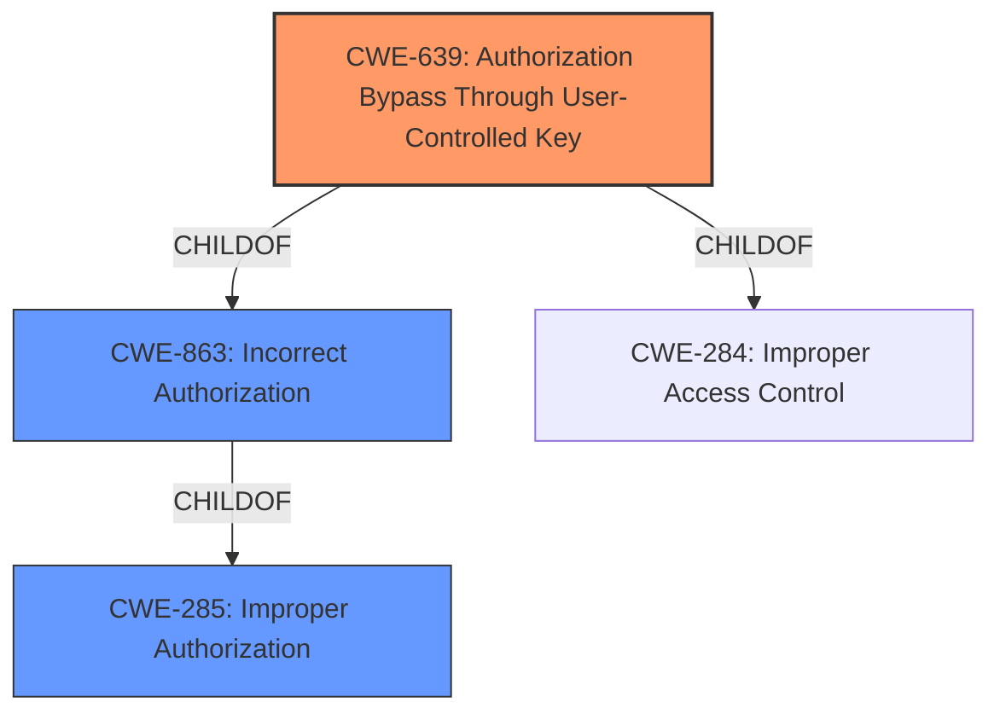

# Analysis Report for CVE-2022-4505

# Vulnerability Analysis Report: CVE-2022-4505

## Description


## Analysis (with Relationship Data)

# Summary
| CWE ID | CWE Name | Confidence | CWE Abstraction Level | CWE Vulnerability Mapping Label | CWE-Vulnerability Mapping Notes |
|---|---|---|---|---|---|
| CWE-639 | Authorization Bypass Through User-Controlled Key | 0.9 | Base | Allowed | Primary CWE |
| CWE-285 | Improper Authorization | 0.7 | Class | Discouraged | Secondary Candidate |
| CWE-863 | Incorrect Authorization | 0.6 | Class | Allowed-with-Review | Secondary Candidate |

## Evidence and Confidence

*   **Confidence Score:** 0.9
*   **Evidence Strength:** HIGH

## Relationship Analysis
The primary CWE, CWE-639, is a Base-level CWE that represents the **authorization bypass** due to the use of a **user-controlled key**. It is a child of CWE-863 (Incorrect Authorization) and CWE-284 (Improper Access Control), indicating that it's a more specific form of authorization issue. CWE-285 is a parent Class of both CWE-639 and CWE-863, but is more general. The analysis favors the specific, Base-level CWE-639.



## Vulnerability Chain
The vulnerability chain starts with the **user-controlled key**, leading to an **authorization bypass**.

Root Cause: User-Controlled Key
Weakness: Authorization Bypass Through User-Controlled Key (CWE-639)
Impact: Unauthorized access to resources

## Summary of Analysis
The analysis concludes that CWE-639 (Authorization Bypass Through User-Controlled Key) is the most appropriate CWE for this vulnerability. This conclusion is based on the following:

- The vulnerability description explicitly mentions "Authorization Bypass Through User-Controlled Key".
- The provided "CVE Reference Links Content Summary" indicates that the code uses loose comparison or type casting to validate numeric values from user input and uses `$_REQUEST` instead of explicit `$_POST` or `$_GET`, which can lead to vulnerabilities by not knowing where data is coming from, supporting the "user-controlled" aspect of the key.
- The Retriever Results list CWE-639 as the top combined result.
- CWE-639 is a Base-level CWE, which is the preferred level of abstraction.

The alternatives, CWE-285 and CWE-863, are Class-level CWEs and are less specific than CWE-639. While they both relate to authorization issues, they do not capture the specific mechanism of the bypass, which is the use of a user-controlled key.

Relevant CWE Information:

# Enhanced Context (25 CWEs)

## CWE-639: Authorization Bypass Through User-Controlled Key
**Abstraction Level**: Base
**Similarity Score**: 0.78
**Source**: dense

**Description**:
The system's authorization functionality does not prevent one user from gaining access to another user's data or record by modifying the key value identifying the data.

**Mapping Guidance**:
- Usage: Allowed
- Rationale: This CWE entry is at the Base level of abstraction, which is a preferred level of abstraction for mapping to the root causes of vulnerabilities.

## CWE-285: Improper Authorization
**Abstraction Level**: Class
**Similarity Score**: 4730.95
**Source**: sparse

**Description**:
The product does not perform or incorrectly performs an authorization check when an actor attempts to access a resource or perform an action.

**Mapping Guidance**:
- Usage: Discouraged
- Rationale: CWE-285 is high-level and lower-level CWEs can frequently be used instead. It is a level-1 Class (i.e., a child of a Pillar).

## CWE-863: Incorrect Authorization
**Abstraction Level**: Class
**Similarity Score**: 4856.20
**Source**: sparse

**Description**:
The product performs an authorization check when an actor attempts to access a resource or perform an action, but it does not correctly perform the check.

**Mapping Guidance**:
- Usage: Allowed-with-Review
- Rationale: This CWE entry is a Class and might have Base-level children that would be more appropriate

## CWE-287: Improper Authentication
The vulnerability description mentions an **authorization bypass**, not an authentication bypass. So CWE-287 is not relevant.

CWE-639 is selected because the vulnerability specifically describes an **authorization bypass** achieved through a **user-controlled key**. The "CVE Reference Links Content Summary" supports this by detailing how user-controlled inputs are improperly validated, leading to unexpected behavior. This aligns directly with the CWE-639 description: "The system's authorization functionality does not prevent one user from gaining access to another user's data or record by modifying the key value identifying the data."


## CWE Relationship Analysis

Current CWEs represent these abstraction levels: .


### Vulnerability Chain Analysis

**Chain starting from CWE-639:**
- 639 (Authorization Bypass Through User-Controlled Key) - ROOT


**Chain starting from CWE-287:**
- 287 (Improper Authentication) - ROOT


### CWE Relationship Diagram

```mermaid
graph TD
    classDef primary fill:#f96,stroke:#333,stroke-width:2px
    classDef secondary fill:#69f,stroke:#333
    classDef tertiary fill:#9e9,stroke:#333
```


*Report generated on 2025-03-30 16:42:33*
