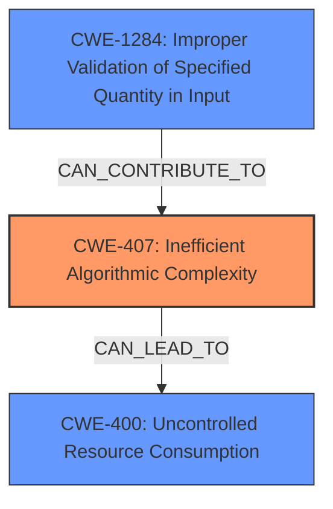

# Enhanced Analysis for CVE-2022-45061

# Summary
| CWE ID    | CWE Name                                                  | Confidence | CWE Abstraction Level | CWE Vulnerability Mapping Label | CWE-Vulnerability Mapping Notes |
| --------- | --------------------------------------------------------- | ---------- | --------------------- | ------------------------------- | ----------------------------- |
| CWE-407   | Inefficient Algorithmic Complexity                        | 0.9        | Class                 | Primary CWE                     | Allowed-with-Review           |
| CWE-400   | Uncontrolled Resource Consumption                         | 0.7        | Class                 | Secondary CWE                   | Discouraged                  |
| CWE-1284  | Improper Validation of Specified Quantity in Input        | 0.6        | Base                  | Secondary CWE                   | Allowed                       |

## Evidence and Confidence

*   **Confidence Score:** 0.8
*   **Evidence Strength:** HIGH

## Relationship Analysis
The primary relationship considered was that CWE-407 is a class-level CWE and its children might be more specific. However, in this case, the description clearly indicates an **inefficient algorithm** as the root cause. CWE-400 is a parent of CWE-770 and describes uncontrolled resource consumption, which is a consequence of the inefficient algorithm. CWE-1284 is related to improper validation of quantity in input, which could be a contributing factor. The graph shows that CWE-407 is the parent of CWE-1333 (Inefficient Regular Expression Complexity), which isn't applicable here as the vulnerability doesn't involve regular expressions.



## Vulnerability Chain
The vulnerability chain starts with an **unnecessary quadratic algorithm** (CWE-407) that leads to excessive CPU consumption, resulting in a **CPU denial of service** (CWE-400). Improper input validation of hostname length (CWE-1284) could contribute to the problem by allowing excessively long names to be processed by the inefficient algorithm.

## Summary of Analysis
The initial analysis identified CWE-407 as a strong candidate due to the presence of an **inefficient algorithm**. The vulnerability description clearly states that an **unnecessary quadratic algorithm** exists in the IDNA decoder. This aligns well with the description of CWE-407, which mentions that an algorithm can have an inefficient worst-case computational complexity. The CVE Reference Links Content Summary also supports this by stating the root cause is "An unnecessary quadratic algorithm exists in one path when processing some inputs to the IDNA (RFC 3490) decoder."

CWE-400 was also considered as it relates to uncontrolled resource consumption, which is the impact of the inefficient algorithm. However, CWE-407 is the more specific root cause.

CWE-1284 was considered because the vulnerability involves an **unreasonably long name**, suggesting a potential lack of input validation.

Ultimately, CWE-407 was chosen as the primary CWE because it directly addresses the root cause, which is the **inefficient algorithm**. It is at the class level, but no more specific base or variant CWEs were identified that directly address inefficient algorithms in the retriever results.

Relevant CWE Information:

# Enhanced Context (25 CWEs)

## CWE-1289: Improper Validation of Unsafe Equivalence in Input
**Abstraction Level**: Base
**Similarity Score**: 0.78
**Source**: dense

**Description**:
The product receives an input value that is used as a resource identifier or other type of reference, but it does not validate or incorrectly validates that the input is equivalent to a potentially-unsafe value.
**Rationale for not selecting**: Not relevant, the vulnerability is about an inefficient algorithm not about unsafe equivalence.

## CWE-1288: Improper Validation of Consistency within Input
**Abstraction Level**: Base
**Similarity Score**: 0.76
**Source**: dense
**Description**:
The product receives a complex input with multiple elements or fields that must be consistent with each other, but it does not validate or incorrectly validates that the input is actually consistent.
**Rationale for not selecting**: Not relevant, the vulnerability is about an inefficient algorithm not about inconsistent input.

## CWE-407: Inefficient Algorithmic Complexity
**Abstraction Level**: Class
**Similarity Score**: 0.75
**Source**: dense

**Description**:
An algorithm in a product has an inefficient worst-case computational complexity that may be detrimental to system performance and can be triggered by an attacker, typically using crafted manipulations that ensure that the worst case is being reached.
**Rationale for selecting**: The vulnerability description mentions an **unnecessary quadratic algorithm**, which directly relates to inefficient algorithmic complexity.

## CWE-184: Incomplete List of Disallowed Inputs
**Abstraction Level**: Base
**Similarity Score**: 0.75
**Source**: dense
**Description**:
The product implements a protection mechanism that relies on a list of inputs (or properties of inputs) that are not allowed by policy or otherwise require other action to neutralize before additional processing takes place, but the list is incomplete.
**Rationale for not selecting**: The vulnerability isn't about a list of disallowed inputs, it's about algorithmic inefficiency.

## CWE-606: Unchecked Input for Loop Condition
**Abstraction Level**: Base
**Similarity Score**: 0.75
**Source**: dense
**Description**:
The product does not properly check inputs that are used for loop conditions, potentially leading to a denial of service or other consequences because of excessive looping.
**Rationale for not selecting**: Not directly related. While excessive looping might be a symptom of the inefficient algorithm, the root cause is the algorithm itself.

## CWE-807: Reliance on Untrusted Inputs in a Security Decision
**Abstraction Level**: Base
**Similarity Score**: 0.75
**Source**: dense
**Description**:
The product uses a protection mechanism that relies on the existence or values of an input, but the input can be modified by an untrusted actor in a way that bypasses the protection mechanism.
**Rationale for not selecting**: This doesn't match the vulnerability, which is about an inefficient algorithm.

## CWE-799: Improper Control of Interaction Frequency
**Abstraction Level**: Class
**Similarity Score**: 0.75
**Source**: dense
**Description**:
The product does not properly limit the number or frequency of interactions that it has with an actor, such as the number of incoming requests.
**Rationale for not selecting**: Not relevant to the root cause of the vulnerability.

## CWE-74: Improper Neutralization of Special Elements in Output Used by a Downstream Component ('Injection')
**Abstraction Level**: Class
**Similarity Score**: 0.75
**Source**: dense
**Description**:
The product constructs all or part of a command, data structure, or record using externally-influenced input from an upstream component, but it does not neutralize or incorrectly neutralizes special elements that could modify how it is parsed or interpreted when it is sent to a downstream component.
**Rationale for not selecting**: This is an injection vulnerability, which doesn't match the description.

## CWE-138: Improper Neutralization of Special Elements
**Abstraction Level**: Class
**Similarity Score**: 0.74
**Source**: dense
**Description**:
The product receives input from an upstream component, but it does not neutralize or incorrectly neutralizes special elements that could be interpreted as control elements or syntactic markers when they are sent to a downstream component.
**Rationale for not selecting**: This is a neutralization issue and does not fit the vulnerability description.

## CWE-183: Permissive List of Allowed Inputs
**Abstraction Level**: Base
**Similarity Score**: 0.74
**Source**: dense
**Description**:
The product implements a protection mechanism that relies on a list of inputs (or properties of inputs) that are explicitly allowed by policy because the inputs are assumed to be safe, but the list is too permissive - that is, it allows an input that is unsafe, leading to resultant weaknesses.
**Rationale for not selecting**: The vulnerability is not about a permissive list of allowed inputs.

## CWE-789: Memory Allocation with Excessive Size Value
**Abstraction Level**: Variant
**Similarity Score**: 7815.91
**Source**: sparse
**Description**:
The product allocates memory based on an untrusted, large size value, but it does not ensure that the size is within expected limits, allowing arbitrary amounts of memory to be allocated.
**Rationale for not selecting**: The vulnerability is not directly related to memory allocation with an excessive size value, although excessive memory *could* be a side effect of the inefficient algorithm.

## CWE-1284: Improper Validation


## CWE Relationship Analysis

Current CWEs represent these abstraction levels: .


### Vulnerability Chain Analysis

**Chain starting from CWE-606:**
- 606 (Unchecked Input for Loop Condition) - ROOT


**Chain starting from CWE-400:**
- 400 (Uncontrolled Resource Consumption) - ROOT


### CWE Relationship Diagram

```mermaid
graph TD
    classDef primary fill:#f96,stroke:#333,stroke-width:2px
    classDef secondary fill:#69f,stroke:#333
    classDef tertiary fill:#9e9,stroke:#333
```